# Operating Systems — T2 Complete Exam-Ready Notes

> **Level:** Intermediate | **Coverage:** Threads and Concurrency + Multilevel Feedback Queue, Multiprocessor and Thread Scheduling, Algorithm Evaluation + Process Synchronization + Deadlocks
> **Built from:** `ch4.ppt` (Threads and Concurrency), `DOC-20260825-WA0000.pdf` (Threads lecture), `Week 4.pptx` (CPU Scheduling: multilevel queues, multiple-processor and real-time scheduling, algorithm evaluation), `ch6.pdf` (Process Synchronization), `Week 6_1 / 6_2 / 6_3.pptx` (Critical section, Semaphores, Monitors), `ch7.ppt` (Synchronization Examples), `ch8.ppt` (Deadlocks), `Week7_Deadlock.pptx` (Deadlock lecture with solved problems), `ch3.ppt` (Processes: background chapter, in Appendix A).
> **Exam use:** Definitions, diagrams, comparisons, algorithms, code interpretation, Banker's and detection numericals, viva points, and practice questions.

**Syllabus covered**

- User and Kernel threads, Multithreading models.
- Multilevel feedback queue scheduling, Multiple processor scheduling, Thread scheduling, Algorithm evaluation.
- Process synchronization: Critical section problems, Semaphores, Synchronization hardware and monitors.
- Deadlocks: System model, Characterization, Methods for handling deadlocks, Deadlock prevention, Avoidance and detection, Recovery from deadlock.

---

## Contents

### Part 1 — Threads, User and Kernel Threads, Multithreading Models, MLFQ, Multiprocessor and Thread Scheduling, Algorithm Evaluation

1. [Learning outcomes](#1-learning-outcomes)
2. [Why threads: motivation](#2-why-threads-motivation)
   - 2.1 The 4-CPU summation scenario · 2.2 Where threads are used · 2.3 Multithreaded server architecture
3. [Thread concept](#3-thread-concept)
   - 3.1 Definition and Thread Control Block · 3.2 Single-threaded vs multithreaded process · 3.3 Threads vs processes · 3.4 Merits of threads · 3.5 Thread scheduling and thread states
4. [Benefits and multicore programming](#4-benefits-and-multicore-programming)
   - 4.1 Four benefits · 4.2 Multicore challenges · 4.3 Concurrency vs parallelism · 4.4 Data vs task parallelism · 4.5 Amdahl's Law
5. [User-level and kernel-level threads](#5-user-level-and-kernel-level-threads)
   - 5.1 User threads · 5.2 Kernel threads · 5.3 ULT states vs process states · 5.4 Merits and demerits of ULT, jacketing · 5.5 Merits and demerits of KLT · 5.6 Comparison table
6. [Multithreading models](#6-multithreading-models)
   - 6.1 Many-to-One · 6.2 One-to-One · 6.3 Many-to-Many · 6.4 Two-level model · 6.5 Comparison
7. [Thread libraries](#7-thread-libraries)
   - 7.1 Overview · 7.2 Pthreads API and example · 7.3 Windows threads program · 7.4 Java threads · 7.5 Java Executor framework
8. [Implicit threading](#8-implicit-threading)
   - 8.1 Thread pools · 8.2 Fork-Join · 8.3 OpenMP · 8.4 Grand Central Dispatch · 8.5 Intel TBB
9. [Threading issues](#9-threading-issues)
   - 9.1 fork and exec semantics · 9.2 Signal handling · 9.3 Thread cancellation · 9.4 Thread-local storage and thread-specific data · 9.5 Thread safety · 9.6 Scheduler activations and LWP · 9.7 Pros and cons of multithreading
10. [Operating-system examples: Windows and Linux threads](#10-operating-system-examples-windows-and-linux-threads)
11. [Scheduling: multilevel feedback queue, multiple processors, threads, and algorithm evaluation](#11-scheduling-multilevel-feedback-queue-multiple-processors-threads-and-algorithm-evaluation)
    - 11.1 Multilevel queue · 11.2 Multilevel feedback queue (MLFQ) · 11.3 Multiple-processor scheduling · 11.4 Real-time scheduling · 11.5 Thread scheduling · 11.6 Algorithm evaluation · 11.7 Practice problem from the slides

### Part 2 — Process Synchronization: Critical Section, Synchronization Hardware, Semaphores, Monitors

12. [Background and the race condition](#12-background-and-the-race-condition)
13. [The critical-section problem](#13-the-critical-section-problem)
    - 13.1 Definition · 13.2 General structure · 13.3 Three requirements · 13.4 Preemptive vs non-preemptive kernels · 13.5 First attempt: the turn variable
14. [Peterson's solution](#14-petersons-solution)
15. [Synchronization hardware](#15-synchronization-hardware)
    - 15.1 Disabling interrupts · 15.2 Locks · 15.3 TestAndSet · 15.4 Swap · 15.5 compare_and_swap · 15.6 Bounded-waiting mutual exclusion
16. [Semaphores](#16-semaphores)
    - 16.1 Definition · 16.2 Counting and binary semaphores · 16.3 Usage · 16.4 Busy waiting · 16.5 Implementation without busy waiting · 16.6 Deadlock, starvation, priority inversion
17. [Classical problems of synchronization](#17-classical-problems-of-synchronization)
    - 17.1 Bounded buffer · 17.2 Readers-writers · 17.3 Dining philosophers
18. [Problems with semaphores](#18-problems-with-semaphores)
19. [Monitors](#19-monitors)
    - 19.1 Concept and syntax · 19.2 Condition variables · 19.3 Signal-and-wait vs signal-and-continue · 19.4 Monitor solution to dining philosophers · 19.5 Implementing a monitor with semaphores · 19.6 Resuming processes and the conditional wait · 19.7 Single-resource allocator
20. [Synchronization examples](#20-synchronization-examples)
    - 20.1 Solaris · 20.2 Windows · 20.3 Linux · 20.4 POSIX / Pthreads · 20.5 Java
21. [Alternative approaches](#21-alternative-approaches)

### Part 3 — Deadlocks: System Model, Characterization, Prevention, Avoidance, Detection, Recovery

22. [Resources and the system model](#22-resources-and-the-system-model)
23. [The deadlock problem](#23-the-deadlock-problem)
24. [Deadlock characterization: the four conditions](#24-deadlock-characterization-the-four-conditions)
25. [Resource-allocation graph](#25-resource-allocation-graph)
26. [Methods for handling deadlocks](#26-methods-for-handling-deadlocks)
27. [Deadlock prevention](#27-deadlock-prevention)
28. [Deadlock avoidance](#28-deadlock-avoidance)
    - 28.1 A priori information · 28.2 Safe state · 28.3 Resource-allocation-graph algorithm · 28.4 Banker's algorithm · 28.5 Safety algorithm · 28.6 Resource-request algorithm
29. [Banker's algorithm: solved examples](#29-bankers-algorithm-solved-examples)
30. [Deadlock detection](#30-deadlock-detection)
31. [Recovery from deadlock](#31-recovery-from-deadlock)
32. [Prevention vs avoidance vs detection](#32-prevention-vs-avoidance-vs-detection)

### Background — Processes and Interprocess Communication (Chapter 3)

- [Appendix A. Processes and interprocess communication (Chapter 3)](#appendix-a-processes-and-interprocess-communication-chapter-3)
  - A.1 Process concept · A.2 Process states · A.3 Process Control Block · A.4 Process scheduling · A.5 Operations on processes · A.6 Interprocess communication · A.7 Shared-memory systems · A.8 Message-passing systems · A.9 Examples of IPC systems · A.10 Pipes · A.11 Client-server communication · A.12 Key terms and likely questions

### Reference

33. [Rapid revision tables](#33-rapid-revision-tables)
34. [Exam question bank](#34-exam-question-bank)
35. [Model answers and marking points](#35-model-answers-and-marking-points)
36. [Final checklist](#final-checklist)

---

## 1. Learning outcomes

After studying these notes, you should be able to:

- identify the components of a thread and contrast threads with processes;
- explain the benefits and challenges of multithreaded and multicore programming, including Amdahl's Law;
- compare user-level and kernel-level threads, with merits, demerits, and jacketing;
- draw and explain the Many-to-One, One-to-One, Many-to-Many, and Two-level models;
- use the Pthreads API (`pthread_create`, `pthread_join`, `pthread_exit`, `pthread_cancel`) and describe Windows and Java threading;
- describe implicit threading: thread pools, fork-join, OpenMP, Grand Central Dispatch, and TBB;
- explain threading issues: `fork()`/`exec()` semantics, signal handling, cancellation, thread-local storage, thread safety, and scheduler activations;
- explain multilevel queue scheduling: separate queues, fixed-priority and time-slice scheduling between queues, starvation;
- explain multilevel feedback queue scheduling with its five parameters and the three-queue example;
- explain multiple-processor scheduling: AMP vs SMP, global and local ready queues, processor affinity, load balancing, multicore processors;
- distinguish hard and soft real-time systems and explain dispatch latency;
- distinguish process-contention scope and system-contention scope in thread scheduling;
- compare the algorithm-evaluation methods and apply Little's formula;
- trace preemptive priority scheduling for processes with CPU and I/O bursts;
- define a race condition and the critical-section problem with its three requirements;
- trace Peterson's solution and the hardware solutions (TestAndSet, Swap, compare_and_swap);
- define semaphores, implement them with and without busy waiting, and use them for the classical problems;
- explain monitors, condition variables, and the monitor solution to dining philosophers;
- define deadlock, state the four necessary conditions, and analyse a resource-allocation graph;
- apply prevention, avoidance (safe state, Banker's algorithm), detection (wait-for graph, detection algorithm), and recovery;
- solve Banker's-algorithm and deadlock-detection numericals step by step.

---

## 2. Why threads: motivation

### 2.1 The 4-CPU summation scenario

The lecture starts with a problem. A machine has **4 CPUs**. A program adds the numbers up to 10 million using one function `addall()`, and the whole process runs on **one CPU**.

```c
unsigned long addall() {
    int i = 0;
    unsigned long sum = 0;
    while (i < 10000000) {
        sum += i;
        i++;
    }
    return sum;
}
```

**Problem:** the other three processors are not used, and the single process takes a long time.

| Attempt | What is done | Result |
|---|---|---|
| **1. One process** | One process, one CPU | Three CPUs sit idle; slow |
| **2. Four processes** | Call `fork()` four times; each process adds 2.5 million numbers on its own CPU | Faster, **but** each process has its own instructions, data, heap, and stack. Most of this is identical, so there is a lot of duplication. Process management and IPC are also needed. |
| **3. Four threads in one process** | Create 4 threads with Pthreads; each thread adds 2.5 million numbers on a separate processor | Threads share the instructions, global data, and heap. Each thread only needs its **own stack**. Threads are lighter than processes, and few or no system calls are needed to create them. |

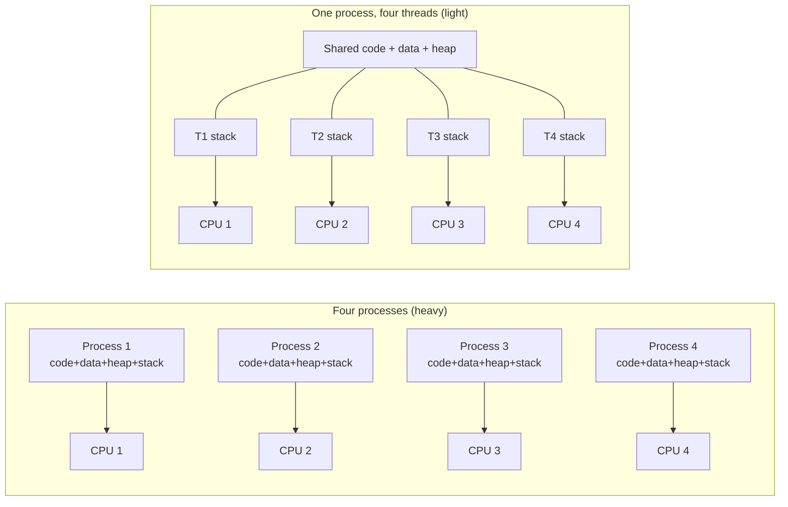
```mermaid
flowchart LR
    subgraph A["Four processes (heavy)"]
        P1["Process 1<br/>code+data+heap+stack"] --> C1["CPU 1"]
        P2["Process 2<br/>code+data+heap+stack"] --> C2["CPU 2"]
        P3["Process 3<br/>code+data+heap+stack"] --> C3["CPU 3"]
        P4["Process 4<br/>code+data+heap+stack"] --> C4["CPU 4"]
    end
    subgraph B["One process, four threads (light)"]
        PR["Shared code + data + heap"] --- T1["T1 stack"] --> D1["CPU 1"]
        PR --- T2["T2 stack"] --> D2["CPU 2"]
        PR --- T3["T3 stack"] --> D3["CPU 3"]
        PR --- T4["T4 stack"] --> D4["CPU 4"]
    end
```

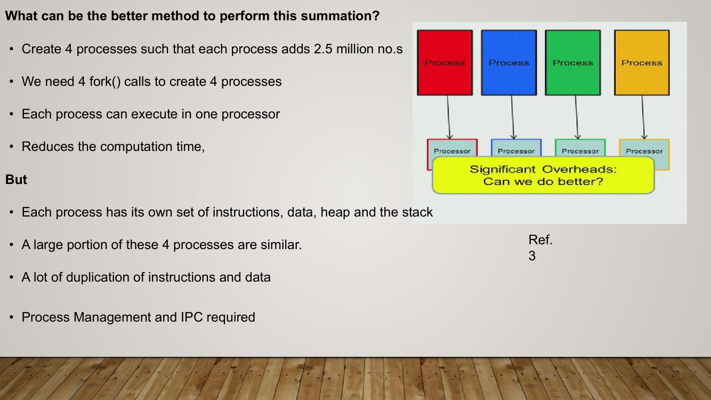

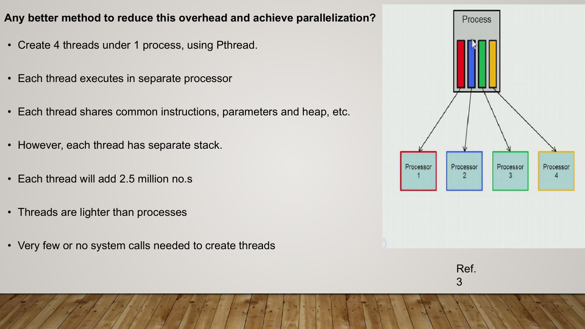

### 2.2 Where threads are used

- Most modern applications are **multithreaded**. Threads run *within* an application.
- Separate tasks inside one application can be given to separate threads:
  - update the display,
  - fetch data,
  - check spelling,
  - answer a network request.
- **Process creation is heavy-weight; thread creation is light-weight.**
- Threads can simplify code and increase efficiency.
- **Kernels are generally multithreaded** as well.

### 2.3 Multithreaded server architecture

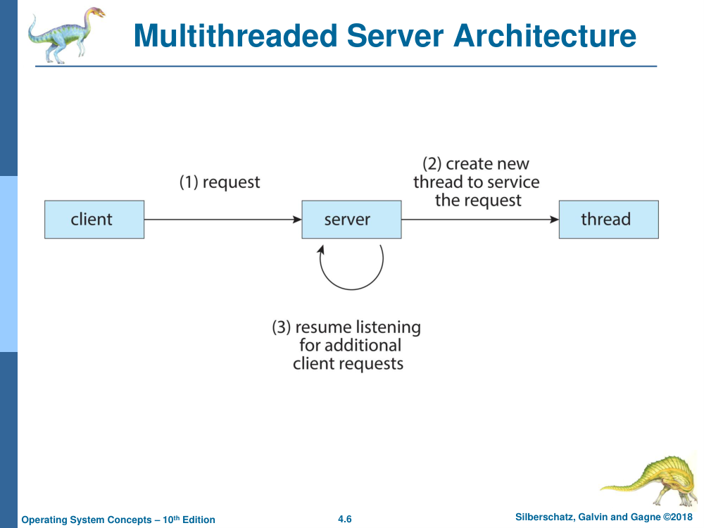

A busy server does not create a new process for each client. Instead:

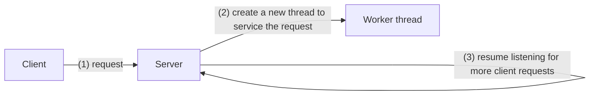
```mermaid
flowchart LR
    C["Client"] -->|"(1) request"| S["Server"]
    S -->|"(2) create a new thread to service the request"| T["Worker thread"]
    S -->|"(3) resume listening for more client requests"| S
```

The server stays responsive because it goes straight back to listening while the worker thread handles the request.

---

## 3. Thread concept

### 3.1 Definition and Thread Control Block

> **Thread:** a separate stream of execution within a single process. It is the basic unit of CPU utilization.

- Threads of one process are **not isolated** from each other (they share memory).
- A thread gives a mechanism to perform multiple tasks **concurrently**.
- The state of a thread is stored in a **Thread Control Block (TCB)**, which holds the registers and stack information.

Every thread has its own:

| Private to each thread | Shared by all threads of the process |
|---|---|
| Thread ID | Code section |
| Program counter | Data section (global variables) |
| Register set | Heap |
| Stack | Open files, signals, other OS resources |

### 3.2 Single-threaded vs multithreaded process

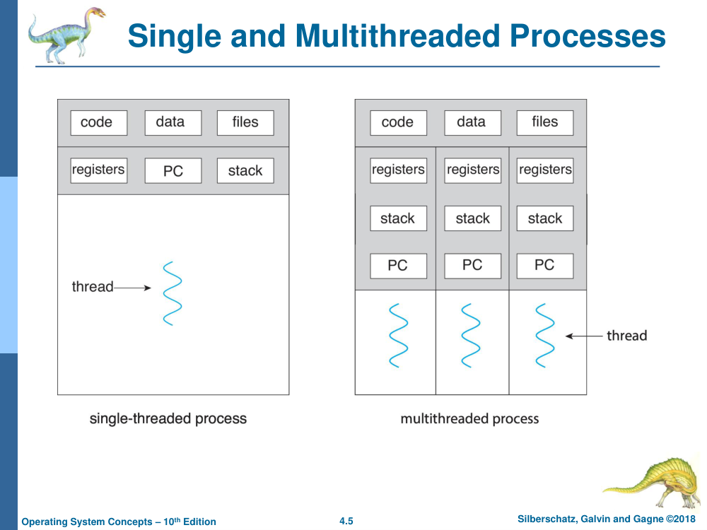

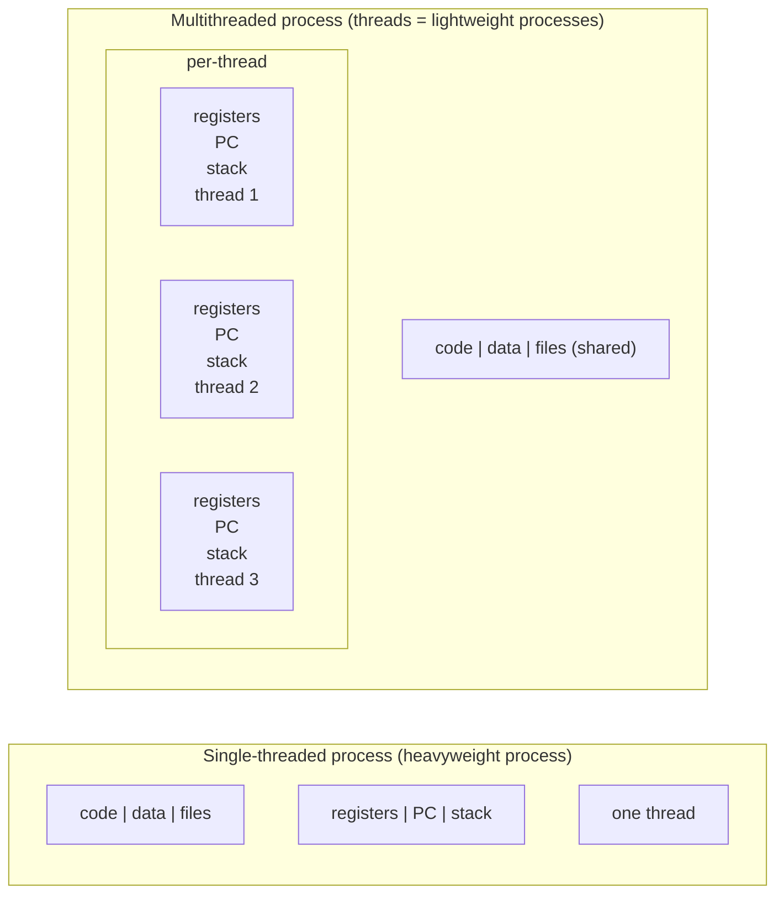
```mermaid
flowchart LR
    subgraph ST["Single-threaded process (heavyweight process)"]
        direction TB
        A1["code | data | files"]
        A2["registers | PC | stack"]
        A3["one thread"]
    end
    subgraph MT["Multithreaded process (threads = lightweight processes)"]
        direction TB
        B1["code | data | files (shared)"]
        subgraph TH["per-thread"]
            direction LR
            X1["registers<br/>PC<br/>stack<br/>thread 1"]
            X2["registers<br/>PC<br/>stack<br/>thread 2"]
            X3["registers<br/>PC<br/>stack<br/>thread 3"]
        end
    end
```

- A traditional process with one thread of control is a **heavyweight process**.
- A thread is often called a **lightweight process (LWP)**.

### 3.3 Threads vs processes

| Thread | Process |
|---|---|
| Has **no** data segment or heap of its own | Has code, heap, stack, and other segments |
| Cannot live on its own; must be attached to a process | Has **at least one** thread |
| There can be more than one thread in a process; each has its own stack | Threads within a process share the same code and files |
| If a thread dies, its stack is reclaimed | If a process dies, **all** its threads die |
| Cheap to create and switch | Expensive to create and switch |
| No isolation from sibling threads | Isolated from other processes |

### 3.4 Merits of threads

- Threads can be **created and destroyed quickly** compared with processes.
- Applications can use threads to run some functions **in the background**.
- Threads **share the same address space**.
- **Switching between threads takes less time** because the state record is smaller.

### 3.5 Thread scheduling and thread states

- Threads are scheduled on the CPU **independently**.
- The state of each executing thread is maintained **separately**.
- If a process is **suspended**, all its threads are suspended.
- If a process is **terminated**, all its threads are terminated.
- A thread has states just like a process: **ready, running, waiting/blocked**.

---

## 4. Benefits and multicore programming

### 4.1 Four benefits

| Benefit | Meaning |
|---|---|
| **Responsiveness** | Execution may continue even if part of the process is blocked. Very important for user interfaces. |
| **Resource sharing** | Threads share the resources of their process. This is easier than shared memory or message passing between processes. |
| **Economy** | Thread creation is cheaper than process creation, and thread switching has lower overhead than a full context switch. |
| **Scalability** | A multithreaded process can take advantage of **multicore** architectures. |

> **Memory aid:** **R-R-E-S** — Responsiveness, Resource sharing, Economy, Scalability.

### 4.2 Multicore challenges

Multicore and multiprocessor systems put pressure on programmers. The five challenges are:

1. **Dividing activities** — finding parts of the application that can run as separate tasks.
2. **Balance** — making sure the tasks do work of roughly equal value.
3. **Data splitting** — dividing the data among the tasks.
4. **Data dependency** — synchronizing tasks when one depends on data from another.
5. **Testing and debugging** — many execution paths make this much harder.

### 4.3 Concurrency vs parallelism

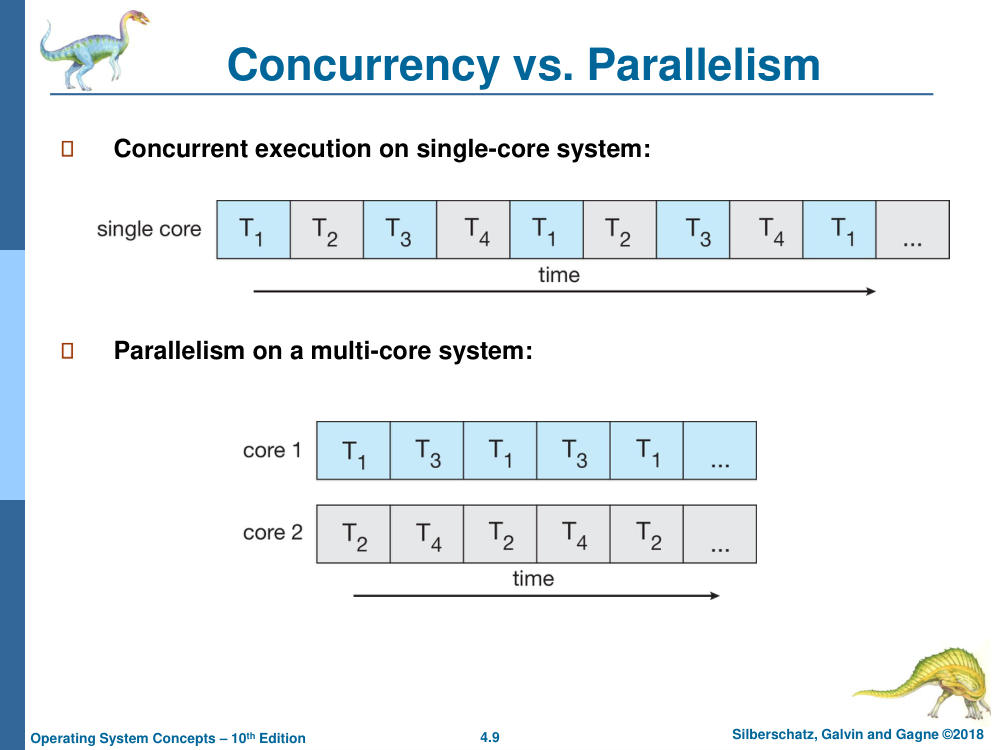

| Concurrency | Parallelism |
|---|---|
| Supports **more than one task making progress** | The system can perform more than one task **simultaneously** |
| Possible on a **single core**: the scheduler interleaves the tasks | Needs **multiple cores** |
| Tasks take turns | Tasks truly run at the same instant |

```text
Concurrent execution on a single core (interleaving):
single core:  T1  T2  T3  T4  T1  T2  T3  T4  T1 ...          → time

Parallel execution on a multicore system:
core 1:       T1  T3  T1  T3  T1 ...
core 2:       T2  T4  T2  T4  T2 ...                          → time
```

> **Exam line:** it is possible to have concurrency without parallelism. Parallelism always implies concurrency.

### 4.4 Data vs task parallelism

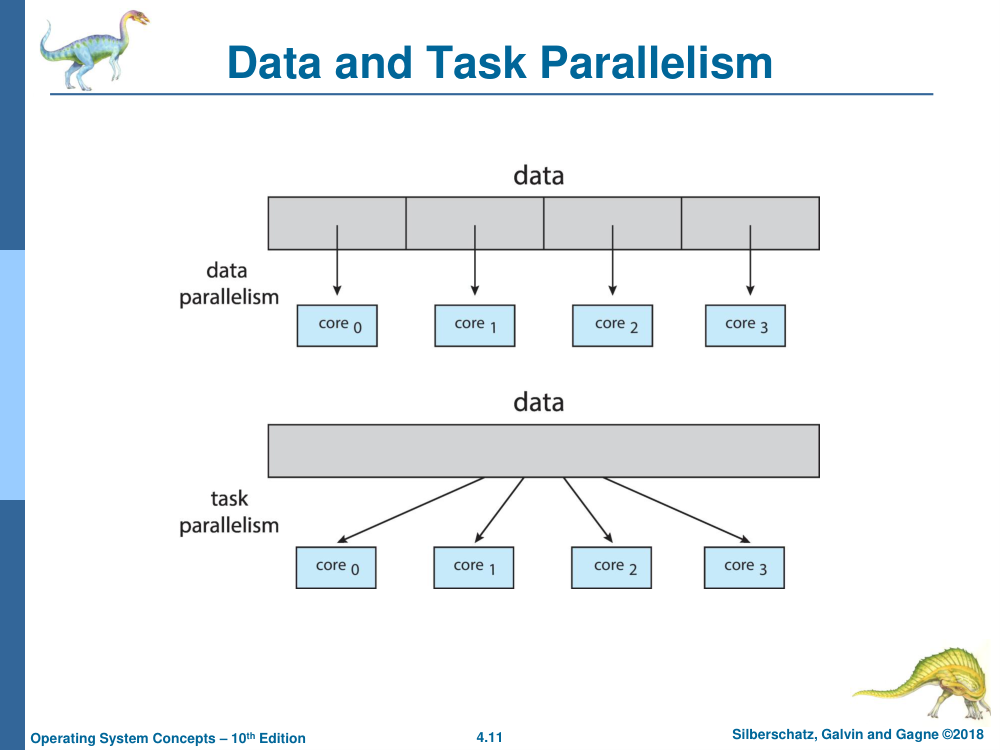

| Type | Idea | Example |
|---|---|---|
| **Data parallelism** | Distribute **subsets of the same data** across cores and perform the **same operation** on each | Summing an array: core 0 sums elements `0..N/2-1`, core 1 sums the rest |
| **Task parallelism** | Distribute **threads (tasks)** across cores, each thread doing a **unique operation** | One thread computes the mean while another computes the standard deviation |

### 4.5 Amdahl's Law

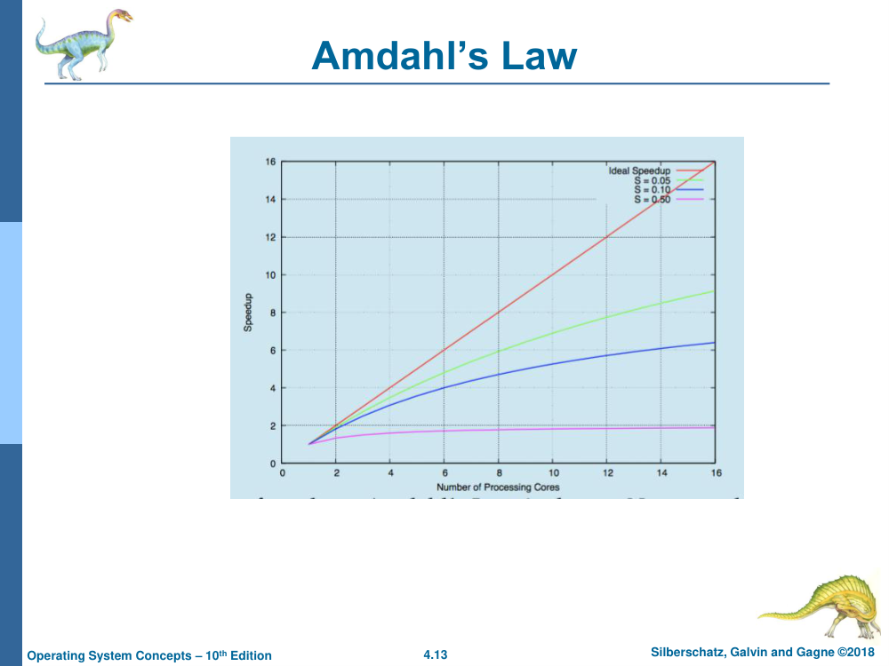

Amdahl's Law identifies the performance gain from adding cores to an application that has both **serial** and **parallel** parts.

Let `S` = serial portion and `N` = number of processing cores:

```text
                      1
speedup  ≤  ─────────────────────
              S  +  (1 − S) / N
```

- **Example from the slides:** application is 75% parallel and 25% serial (`S = 0.25`). Moving from 1 to 2 cores gives
  `1 / (0.25 + 0.75/2) = 1 / 0.625 = 1.6` times speedup.
- As `N → ∞`, speedup approaches **`1 / S`**. With `S = 0.25` the best possible speedup is 4, however many cores are added.
- The **serial portion has a disproportionate effect** on the gain from extra cores.
- Open question raised in the slides: does the law take contemporary multicore systems into account?

---

## 5. User-level and kernel-level threads

> **Note from the lecture:** this section is about threads of *user processes*. Both ULTs and KLTs execute user code in user mode. The OS may have its own internal threads too, but that is a different topic.

### 5.1 User threads

- Management is done by a **user-level threads library**; the application handles them.
- The **kernel is not aware** of these threads.
- Three primary thread libraries: **POSIX Pthreads**, **Windows threads**, **Java threads**.

### 5.2 Kernel threads

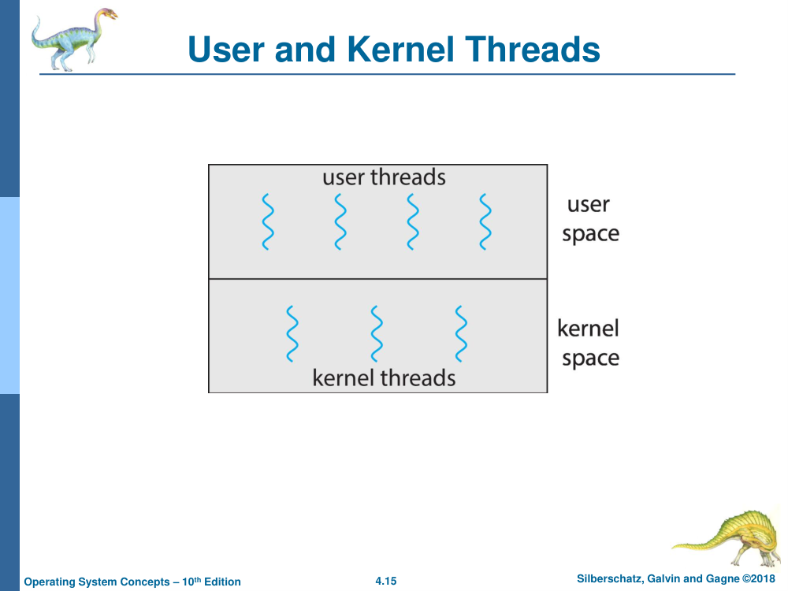

- Created, supported, and managed by the **kernel**.
- Also called **lightweight processes**.
- Virtually all general-purpose operating systems support them: **Windows, Linux, Mac OS X, iOS, Android**.

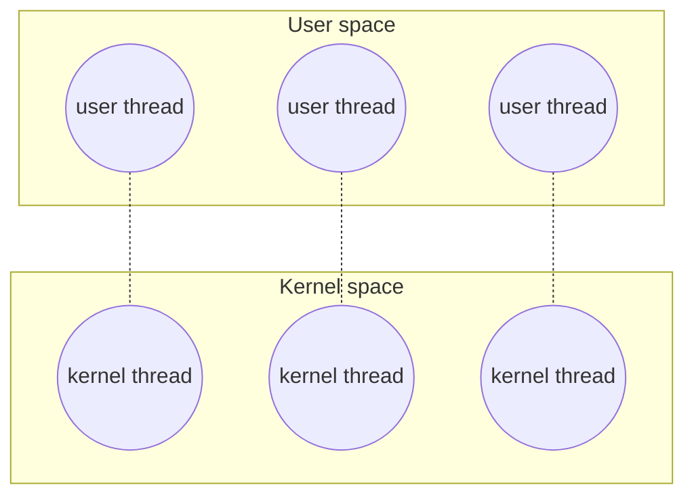
```mermaid
flowchart TB
    subgraph US["User space"]
        U1(("user thread")) 
        U2(("user thread"))
        U3(("user thread"))
    end
    subgraph KS["Kernel space"]
        K1(("kernel thread"))
        K2(("kernel thread"))
        K3(("kernel thread"))
    end
    U1 -.- K1
    U2 -.- K2
    U3 -.- K3
```

### 5.3 ULT states vs process states

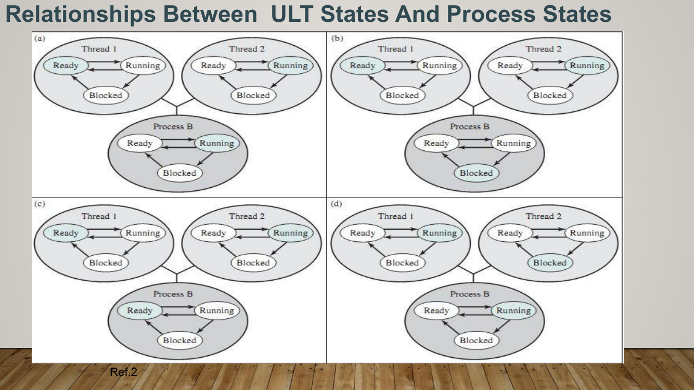

With pure user-level threads the kernel schedules the **process**, while the library schedules the **threads**. So a thread's state and its process's state can look inconsistent. The lecture (from Stallings) shows process B with two threads:

| Case | Thread 1 | Thread 2 | Process B | What happened |
|---|---|---|---|---|
| (a) | Ready | **Running** | **Running** | Normal starting point: thread 2 is running inside running process B |
| (b) | Ready | Running (as the library sees it) | **Blocked** | Thread 2 made a blocking system call (for example I/O). The kernel blocks the whole process. The library still records thread 2 as "running" although it is not actually executing. |
| (c) | Ready | Running (as the library sees it) | **Ready** | A clock interrupt: process B used up its time slice and is moved to Ready. Thread 2 is still "running" in the library's view. |
| (d) | **Running** | **Blocked** | **Running** | Thread 2 needs something from thread 1, so the library blocks thread 2 and runs thread 1. The process itself keeps running; the kernel sees no change. |

> **Key point:** with ULTs, a thread marked *Running* is only really executing when its process is also *Running*.

### 5.4 Merits and demerits of ULT, jacketing

**Merits (+)**

- Can be implemented on an OS that **does not support threading**.
- **Fast creation and switching.**
- **No system call** (no mode switch) is needed for thread management.

**Demerits (−)**

- A process with many threads still competes as **one unit** with a single-threaded process.
- Scheduling decisions cannot favour processes that have a larger number of threads.
- If one thread makes a **blocking system call, all the other threads are blocked** too.

> **Jacketing** is the solution to the blocking problem. A jacket routine **converts a blocking system call into a non-blocking system call**. The thread library checks first whether the call would block; if so, it runs another thread and retries later.

### 5.5 Merits and demerits of KLT

**Merits (+)**

- The **thread table is stored in kernel space**, so the kernel knows how many threads each process has.
- The OS can give **more time quantum** to a process with a large number of threads.
- Better for applications that **block frequently**.
- One thread making a system call **does not block the others**.

**Demerits (−)**

- **Slow.**
- **Larger overhead** because management is done in the kernel.
- Transferring control from one thread to another within the same process requires a **mode switch to the kernel**.

### 5.6 Comparison table

| Aspect | User-Level Threads (ULT) | Kernel-Level Threads (KLT) |
|---|---|---|
| Managed by | Thread library in user space | Kernel |
| Kernel awareness | Kernel is unaware | Kernel knows every thread (thread table in kernel) |
| Creation and switching | Fast; no system call | Slow; needs a mode switch |
| Blocking system call | Blocks the whole process | Blocks only that thread |
| Multiprocessor use | Threads of one process cannot run in parallel | Threads can run on different CPUs |
| Scheduling | Process is the unit; cannot favour many-thread processes | Kernel can give more CPU time to many-thread processes |
| OS support needed | None; works even if OS has no threads | OS must support threads |
| Fix for main weakness | Jacketing | — |

---

## 6. Multithreading models

A multithreading model describes how **user threads are mapped to kernel threads**.

### 6.1 Many-to-One

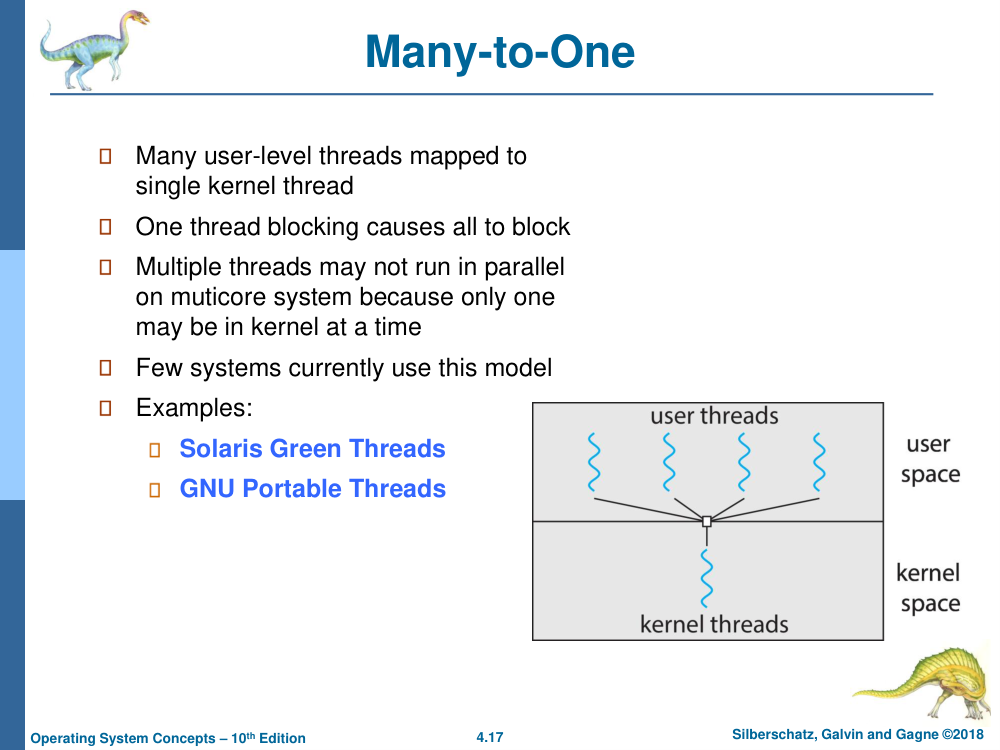

Many user-level threads are mapped to a **single** kernel thread.

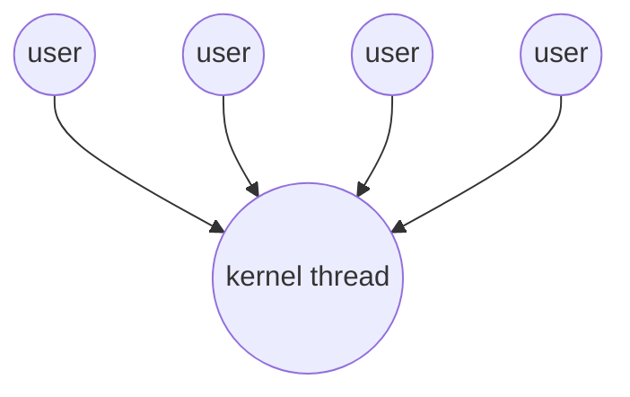
```mermaid
flowchart TB
    U1(("user")) --> K(("kernel thread"))
    U2(("user")) --> K
    U3(("user")) --> K
    U4(("user")) --> K
```

- **One thread blocking causes all to block.**
- Multiple threads **may not run in parallel** on a multicore system because only one may be in the kernel at a time.
- **Few systems currently use this model.**
- Examples: **Solaris Green Threads**, **GNU Portable Threads**.

### 6.2 One-to-One

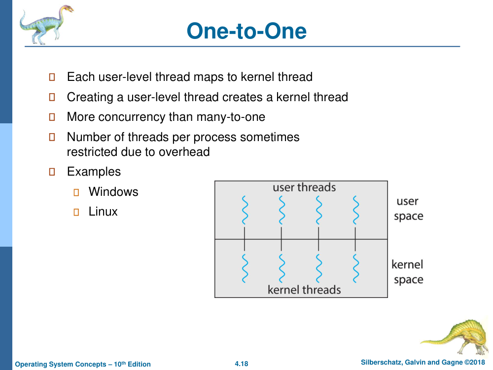

Each user-level thread maps to **one** kernel thread.

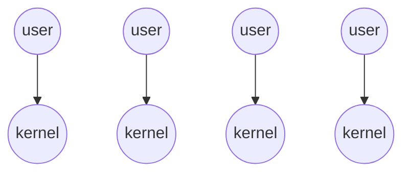
```mermaid
flowchart TB
    U1(("user")) --> K1(("kernel"))
    U2(("user")) --> K2(("kernel"))
    U3(("user")) --> K3(("kernel"))
    U4(("user")) --> K4(("kernel"))
```

- Creating a user-level thread **creates a kernel thread**.
- **More concurrency** than many-to-one.
- The number of threads per process is sometimes **restricted due to overhead**.
- Examples: **Windows** (NT/XP/2000), **Linux**.

### 6.3 Many-to-Many

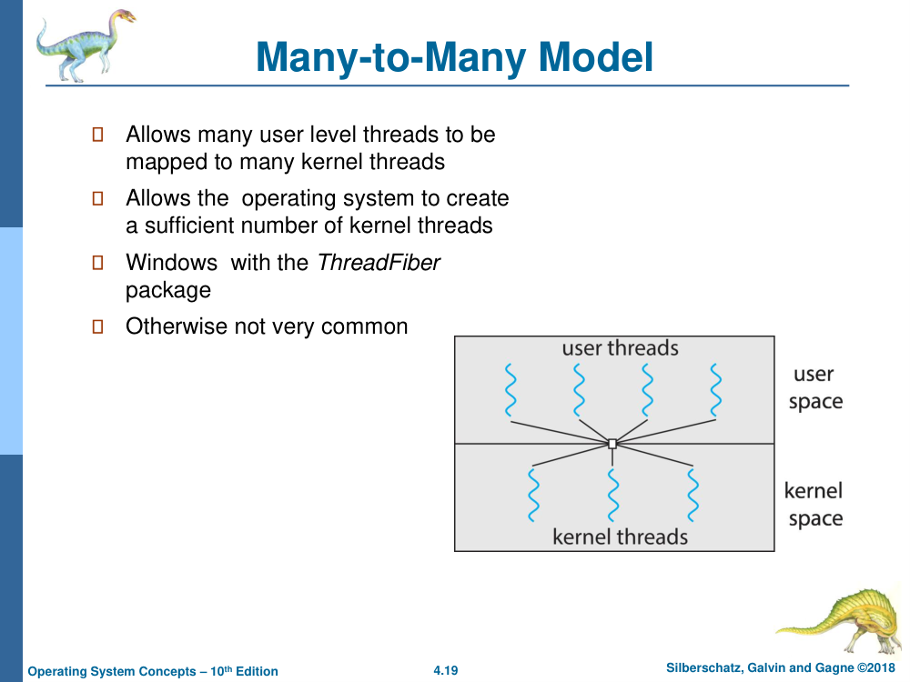

Many user-level threads are mapped to **many** kernel threads.

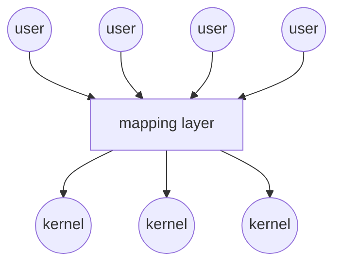
```mermaid
flowchart TB
    U1(("user")) --> M["mapping layer"]
    U2(("user")) --> M
    U3(("user")) --> M
    U4(("user")) --> M
    M --> K1(("kernel"))
    M --> K2(("kernel"))
    M --> K3(("kernel"))
```

- Allows the operating system to **create a sufficient number of kernel threads**.
- Example: **Windows NT/2000 with the ThreadFiber package**.
- Otherwise **not very common**.

### 6.4 Two-level model

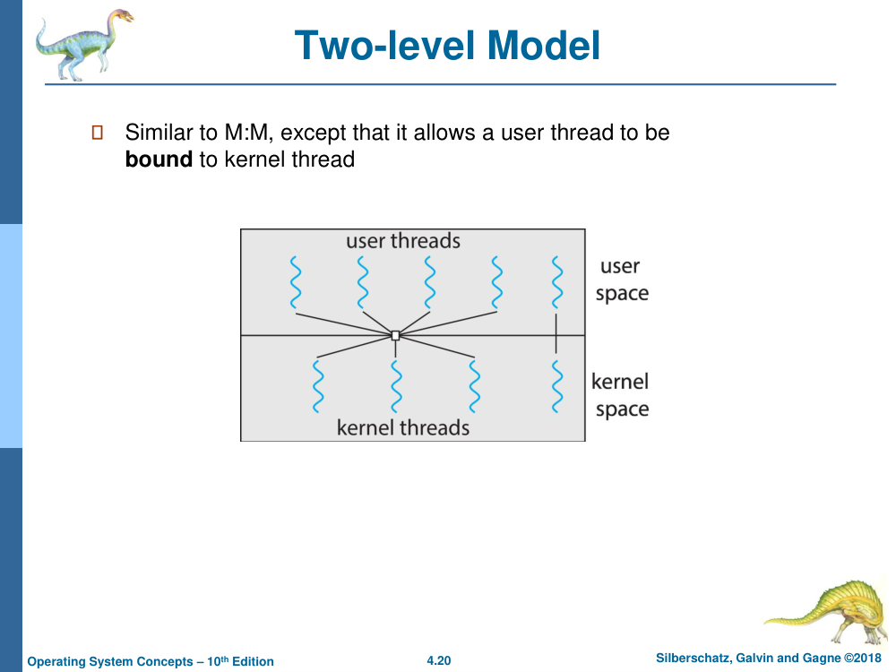

Similar to many-to-many, **except that it also allows a user thread to be bound to a kernel thread**. Important threads get a dedicated kernel thread while the rest are multiplexed.

### 6.5 Comparison

| Model | Mapping | Blocking call | Parallel on multicore? | Cost | Examples |
|---|---|---|---|---|---|
| **Many-to-One** | N user : 1 kernel | Blocks all threads | No | Lowest | Solaris Green Threads, GNU Portable Threads |
| **One-to-One** | 1 user : 1 kernel | Blocks only that thread | Yes | High; thread count may be limited | Windows, Linux |
| **Many-to-Many** | N user : M kernel | Kernel schedules another thread | Yes | Moderate | Windows with ThreadFiber |
| **Two-level** | M:M plus bound threads | Same as M:M | Yes | Moderate | — |

---

## 7. Thread libraries

### 7.1 Overview

A **thread library** gives the programmer an **API for creating and managing threads**. There are two primary ways of implementing one:

1. the library is **entirely in user space** (calling it is a local function call);
2. a **kernel-level library** supported by the OS (calling it results in a system call).

Three main libraries: **POSIX Pthreads**, **Windows (Win32)**, **Java**.

### 7.2 Pthreads API and example

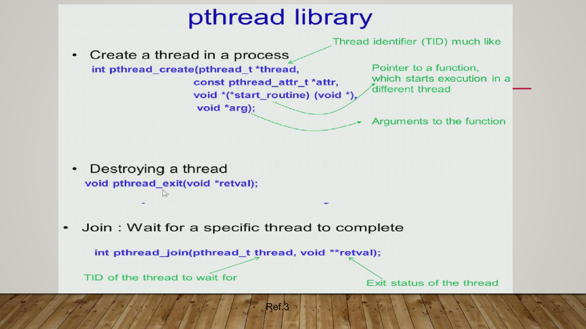

- May be provided either as **user-level or kernel-level**.
- A **POSIX standard (IEEE 1003.1c)** API for thread creation and synchronization.
- It is a **specification, not an implementation**: the API says how the library must behave; how it is built is up to the library developers.
- Common in UNIX operating systems (**Linux and Mac OS X**).
- Programs must include `<pthread.h>` and be compiled/linked with **`-pthread`** or **`-lpthread`**.

| Function | Purpose |
|---|---|
| `pthread_t pthread_self()` | Returns the ID of the current (calling) thread |
| `int pthread_create(pthread_t *thread, const pthread_attr_t *attr, void *(*start_routine)(void *), void *arg)` | Creates a thread. `thread` receives the thread identifier (TID), `attr` gives attributes, `start_routine` is the function that starts executing in the new thread, `arg` is its argument |
| `void pthread_exit(void *retval)` | Destroys (terminates) the calling thread |
| `int pthread_join(pthread_t thread, void **retval)` | Waits for a specific thread to complete. `thread` is the TID to wait for; `retval` receives its exit status |
| `pthread_cancel(tid)` | Requests cancellation of a thread before it has completed |
| `pthread_attr_init(&attr)` | Sets default attributes |

**A thread terminates when any of these happens:**

- it completes its function and returns a value;
- it receives a `pthread_cancel()` request;
- the thread itself initiates termination (`pthread_exit`);
- the process that owns the threads terminates.

**Lecture example — the 4-thread summation (solves the scenario in section 2.1):**

```c
#include <pthread.h>
#include <stdio.h>

unsigned long sum[4];

void *thread_fn(void *arg) {
    long id = (long) arg;
    int start = id * 2500000;      /* each thread handles its own quarter */
    int i = 0;

    while (i < 2500000) {
        sum[id] += (i + start);
        i++;
    }
    return NULL;
}

int main() {
    pthread_t t1, t2, t3, t4;

    pthread_create(&t1, NULL, thread_fn, (void *)0);
    pthread_create(&t2, NULL, thread_fn, (void *)1);
    pthread_create(&t3, NULL, thread_fn, (void *)2);
    pthread_create(&t4, NULL, thread_fn, (void *)3);

    pthread_join(t1, NULL);
    pthread_join(t2, NULL);
    pthread_join(t3, NULL);
    pthread_join(t4, NULL);

    printf("%lu\n", sum[0] + sum[1] + sum[2] + sum[3]);
    return 0;
}
```

Compile and run (you must link the pthread library):

```text
$ gcc threads.c -lpthread
$ ./a.out
```

**Textbook example — one worker thread sums 1..N:**

```c
#include <pthread.h>
#include <stdio.h>
#include <stdlib.h>

int sum;                              /* shared by the threads */
void *runner(void *param);            /* the thread's function */

int main(int argc, char *argv[]) {
    pthread_t tid;                    /* thread identifier */
    pthread_attr_t attr;              /* thread attributes */

    pthread_attr_init(&attr);         /* default attributes */
    pthread_create(&tid, &attr, runner, argv[1]);
    pthread_join(tid, NULL);          /* wait for the thread to exit */
    printf("sum = %d\n", sum);
}

void *runner(void *param) {
    int i, upper = atoi(param);
    sum = 0;
    for (i = 1; i <= upper; i++)
        sum += i;
    pthread_exit(0);
}
```

**Joining 10 threads** — keep the IDs in an array and join in a loop:

```c
#define NUM_THREADS 10
pthread_t workers[NUM_THREADS];

for (int i = 0; i < NUM_THREADS; i++)
    pthread_join(workers[i], NULL);
```

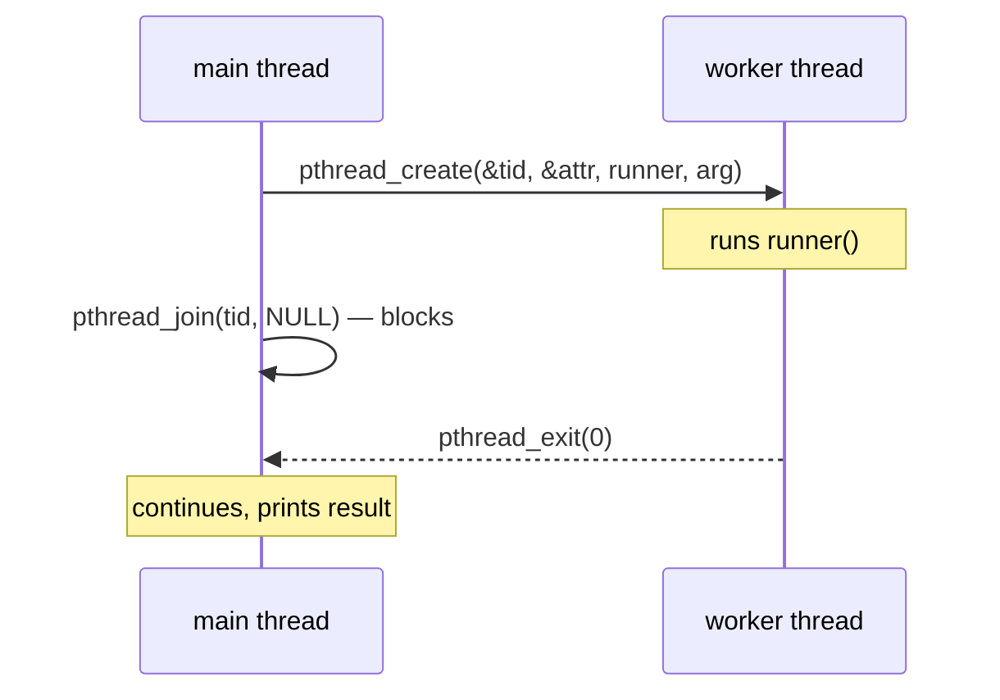
```mermaid
sequenceDiagram
    participant M as main thread
    participant W as worker thread
    M->>W: pthread_create(&tid, &attr, runner, arg)
    Note over W: runs runner()
    M->>M: pthread_join(tid, NULL) — blocks
    W-->>M: pthread_exit(0)
    Note over M: continues, prints result
```

### 7.3 Windows threads program

The same summation written with the Windows API follows the same pattern with different names:

| Step | Windows API |
|---|---|
| Thread function | `DWORD WINAPI Summation(LPVOID Param)` |
| Create a thread | `CreateThread(NULL, 0, Summation, &Param, 0, &ThreadId)` — default security attributes, default stack size, thread function, parameter, default creation flags, returns the thread identifier |
| Wait for it | `WaitForSingleObject(ThreadHandle, INFINITE)` |
| Clean up | `CloseHandle(ThreadHandle)` |

Shared data is a global `DWORD Sum;`. `WaitForSingleObject` plays the role of `pthread_join`.

### 7.4 Java threads

- Java threads are **managed by the JVM**.
- They are typically implemented using the threads model of the **underlying OS**.
- Two ways to create a Java thread:
  1. **extend the `Thread` class**;
  2. **implement the `Runnable` interface** — this is the **standard practice**.

```java
// 1. Implementing Runnable
class Task implements Runnable {
    public void run() {
        System.out.println("I am a thread.");
    }
}

// 2. Creating a thread
Thread worker = new Thread(new Task());
worker.start();          // start() creates the thread and calls run()

// 3. Waiting on a thread
try {
    worker.join();
} catch (InterruptedException ie) { }
```

### 7.5 Java Executor framework

Rather than creating threads explicitly, Java also allows thread creation around the **`Executor`** interface:

```java
public interface Executor {
    void execute(Runnable command);
}

Executor service = new Executor(...);   // obtained from a factory in practice
service.execute(new Task());
```

To **return a result**, a task implements `Callable<T>` and is submitted to an `ExecutorService`; the result is fetched from a `Future`:

```java
class Summation implements Callable<Integer> {
    private int upper;
    public Summation(int upper) { this.upper = upper; }

    public Integer call() {              // like run(), but returns a value
        int sum = 0;
        for (int i = 1; i <= upper; i++) sum += i;
        return new Integer(sum);
    }
}

ExecutorService pool = Executors.newSingleThreadExecutor();
Future<Integer> result = pool.submit(new Summation(upper));
System.out.println("sum = " + result.get());   // get() blocks until done
```

The Executor framework **separates the task from the mechanics of running it**.

---

## 8. Implicit threading

- Growing in popularity because, as the number of threads increases, **program correctness becomes harder with explicit threads**.
- **Creation and management of threads is done by compilers and run-time libraries** rather than by programmers.
- The programmer identifies *tasks*; the system maps them to threads.

Five methods are explored: **Thread Pools, Fork-Join, OpenMP, Grand Central Dispatch, Intel Threading Building Blocks**.

### 8.1 Thread pools

Create a number of threads in a **pool** where they **await work**.

**Advantages**

1. It is usually **slightly faster** to service a request with an existing thread than to create a new one.
2. The number of threads in the application is **bound to the size of the pool**.
3. **Separating the task from the mechanics of creating it** allows different strategies for running the task, for example scheduling tasks to run periodically.

- The **Windows API** supports thread pools: a function such as `DWORD WINAPI PoolFunction(PVOID Param)` is written to run as a separate thread and is handed to the pool.
- **Java thread pools** — three factory methods in the `Executors` class:

| Factory method | Pool created |
|---|---|
| `Executors.newSingleThreadExecutor()` | Pool of size 1 |
| `Executors.newFixedThreadPool(int size)` | Pool with a fixed number of threads |
| `Executors.newCachedThreadPool()` | Unbounded pool that reuses threads |

```java
ExecutorService pool = Executors.newCachedThreadPool();
for (int i = 0; i < numTasks; i++)
    pool.execute(new Task());
pool.shutdown();        // rejects new tasks, finishes existing ones
```

### 8.2 Fork-Join

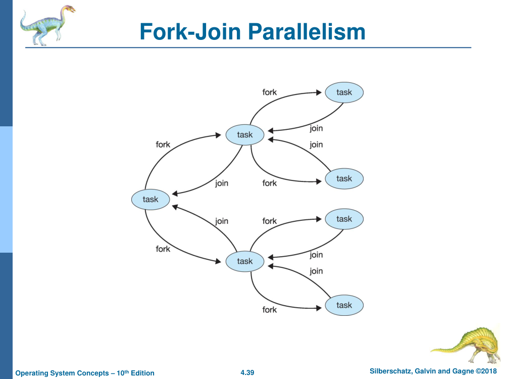

Multiple threads (tasks) are **forked**, and then **joined**. This is a divide-and-conquer strategy.

**General algorithm:**

```text
Task(problem)
    if problem is small enough
        solve the problem directly
    else
        subtask1 = fork(new Task(subset of problem))
        subtask2 = fork(new Task(subset of problem))
        result1 = join(subtask1)
        result2 = join(subtask2)
        return combined results
```

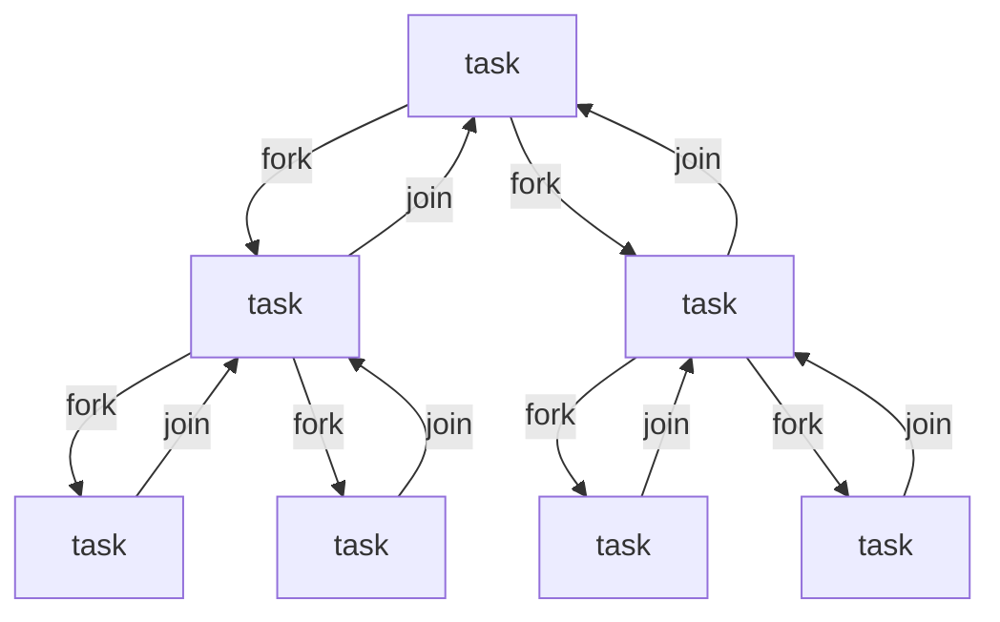
```mermaid
flowchart TB
    T["task"] -->|fork| A["task"]
    T -->|fork| B["task"]
    A -->|fork| A1["task"]
    A -->|fork| A2["task"]
    B -->|fork| B1["task"]
    B -->|fork| B2["task"]
    A1 -->|join| A
    A2 -->|join| A
    B1 -->|join| B
    B2 -->|join| B
    A -->|join| T
    B -->|join| T
```

**Fork-Join in Java**

```java
ForkJoinPool pool = new ForkJoinPool();
int[] array = new int[SIZE];
SumTask task = new SumTask(0, SIZE - 1, array);
int sum = pool.invoke(task);

class SumTask extends RecursiveTask<Integer> {
    static final int THRESHOLD = 1000;
    private int begin, end;
    private int[] array;

    protected Integer compute() {
        if (end - begin < THRESHOLD) {          // small enough: solve directly
            int sum = 0;
            for (int i = begin; i <= end; i++) sum += array[i];
            return sum;
        } else {                                 // split
            int mid = (begin + end) / 2;
            SumTask left  = new SumTask(begin, mid, array);
            SumTask right = new SumTask(mid + 1, end, array);
            left.fork();
            right.fork();
            return right.join() + left.join();
        }
    }
}
```

- **`ForkJoinTask`** is an abstract base class.
- **`RecursiveTask`** and **`RecursiveAction`** extend `ForkJoinTask`.
- `RecursiveTask` **returns a result** (the return value of `compute()`).
- `RecursiveAction` **does not return a result**.

### 8.3 OpenMP

- A set of **compiler directives and an API** for C, C++, and FORTRAN.
- Supports parallel programming in **shared-memory** environments.
- Identifies **parallel regions**: blocks of code that can run in parallel.

```c
#include <omp.h>
#include <stdio.h>

int main() {
    #pragma omp parallel            /* create as many threads as there are cores */
    {
        printf("I am a parallel region.");
    }
    return 0;
}
```

Run a `for` loop in parallel:

```c
#pragma omp parallel for
for (i = 0; i < N; i++) {
    c[i] = a[i] + b[i];
}
```

### 8.4 Grand Central Dispatch

- An **Apple** technology for **macOS and iOS**.
- Extensions to C, C++, and Objective-C, plus an API and a run-time library.
- Allows identification of parallel sections; **manages most of the details of threading**.
- A **block** is written as `^{ }`, for example `^{ printf("I am a block"); }`.
- Blocks are placed in a **dispatch queue**. When a block is removed from the queue it is assigned to an available thread in a **thread pool**.

Two types of dispatch queue:

| Queue type | Behaviour |
|---|---|
| **Serial** | Blocks are removed in **FIFO order**, one at a time. The queue is per process and is called the **main queue**. Programmers can create additional serial queues within a program. |
| **Concurrent** | Blocks are removed in FIFO order, but **several may be removed at a time**. There are four system-wide queues divided by quality of service. |

Quality-of-service classes (as listed on the slide):

- `QOS_CLASS_USER_INTERACTIVE`
- `QOS_CLASS_USER_INITIATED`
- `QOS_CLASS_USER_UTILITY`
- `QOS_CLASS_USER_BACKGROUND`

For **Swift**, a task is defined as a **closure**, which is similar to a block but without the caret. Closures are submitted with `dispatch_async()`:

```swift
let queue = dispatch_get_global_queue(QOS_CLASS_USER_INITIATED, 0)
dispatch_async(queue, { print("I am a closure.") })
```

### 8.5 Intel TBB

**Intel Threading Building Blocks** is a **template library for designing parallel C++ programs**.

```cpp
// serial version of a simple for loop
for (int i = 0; i < n; i++)
    apply(v[i]);

// the same loop written with TBB
parallel_for(size_t(0), n, [=](size_t i) { apply(v[i]); });
```

---

## 9. Threading issues

The slides list these issues: semantics of `fork()` and `exec()`, signal handling (synchronous and asynchronous), thread cancellation (asynchronous or deferred), thread-local storage, scheduler activations, thread pools, thread safety, and thread-specific data.

### 9.1 fork and exec semantics

- **Question:** does `fork()` duplicate **only the calling thread** or **all threads**?
- Some UNIX systems keep **two versions of `fork()`** so that both options are available.
- **`exec()`** usually works as normal: the program given as its parameter **replaces the entire running process, including all threads**.
- **Rule of thumb:** if `exec()` is called immediately after forking, duplicating only the calling thread is enough, because `exec()` will replace everything anyway. If the child does not call `exec()`, all threads should be duplicated.
- The lecture's recommendation for multithreaded processes is to pair `fork()` with `exec()` (the slide words it as "use fork() only after exec()"), since forking a multithreaded process without `exec()` is risky.

### 9.2 Signal handling

> **Signal:** used in UNIX systems to **notify a process that a particular event has occurred**.

A **signal handler** processes signals:

1. A signal is **generated** by a particular event.
2. The signal is **delivered** to a process.
3. The signal is **handled** by one of two handlers: the **default** handler or a **user-defined** handler.

- Every signal has a **default handler** that the kernel runs when handling that signal.
- A **user-defined** signal handler can **override** the default.
- Signals may be **synchronous** (caused by the running code itself, such as an illegal memory access or division by zero) or **asynchronous** (caused by an external event, such as Ctrl+C or a timer expiring).
- For a **single-threaded** process, the signal is simply delivered to the process.

**Where should a signal be delivered in a multithreaded process?** Four options:

1. Deliver the signal to the **thread to which the signal applies**.
2. Deliver the signal to **every thread** in the process.
3. Deliver the signal to **certain threads** in the process.
4. Assign a **specific thread to receive all signals** for the process.

### 9.3 Thread cancellation

> **Thread cancellation:** terminating a thread **before it has finished**. The thread to be cancelled is the **target thread**.

| Approach | Behaviour | Pthreads type |
|---|---|---|
| **Asynchronous cancellation** | Terminates the target thread **immediately** | `PTHREAD_CANCEL_ASYNCHRONOUS` |
| **Deferred cancellation** | The target thread **periodically checks** whether it should be cancelled, and is cancelled when it reaches a **cancellation point** | `PTHREAD_CANCEL_DEFERRED` |

Pthread code to create and cancel a thread:

```c
pthread_t tid;
pthread_create(&tid, 0, worker, NULL);   /* create the thread */
...
pthread_cancel(tid);                     /* request cancellation */
pthread_join(tid, NULL);                 /* wait for it to terminate */
```

Invoking cancellation only **requests** it. Whether the thread is actually cancelled depends on its **state** and **type**:

| Mode | State | Type |
|---|---|---|
| Off | `PTHREAD_CANCEL_DISABLE` — thread cannot be cancelled | — |
| Deferred | `PTHREAD_CANCEL_ENABLE` (default state) | Deferred (default type) |
| Asynchronous | `PTHREAD_CANCEL_ENABLE` | Asynchronous |

- If cancellation is **disabled**, the request **remains pending** until the thread enables it.
- The **default type is deferred**. Cancellation only happens when the thread reaches a cancellation point, for example `pthread_testcancel()`. Then the **cleanup handler** is invoked.
- On **Linux**, thread cancellation is handled through **signals**.

**Thread cancellation in Java:** deferred cancellation uses the **`interrupt()`** method, which sets the interrupted status of a thread. The thread then checks whether it has been interrupted:

```java
Thread worker;
...
worker.interrupt();                 // set the interruption status

// inside the worker
while (!Thread.currentThread().isInterrupted()) {
    ...
}
```

### 9.4 Thread-local storage and thread-specific data

> **Thread-local storage (TLS)** allows **each thread to have its own copy of data**.

- Useful when you **do not control the thread creation process**, for example when using a **thread pool**.
- **Different from local variables:** local variables are visible only during a single function invocation, while TLS is visible **across function invocations**.
- **Similar to `static` data**, except that TLS is **unique to each thread**.

**Thread-specific data** (the lecture's term for the same idea):

- makes existing functions **thread-safe**;
- may be slightly **less efficient** than being reentrant;
- allows each thread to have its **own copy** of data;
- provides **per-thread storage** for a function.

### 9.5 Thread safety

> A function is **thread-safe** when it can be called by **multiple threads at the same time without creating any disruption**.

Example of a function that is **not** thread-safe:

```c
static int glob = 0;

static void Incr(int loops) {
    int loc, j;
    for (j = 0; j < loops; j++) {
        loc = glob;      /* read shared value   */
        loc++;           /* modify local copy   */
        glob = loc;      /* write back          */
    }
}
```

It is unsafe because it **uses global or static values that are shared by all threads**. Two threads can read the same `glob`, both add one, and one update is lost.

**How to ensure thread safety**

1. **Serialize the function:** keep the critical section of the code **locked** so that only one thread accesses it at a time.
2. Use only **thread-safe system functions**.
3. **Avoid global and static variables.**

### 9.6 Scheduler activations and LWP

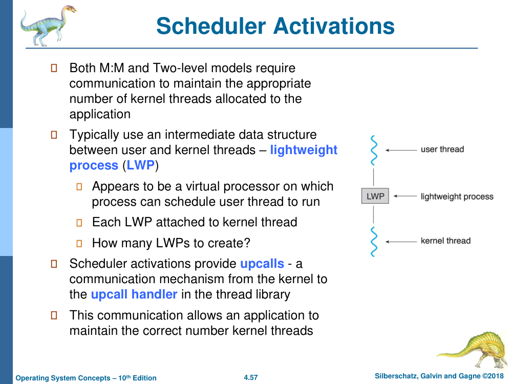

- Both the **M:M** and **Two-level** models require communication between the kernel and the thread library to keep an **appropriate number of kernel threads** allocated to the application.
- They typically use an intermediate data structure between user and kernel threads: the **lightweight process (LWP)**.
  - To the user-thread library, an LWP appears to be a **virtual processor** on which the process can schedule a user thread to run.
  - **Each LWP is attached to a kernel thread.**
  - Design question: **how many LWPs should be created?**
- **Scheduler activations** provide **upcalls**: a communication mechanism **from the kernel to the upcall handler in the thread library**.
- This communication lets an application **maintain the correct number of kernel threads**.

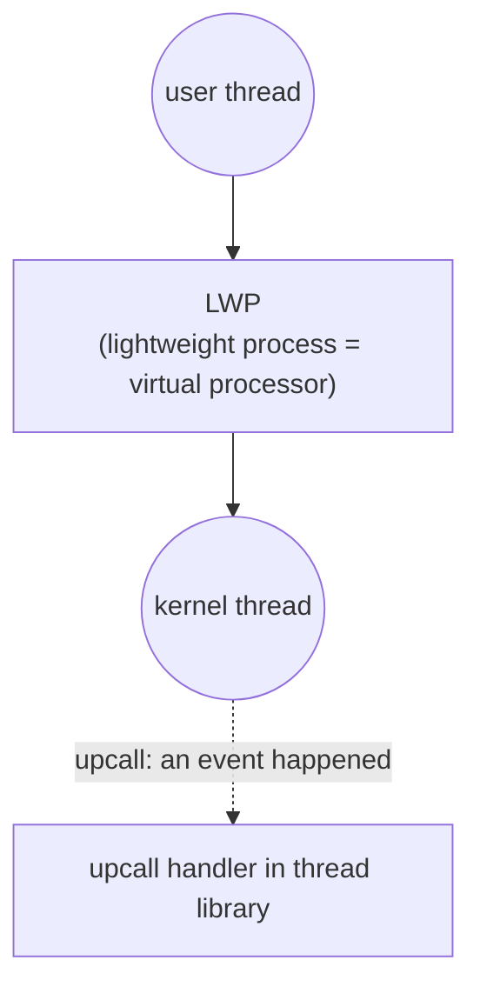
```mermaid
flowchart TB
    UT(("user thread")) --> LWP["LWP<br/>(lightweight process = virtual processor)"]
    LWP --> KT(("kernel thread"))
    KT -. "upcall: an event happened" .-> LIB["upcall handler in thread library"]
```

### 9.7 Pros and cons of multithreading

| Advantages | Disadvantages |
|---|---|
| Easy to share resources | Threads compete for memory |
| Faster to create | Thread safety must be ensured |
| | An error in one thread can disrupt the others, because resources are shared |

**Considerations for future design:** handling signals is tricky, and all threads must run the same program.

---

## 10. Operating-system examples: Windows and Linux threads

### 10.1 Windows threads

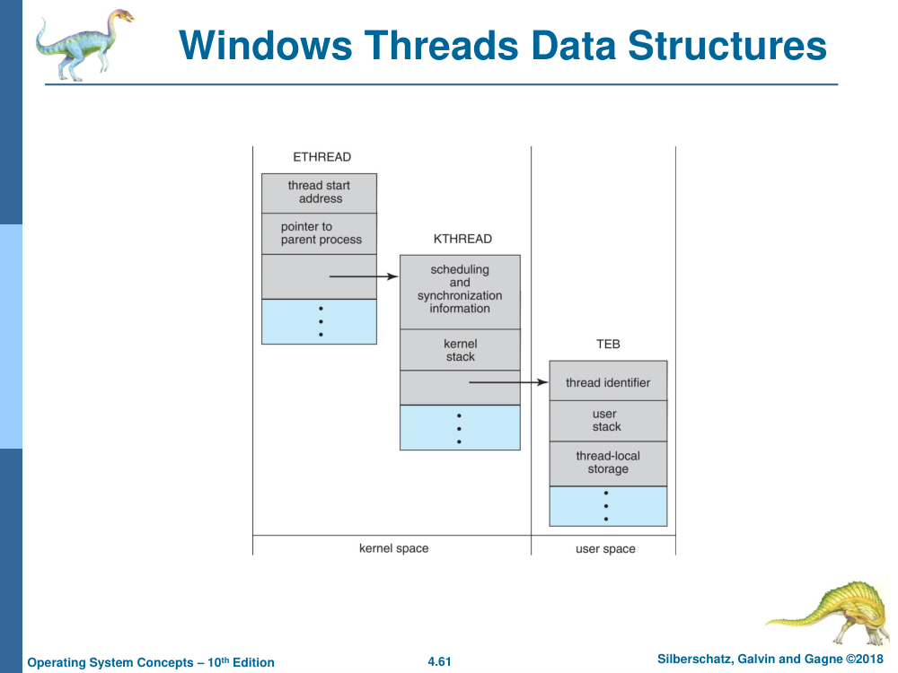

- The **Windows API** is the primary API for Windows applications.
- It implements the **one-to-one** mapping, at kernel level.
- Each thread contains:
  - a **thread ID**;
  - a **register set** representing the state of the processor;
  - **separate user and kernel stacks**, used when the thread runs in user mode or kernel mode;
  - a **private data storage area** used by run-time libraries and dynamic link libraries (DLLs).
- The register set, stacks, and private storage area are known as the **context of the thread**.

Primary data structures of a thread:

| Structure | Full name | Contains | Lives in |
|---|---|---|---|
| **ETHREAD** | Executive thread block | Thread start address, pointer to the parent process, pointer to the KTHREAD | Kernel space |
| **KTHREAD** | Kernel thread block | Scheduling and synchronization information, kernel-mode stack, pointer to the TEB | Kernel space |
| **TEB** | Thread environment block | Thread identifier, user-mode stack, thread-local storage | User space |

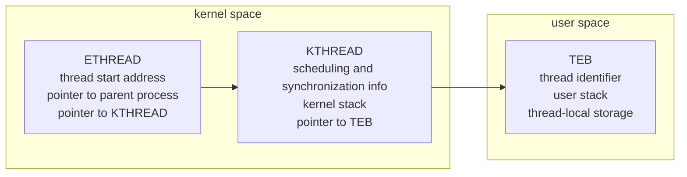
```mermaid
flowchart LR
    subgraph KSP["kernel space"]
        E["ETHREAD<br/>thread start address<br/>pointer to parent process<br/>pointer to KTHREAD"] --> K["KTHREAD<br/>scheduling and synchronization info<br/>kernel stack<br/>pointer to TEB"]
    end
    subgraph USP["user space"]
        T["TEB<br/>thread identifier<br/>user stack<br/>thread-local storage"]
    end
    K --> T
```

### 10.2 Linux threads

- Linux refers to them as **tasks** rather than threads.
- Thread creation is done through the **`clone()`** system call.
- `clone()` allows a child task to **share the address space** of the parent task (process).
- **Flags control the behaviour:**

| Flag | Meaning |
|---|---|
| `CLONE_FS` | File-system information is shared |
| `CLONE_VM` | The same memory space is shared |
| `CLONE_SIGHAND` | Signal handlers are shared |
| `CLONE_FILES` | The set of open files is shared |

- `struct task_struct` points to the process data structures, which may be **shared or unique**.
- With no sharing flags, `clone()` behaves like `fork()`; with all of them, it behaves like creating a thread.

---

## 11. Scheduling: multilevel feedback queue, multiple processors, threads, and algorithm evaluation

> **Source note:** sections 11.1 to 11.4, 11.6, and 11.7 follow `Week 4.pptx` (CPU Scheduling), with the textbook detail filled in around the slides. **Thread scheduling (11.5)** is in the syllabus but has no slides in that deck, so it is the standard textbook treatment.

### 11.1 Multilevel queue

**Why.** All types of jobs (user programs, applications, registry cleaning, system-health monitoring) compete for a place in a **single ready queue**, although they have very different response-time needs.

> **Multilevel queue (MLQ):** the ready queue is **partitioned into separate queues**, for example **foreground (interactive)** and **background (batch)**.

- A process is **permanently assigned** to one queue (by type, priority, or memory size). **A process cannot move between the queues.**
- Each queue has its **own scheduling algorithm**, for example **foreground: RR**, **background: FCFS**.
- **Scheduling must also be done between the queues.** There are two ways:

| Between-queue scheduling | How it works | Problem |
|---|---|---|
| **Fixed-priority scheduling** | Serve **all** of the foreground queue, then the background queue. A lower queue runs only when every higher queue is empty | **Possibility of starvation** of the lower queues |
| **Time slice** | Each queue gets a certain share of CPU time, which it schedules among its own processes, for example **80% to foreground (RR)** and **20% to background (FCFS)** | No starvation, but the split must be chosen well |

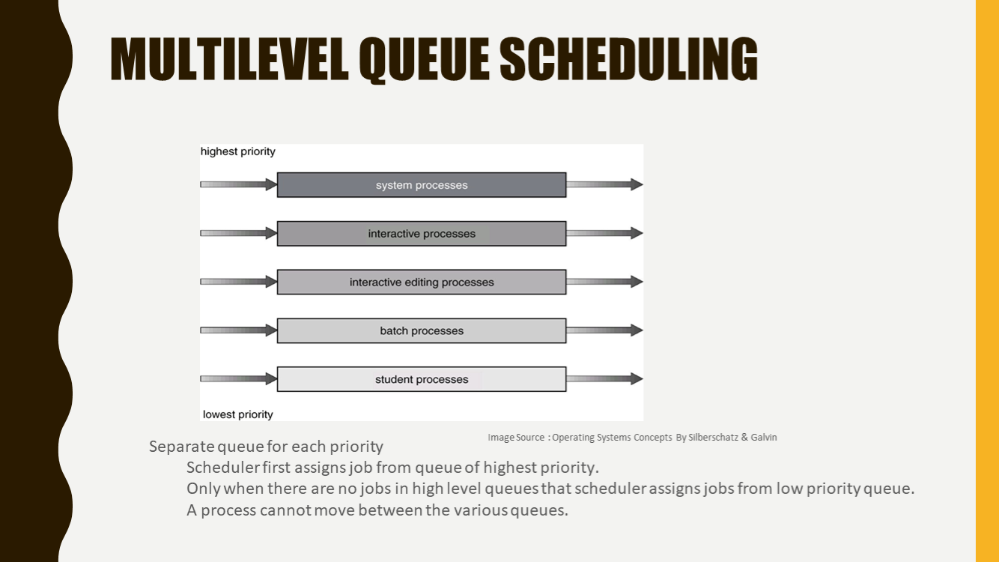

**The five-queue example** (highest to lowest priority): system processes → interactive processes → interactive editing processes → batch processes → student processes.

- There is a **separate queue for each priority**.
- The scheduler first assigns jobs from the **queue of highest priority**.
- Only when there are **no jobs in the higher-level queues** does the scheduler take jobs from a lower-priority queue.
- If an interactive editing process enters its ready queue while a batch process is running, the batch process is **preempted**.

**Advantages and disadvantages**

| Advantages | Disadvantages |
|---|---|
| Different classes of process get an algorithm that suits them | **Inflexible**: a process can never change queue |
| Low scheduling overhead, because queue assignment is fixed | Lower queues can **starve** under fixed priority |

### 11.2 Multilevel feedback queue (MLFQ)

> **Multilevel feedback queue:** a scheduling algorithm in which a process **can move between queues** depending on its CPU-burst behaviour.

**Idea**

- A process that uses **too much CPU time** is **moved down** to a lower-priority queue.
- **I/O-bound and interactive** processes, which have short CPU bursts, stay in the **higher-priority** queues.
- A process that **waits too long** in a lower queue can be **moved up**. This is **aging**, and it prevents starvation.
- The result approximates SJF **without knowing burst lengths in advance**: the scheduler learns from how the process behaves.

**Five parameters define an MLFQ scheduler**

1. the **number of queues**;
2. the **scheduling algorithm for each queue**;
3. the method used to decide when to **upgrade** a process to a higher-priority queue;
4. the method used to decide when to **demote** a process to a lower-priority queue;
5. the method used to decide **which queue a process enters** when it needs service.

**Standard example: three queues**

| Queue | Algorithm | Time quantum | Priority |
|---|---|---|---|
| **Q0** | Round Robin | 8 ms | Highest |
| **Q1** | Round Robin | 16 ms | Middle |
| **Q2** | FCFS | — | Lowest |

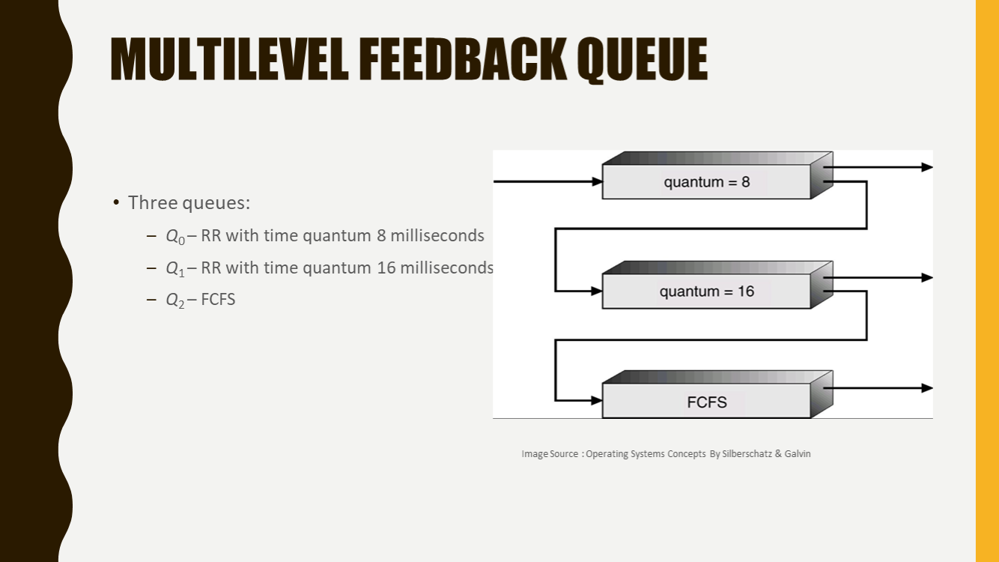

**Rules**

1. A new process enters **Q0**. When it gets the CPU it receives **8 ms**.
2. If it does not finish in 8 ms, it is **moved to the tail of Q1**.
3. In Q1 it receives **16 more ms**. If it still does not finish, it is **preempted and moved to Q2**.
4. Q2 is served **FCFS**, and only when Q0 and Q1 are empty.
5. A process arriving in a higher queue **preempts** a process running from a lower queue.

Within Q0 and within Q1 the processes are taken in **FCFS order**; the quantum only limits how long each one runs before it is demoted. That is why the slides say "Q0 serves the processes as FCFS".

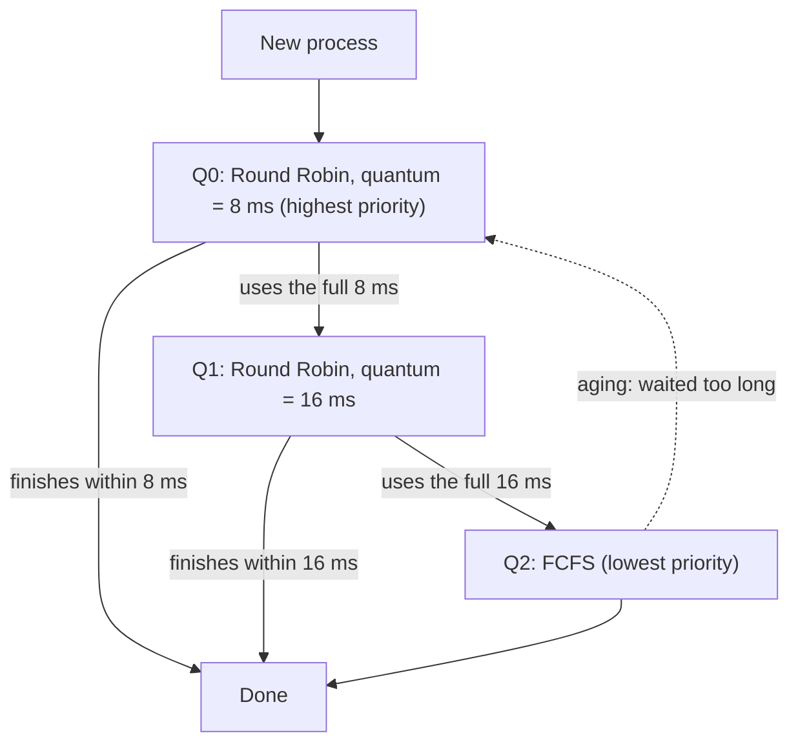
```mermaid
flowchart TB
    N["New process"] --> Q0["Q0: Round Robin, quantum = 8 ms (highest priority)"]
    Q0 -->|"finishes within 8 ms"| D["Done"]
    Q0 -->|"uses the full 8 ms"| Q1["Q1: Round Robin, quantum = 16 ms"]
    Q1 -->|"finishes within 16 ms"| D
    Q1 -->|"uses the full 16 ms"| Q2["Q2: FCFS (lowest priority)"]
    Q2 --> D
    Q2 -. "aging: waited too long" .-> Q0
```

**Worked trace:** a process with a CPU burst of **30 ms** arrives when the system is otherwise idle.

| Queue | Time given | Burst remaining afterwards |
|---|---|---|
| Q0 | 8 ms | 22 ms → demoted to Q1 |
| Q1 | 16 ms | 6 ms → demoted to Q2 |
| Q2 | 6 ms (FCFS) | 0 → finished |

A process with a burst of **5 ms** finishes entirely in Q0. A process with a burst of **20 ms** uses 8 ms in Q0 and finishes its remaining 12 ms in Q1.

**Effect**

- Bursts of **8 ms or less** get the highest priority and finish quickly, so response time is good.
- Bursts between **8 and 24 ms** are also served fairly quickly, at lower priority.
- **Long CPU-bound** processes sink to Q2 and use whatever CPU time is left over.

**Advantages and disadvantages**

| Advantages | Disadvantages |
|---|---|
| Most **general** and flexible scheduling scheme | Most **complex** scheme |
| Favours short and I/O-bound jobs without knowing burst times | Needs good values for all five parameters |
| Aging prevents starvation | Moving processes between queues adds overhead |

**MLQ vs MLFQ**

| Aspect | Multilevel queue (MLQ) | Multilevel feedback queue (MLFQ) |
|---|---|---|
| Queue assignment | Permanent | Changes with behaviour |
| Movement between queues | Not allowed | Allowed (demotion and upgrade) |
| Starvation | Lower queues can starve | Prevented by aging |
| Flexibility | Low | High |
| Complexity and overhead | Lower | Higher |

### 11.3 Multiple-processor scheduling

CPU scheduling is **more complex when multiple CPUs are available**. **Load sharing** becomes possible. The usual assumption is **homogeneous processors** within the multiprocessor (identical in function), so a process taken from the queue can be given to **any processor that is available**.

**Approaches**

| Approach | Description | Advantage | Disadvantage |
|---|---|---|---|
| **Asymmetric multiprocessing (AMP, master-slave)** | One **master** processor acts as the scheduler: it makes all scheduling decisions and handles I/O and system activities. The other (slave) processors execute only user code. | Simple: only one processor touches the system data structures, so less data sharing is needed | The master can become a bottleneck |
| **Symmetric multiprocessing (SMP)** | Each processor is **self-scheduling**. Ready processes are in one **common ready queue**, or each processor has its own **private queue**. | No single bottleneck; better load distribution | Access to shared data structures must be synchronized carefully |

Most modern operating systems (Windows, Linux, macOS) use **SMP**.

**SMP in the slides**

- The processors are **identical in functionality**, with **uniform memory access (UMA)**, and they **share the I/O bus and memory**.
- Scheduling criterion: **self-scheduling**. Each processor selects a process for itself from the ready queue.

| Ready-queue organisation | Meaning |
|---|---|
| **Global ready queue** | One queue shared by all processors; a processor selects a process from the global queue |
| **Local ready queue** | Each processor maintains its own queue |
| **Hybrid** | A process may be either in the global ready queue or in a local ready queue |

| Scheme | Scheduling criterion |
|---|---|
| **Asymmetric (master-slave)** | **One processor acts as the scheduler**; only it accesses the system data structures, which alleviates the need for data sharing |
| **Symmetric** | **Self-scheduling**: each processor selects one process from the ready queue |

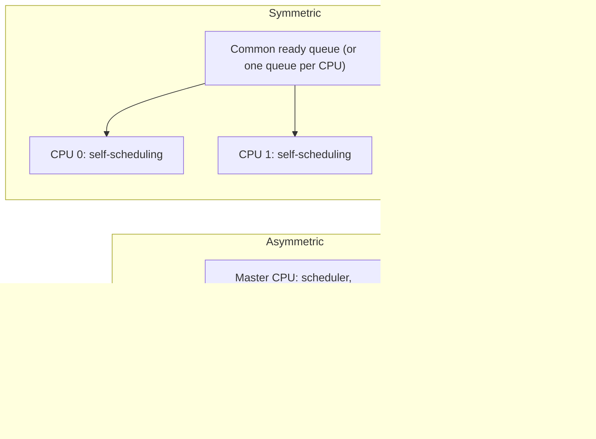
```mermaid
flowchart LR
    subgraph AMP["Asymmetric"]
        M["Master CPU: scheduler, I/O, kernel work"] --> S1["CPU 1: user code"]
        M --> S2["CPU 2: user code"]
    end
    subgraph SMP["Symmetric"]
        RQ["Common ready queue (or one queue per CPU)"] --> C0["CPU 0: self-scheduling"]
        RQ --> C1["CPU 1: self-scheduling"]
        RQ --> C2["CPU 2: self-scheduling"]
    end
```

**Processor affinity**

> **Processor affinity:** a process tends to stay on the processor it is already running on, because that processor's cache already holds its data. Migrating it means the old cache contents are wasted and the new cache must be refilled.

| Type | Meaning |
|---|---|
| **Soft affinity** | The OS *tries* to keep the process on the same processor but does not guarantee it |
| **Hard affinity** | The process is *bound* to a set of processors and will not migrate (for example `sched_setaffinity()` on Linux) |

On **NUMA** (non-uniform memory access) systems, a CPU reaches its local memory faster than memory on another board, so keeping a process near its memory matters even more.

**Load balancing**

Load balancing keeps the workload **evenly distributed** across the processors of an SMP system. It is needed only when each processor has its **own private queue**; with a common queue, an idle processor simply takes the next process.

| Technique | How it works |
|---|---|
| **Push migration** | A periodic task checks the load and **pushes** processes from overloaded to less-busy processors |
| **Pull migration** | An **idle** processor **pulls** a waiting task from a busy processor |

The two are often used together (Linux does both). Load balancing works **against** processor affinity, because moving a process throws away its warm cache.

**Multicore processors**

- A **multicore processor** places several processor cores on **one physical chip**. It is faster and uses less power than several single-core chips.
- **Memory stall:** when a processor accesses memory, it may spend a significant time waiting for the data to become available (for example on a cache miss).
- To use that waiting time, each core is given **two or more hardware threads**. When one thread stalls on memory, the core switches to another. The OS sees each hardware thread as a **logical processor**.

| Multithreading type | When the core switches threads |
|---|---|
| **Coarse-grained** | Only on a long-latency event such as a memory stall; the switch is costly because the pipeline is flushed |
| **Fine-grained (interleaved)** | At a much finer level, typically at instruction-cycle boundaries; the switch is cheap |

So there are **two levels of scheduling**: the OS chooses which software thread runs on each logical CPU, and each core chooses which hardware thread to run.

### 11.4 Real-time scheduling

| Type | Requirement |
|---|---|
| **Hard real-time systems** | Required to complete a critical task within a **guaranteed amount of time**. A late result is a failure |
| **Soft real-time computing** | Requires only that **critical processes receive priority** over less fortunate ones. There is no guarantee of when they will be scheduled |

**Dispatch latency**

> **Dispatch latency:** the time the dispatcher takes to **stop one process and start another**. For real-time work it must be kept very small.

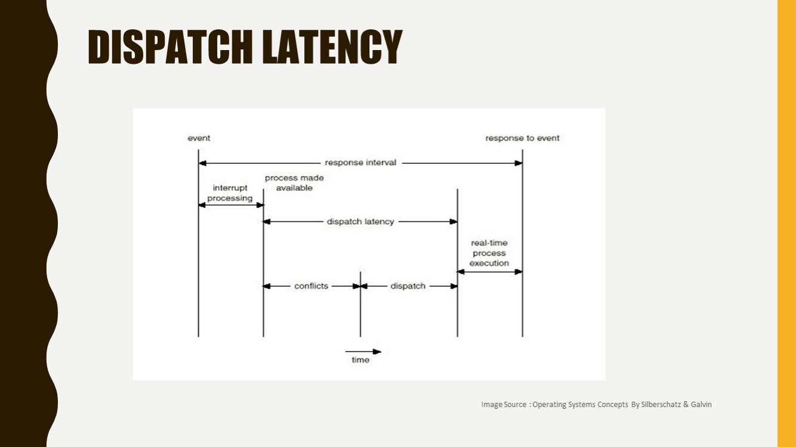

Reading the figure from left to right:

| Interval | Meaning |
|---|---|
| **Interrupt processing** | From the **event** until the real-time process is **made available** (ready) |
| **Dispatch latency** | From the process being made available until it starts running. It has two phases |
| — **Conflict phase** | (1) Preempt any process running in the kernel; (2) low-priority processes release the resources that the high-priority process needs |
| — **Dispatch phase** | Schedule the high-priority process onto an available CPU |
| **Real-time process execution** | The process runs and produces the response |
| **Response interval** | The whole time from the **event** to the **response to the event** |

To keep dispatch latency low, the kernel must be **preemptible** (or have preemption points), so that a real-time process does not have to wait for a long system call to finish.

### 11.5 Thread scheduling

On systems that support threads, it is **kernel-level threads**, not processes, that the OS schedules. User-level threads are managed by the thread library and must be mapped to a kernel thread (often through an LWP) to run on a CPU.

| Aspect | Process-contention scope (PCS) | System-contention scope (SCS) |
|---|---|---|
| Who schedules | The **thread library** | The **kernel** |
| What is scheduled | User-level threads onto an available **LWP** | Kernel threads onto a **physical CPU** |
| Competition | Among threads of the **same process** | Among **all threads in the system** |
| Models | Many-to-one and many-to-many | One-to-one |
| Basis | Priority set by the programmer; the highest-priority runnable thread runs | The kernel's scheduling policy |
| Used by | Systems with many-to-many libraries | Windows, Linux |

**Pthread scheduling API**

| Value | Meaning |
|---|---|
| `PTHREAD_SCOPE_PROCESS` | Schedule the thread using **PCS** |
| `PTHREAD_SCOPE_SYSTEM` | Schedule the thread using **SCS** |

```c
pthread_attr_t attr;
int scope;

pthread_attr_init(&attr);
pthread_attr_getscope(&attr, &scope);                  /* read the current scope */
pthread_attr_setscope(&attr, PTHREAD_SCOPE_SYSTEM);    /* request SCS            */
pthread_create(&tid, &attr, runner, NULL);
```

Linux and macOS allow only `PTHREAD_SCOPE_SYSTEM`.

### 11.6 Algorithm evaluation

How do we choose a CPU-scheduling algorithm for a particular system? First **define the criteria** (for example "maximize CPU utilization while keeping response time under 1 second"), then **evaluate** the candidate algorithms. The slides list three methods (**deterministic modelling, queueing models, simulations**); the textbook adds a fourth, **implementation**.

**1. Deterministic modelling**

A kind of **analytic evaluation**: take a **particular predetermined workload** and compute the performance of each algorithm for that workload. It needs two things fixed in advance: a **predetermined workload** and **predefined criteria**.

Example: five processes arrive at time 0 in the order P1 to P5 with CPU bursts **10, 29, 3, 7, 12 ms**.

| Algorithm | Gantt chart | Waiting times (P1…P5) | Average waiting time |
|---|---|---|---|
| **FCFS** | P1(0–10) P2(10–39) P3(39–42) P4(42–49) P5(49–61) | 0, 10, 39, 42, 49 | 140 / 5 = **28 ms** |
| **SJF** | P3(0–3) P4(3–10) P1(10–20) P5(20–32) P2(32–61) | 10, 32, 0, 3, 20 | 65 / 5 = **13 ms** |
| **RR, q = 10** | P1(0–10) P2(10–20) P3(20–23) P4(23–30) P5(30–40) P2(40–50) P5(50–52) P2(52–61) | 0, 32, 20, 23, 40 | 115 / 5 = **23 ms** |

For this workload SJF gives less than half the average waiting time of FCFS, and RR lies in between.

- **Advantages:** simple and fast; gives **exact numbers** that are easy to compare.
- **Disadvantages:** needs exact input, and the answer applies **only to that workload**.

**2. Queueing models**

- The computer system is described as a **network of servers**, each with a **queue** of waiting processes (the CPU with its ready queue, each I/O device with its device queue). If we define a queue for the CPU and for the various I/O devices, we can test the scheduling algorithms using **queueing theory**.
- Bursts are not fixed; instead we know the **distribution** of CPU and I/O bursts and of **arrival times**. From the **arrival rate** and **service rate** we compute utilization, average queue length, and average waiting time. This is **queueing-network analysis**.

> **Little's formula:** **`n = λ × W`**
> `n` = average queue length, `λ` = average arrival rate, `W` = average waiting time in the queue.

- It holds for **any scheduling algorithm and any arrival distribution** when the system is in a **steady state** (processes leave the queue at the same rate as they arrive).
- Example: if 7 processes arrive every second (`λ = 7`) and there are normally 14 in the queue (`n = 14`), the average wait is `W = n / λ = 2 seconds`.
- **Advantage:** useful for comparing algorithms over a whole class of workloads.
- **Disadvantages:** only a limited class of algorithms and distributions can be handled; the mathematics needs **simplifying assumptions** that may not be realistic, so the results are approximate.

**3. Simulations**

- **Program a model** of the computer system and **run the algorithm on this model**. A variable represents the **clock**; as it advances, the simulator changes the system state. After the simulation, the **statistics are gathered** and the efficiency is computed.
- The input can be generated in three ways:
  - a **random-number generator** following probability distributions;
  - distributions defined mathematically or **measured empirically**;
  - **trace data (trace tapes)**: data collected from **real processes on real machines**.

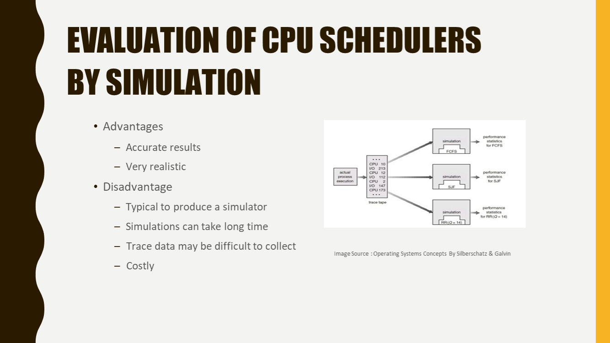

| Advantages | Disadvantages |
|---|---|
| **Accurate results**: more accurate than queueing models | **Difficult to produce** a simulator: designing, coding, and debugging it is a major task |
| **Very realistic**: trace data lets different algorithms be compared on exactly the same real input | Simulations can take a **long time** to run |
| | **Trace data may be difficult to collect** and needs a lot of storage |
| | **Costly** |

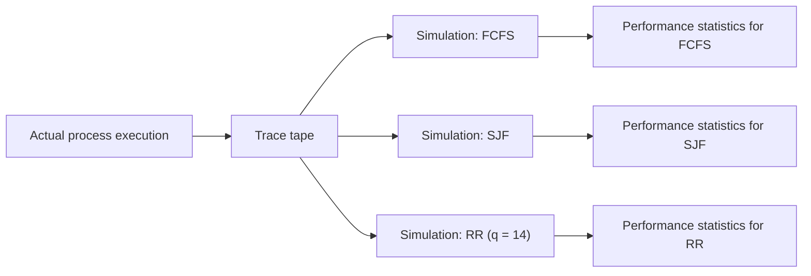
```mermaid
flowchart LR
    A["Actual process execution"] --> T["Trace tape"]
    T --> S1["Simulation: FCFS"] --> R1["Performance statistics for FCFS"]
    T --> S2["Simulation: SJF"] --> R2["Performance statistics for SJF"]
    T --> S3["Simulation: RR (q = 14)"] --> R3["Performance statistics for RR"]
```

**4. Implementation**

- **Code the algorithm, put it in the operating system, and measure** it under real operating conditions.
- **Advantage:** the only **completely accurate** way to evaluate a scheduling algorithm.
- **Disadvantages:** **high cost** (coding, modifying the OS, testing) and **high risk**; the **environment changes**, because users adapt their programs to the scheduler (for example by splitting long jobs so that they look short).
- The most flexible schedulers can be **tuned** by system managers or through APIs that change priorities, but tuning for one situation may hurt performance in others.

**Comparison of the four methods**

| Method | Input | Accuracy | Cost |
|---|---|---|---|
| **Deterministic modelling** | One fixed workload | Exact, but only for that workload | Low |
| **Queueing models** | Arrival and service distributions | Approximate | Low to medium |
| **Simulations** | Random data or trace tapes | High | Medium to high |
| **Implementation** | Real system and real users | Highest | Very high |

### 11.7 Practice problem from the slides (preemptive priority with I/O)

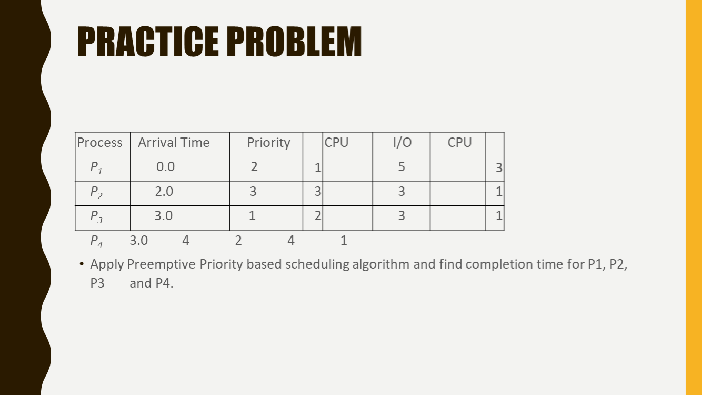

| Process | Arrival time | Priority | CPU burst 1 | I/O | CPU burst 2 |
|---|---|---|---|---|---|
| P1 | 0 | 2 | 1 | 5 | 3 |
| P2 | 2 | 3 | 3 | 3 | 1 |
| P3 | 3 | 1 | 2 | 3 | 1 |
| P4 | 3 | 4 | 2 | 4 | 1 |

**Question.** Apply the **preemptive priority** scheduling algorithm and find the completion time of P1, P2, P3, and P4.

**Assumptions** (the slide does not state them, so write them in your answer):

1. A **smaller number means a higher priority** (the textbook convention), so the order is P3 > P1 > P2 > P4.
2. I/O is done **in parallel**: each process uses its own device and never waits for I/O.
3. A process coming back from I/O rejoins the ready queue at once and **preempts** a lower-priority running process.

**Step-by-step trace**

| Time | Event | CPU runs |
|---|---|---|
| 0–1 | P1 arrives and runs its first burst (1). It then starts I/O, back at **6** | P1 |
| 1–2 | Nothing is ready | idle |
| 2–3 | P2 arrives and runs (3 → 2 left) | P2 |
| 3–5 | P3 and P4 arrive. P3 (priority 1) **preempts P2** and runs its first burst (2). I/O until **8** | P3 |
| 5–6 | Ready: P2, P4. P2 has the higher priority (2 → 1 left) | P2 |
| 6–8 | P1 returns from I/O and **preempts P2**. It runs its second burst (3 → 1 left) | P1 |
| 8–9 | P3 returns from I/O and **preempts P1**. It runs its second burst (1). **P3 completes at 9** | P3 |
| 9–10 | P1 resumes (1 left). **P1 completes at 10** | P1 |
| 10–11 | P2 finishes its first burst (1 left). I/O until **14** | P2 |
| 11–13 | P4 finally runs its first burst (2). I/O until **17** | P4 |
| 13–14 | Everything is in I/O | idle |
| 14–15 | P2 returns and runs its second burst (1). **P2 completes at 15** | P2 |
| 15–17 | P4 is still in I/O | idle |
| 17–18 | P4 returns and runs its second burst (1). **P4 completes at 18** | P4 |

**Gantt chart**

```text
| P1 | idle | P2 |  P3  | P2 |  P1  | P3 | P1 | P2 |  P4   | idle | P2 | idle  | P4 |
0    1      2    3      5    6      8    9    10   11      13     14   15      17   18
```

**Answer**

| Process | Completion time | Turnaround time (completion − arrival) |
|---|---|---|
| P1 | **10** | 10 |
| P2 | **15** | 13 |
| P3 | **9** | 6 |
| P4 | **18** | 15 |

**If your instructor uses "larger number = higher priority"** (P4 > P2 > P1 > P3), the same method gives the CPU order P1(0–1), idle(1–2), P2(2–3), P4(3–5), P2(5–7), P1(7–9), P4(9–10), P2(10–11), P1(11–12), P3(12–14), idle(14–17), P3(17–18), so the completion times are **P1 = 12, P2 = 11, P3 = 18, P4 = 10**.

---

## 12. Background and the race condition

### 12.1 Why synchronization is needed

- Processes can execute **concurrently**.
- A process may be **interrupted at any moment**, even when it has only partly completed its work.
- **Concurrent access to shared data may result in data inconsistency.**
- A **mechanism is required** to maintain data consistency by ensuring the **orderly execution of cooperating processes**.

### 12.2 Producer-consumer with a shared counter

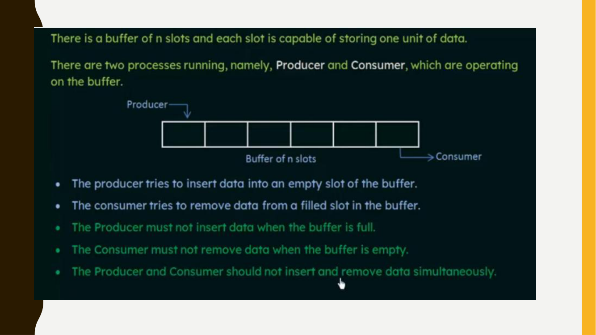

There is a **buffer of n slots**, each slot holding one unit of data. Two processes operate on it: a **Producer** and a **Consumer**.

- The producer tries to insert data into an **empty** slot.
- The consumer tries to remove data from a **filled** slot.
- The producer must **not insert when the buffer is full**.
- The consumer must **not remove when the buffer is empty**.
- The producer and consumer should **not insert and remove simultaneously**.

To use **all** the buffer slots, keep an integer `counter` that tracks the number of full buffers. It starts at 0, is **incremented by the producer** and **decremented by the consumer**.

```c
/* Producer */
while (true) {
    /* produce an item in nextProduced */
    while (counter == BUFFER_SIZE)
        ;                               /* buffer full: do nothing */
    buffer[in] = nextProduced;
    in = (in + 1) % BUFFER_SIZE;
    counter++;
}

/* Consumer */
while (true) {
    while (counter == 0)
        ;                               /* buffer empty: do nothing */
    nextConsumed = buffer[out];
    out = (out + 1) % BUFFER_SIZE;
    counter--;
    /* consume the item in nextConsumed */
}
```

### 12.3 Race condition

`counter++` and `counter--` look like single statements, but each is three machine instructions:

| `counter++` (producer) | `counter--` (consumer) |
|---|---|
| `register1 = counter` (load) | `register2 = counter` (load) |
| `register1 = register1 + 1` (increment) | `register2 = register2 - 1` (decrement) |
| `counter = register1` (store) | `counter = register2` (store) |

Consider this interleaving with `counter = 5` initially:

| Step | Who | Instruction | Result |
|---|---|---|---|
| S0 | producer | `register1 = counter` | register1 = 5 |
| S1 | producer | `register1 = register1 + 1` | register1 = 6 |
| S2 | consumer | `register2 = counter` | register2 = 5 |
| S3 | consumer | `register2 = register2 - 1` | register2 = 4 |
| S4 | producer | `counter = register1` | counter = 6 |
| S5 | consumer | `counter = register2` | **counter = 4** |

One item was produced and one consumed, so the correct value is **5**. The result is **4** (or 6 if S4 and S5 are swapped).

> **Race condition:** several processes access and manipulate the same data concurrently, and the outcome depends on the **particular order** in which the accesses take place.

---

## 13. The critical-section problem

### 13.1 Definition

- Consider a system of `n` processes `{P0, P1, …, Pn-1}`.
- Each process has a segment of code called its **critical section**, in which it may be changing common variables, updating a table, writing a file, and so on.
- **When one process is in its critical section, no other process may be in its critical section.**
- The **critical-section problem** is to design a **protocol** (an algorithm) that the processes can use to cooperate.
- Each process must **ask permission** to enter its critical section.
- The problem is especially challenging with **preemptive kernels**.

### 13.2 General structure

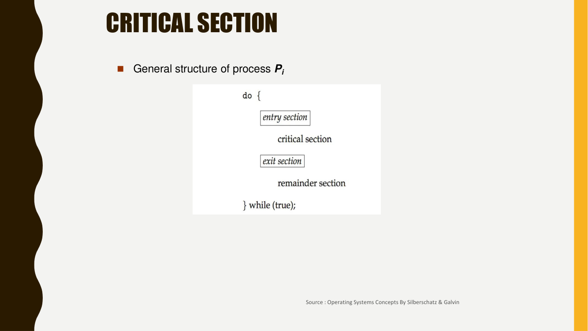

```c
do {
    /* entry section     — ask permission to enter      */
        critical section
    /* exit section      — announce that we have left   */
        remainder section
} while (true);
```

| Section | Role |
|---|---|
| **Entry section** | Code that requests permission to enter |
| **Critical section** | Code that accesses the shared data |
| **Exit section** | Code that releases the permission |
| **Remainder section** | Everything else |

### 13.3 Three requirements

A solution to the critical-section problem must satisfy all three:

1. **Mutual exclusion** — if process `Pi` is executing in its critical section, then **no other process** can be executing in its critical section.
2. **Progress** — if no process is executing in its critical section and some processes wish to enter, then only the processes **not in their remainder sections** can take part in deciding which enters next, and this selection **cannot be postponed indefinitely**.
3. **Bounded waiting** — there is a **bound (limit)** on the number of times other processes may enter their critical sections **after** a process has made a request to enter and **before** that request is granted.

Assumptions: each process executes at a **nonzero speed**; **no assumption** is made about the relative speed of the `n` processes.

> **Memory aid:** **M-P-B** — Mutual exclusion, Progress, Bounded waiting.

### 13.4 Preemptive vs non-preemptive kernels

There are two approaches to critical-section handling in an OS, depending on the kernel:

| Kernel type | Behaviour | Race conditions on kernel data |
|---|---|---|
| **Preemptive** | Allows a process to be preempted while running in kernel mode | Possible; must be designed carefully |
| **Non-preemptive** | A process runs until it exits kernel mode, blocks, or voluntarily yields the CPU | Essentially free of them, since only one process is active in the kernel at a time |

### 13.5 First attempt: the turn variable

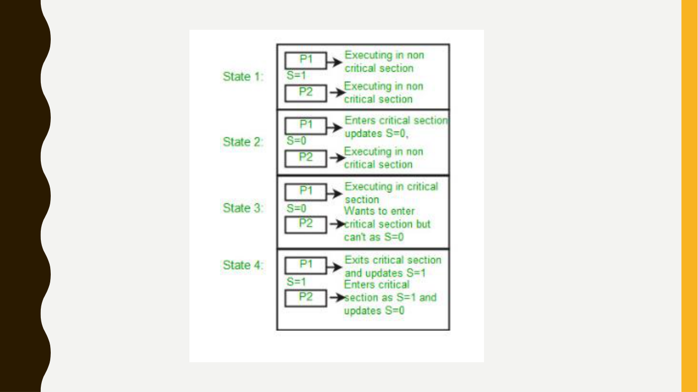

The lecture first shows a simple lock picture using a variable `S` (`S = 1` means free):

| State | P1 | P2 | S |
|---|---|---|---|
| 1 | Executing in non-critical section | Executing in non-critical section | 1 |
| 2 | **Enters** critical section, sets `S = 0` | Executing in non-critical section | 0 |
| 3 | Executing in critical section | Wants to enter but **cannot**, since `S = 0` | 0 |
| 4 | Exits critical section, sets `S = 1` | Enters critical section as `S = 1`, sets `S = 0` | 1 → 0 |

Then a first software algorithm that uses a shared variable `turn`:

```c
/* Algorithm for process Pi (the other process is Pj) */
do {
    while (turn == j)
        ;                       /* wait while it is the other's turn */
        critical section
    turn = j;                   /* hand the turn to the other process */
        remainder section
} while (true);
```

| Requirement | Satisfied? | Why |
|---|---|---|
| Mutual exclusion | Yes | `turn` has only one value at a time |
| Progress | **No** | The processes must **strictly alternate**. If it is `Pj`'s turn and `Pj` is in its remainder section and does not want to enter, `Pi` is stuck even though the critical section is free. |
| Bounded waiting | Yes | The other process can enter at most once before you |

This failure of **progress** is the reason for Peterson's solution.

---

## 14. Peterson's solution

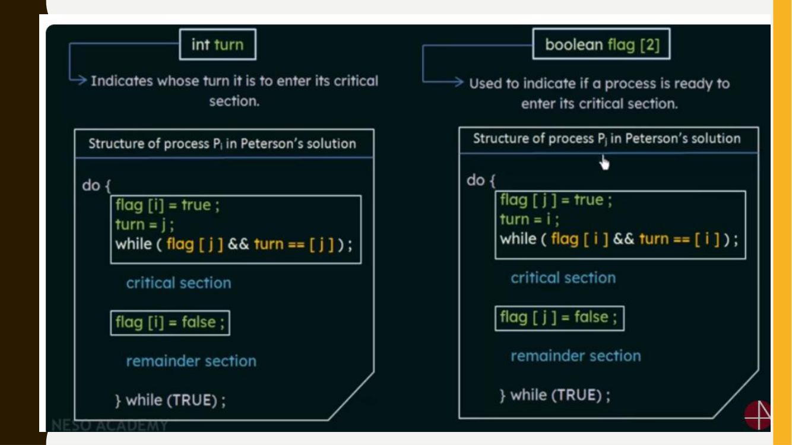

- A classic **software-based** solution to the critical-section problem; a good solution for **two processes**.
- It **may not work correctly on modern computer architectures**, but it gives a good algorithmic description and shows the difficulty of meeting all three requirements.
- It is restricted to **two processes** `Pi` and `Pj` that alternate between their critical and remainder sections.
- **Assumption:** the `load` and `store` machine-language instructions are **atomic** (cannot be interrupted).

The two processes **share two variables**:

| Variable | Meaning |
|---|---|
| `int turn;` | Indicates **whose turn** it is to enter the critical section |
| `boolean flag[2];` | Indicates whether a process is **ready** to enter. `flag[i] = true` means `Pi` is ready. |

```c
/* Process Pi */                         /* Process Pj */
do {                                     do {
    flag[i] = true;                          flag[j] = true;
    turn = j;                                turn = i;
    while (flag[j] && turn == j)             while (flag[i] && turn == i)
        ;                                        ;
        critical section                         critical section
    flag[i] = false;                         flag[j] = false;
        remainder section                        remainder section
} while (true);                          } while (true);
```

**How to read it:** "I am ready (`flag[i] = true`), but you go first if you want (`turn = j`). I wait only while you are ready **and** it is your turn."

**Proof that the three requirements hold**

1. **Mutual exclusion is preserved.** `Pi` enters only if `flag[j] == false` or `turn == i`. If both were inside together, both flags would be true, so `turn` would have to be both `i` and `j` at once, which is impossible.
2. **Progress is satisfied.** `Pi` is stuck only while `flag[j] == true && turn == j`. If `Pj` is not interested, `flag[j]` is false and `Pi` enters straight away.
3. **Bounded waiting is met.** When `Pj` leaves, it sets `flag[j] = false`. If it tries again, it sets `turn = i`, so `Pi` enters after **at most one** entry by `Pj`.

---

## 15. Synchronization hardware

- Many systems provide **hardware support** for implementing critical-section code.
- All these solutions are based on the idea of **locking**: protecting critical regions with locks.

### 15.1 Disabling interrupts

- On a **uniprocessor**, we could **disable interrupts**. The currently running code then executes **without preemption**.
- This is generally **too inefficient on multiprocessor systems**. Operating systems that rely on it are **not broadly scalable**.

### 15.2 Locks

Modern machines provide special **atomic hardware instructions** (**atomic = non-interruptible**) that either

- **test a memory word and set its value**, or
- **swap the contents of two memory words**.

General lock-based solution:

```c
do {
    acquire lock
        critical section
    release lock
        remainder section
} while (TRUE);
```

### 15.3 TestAndSet

```c
boolean TestAndSet(boolean *target) {
    boolean rv = *target;     /* remember the old value */
    *target = TRUE;           /* set the lock            */
    return rv;                /* return the old value    */
}
```

Properties:

1. It is executed **atomically**.
2. It **returns the original value** of the passed parameter.
3. It **sets the new value** of the passed parameter to `TRUE`.

**Solution** — shared boolean `lock`, initialized to `FALSE`:

```c
do {
    while (TestAndSet(&lock))
        ;                     /* do nothing: lock was already TRUE */
        /* critical section */
    lock = FALSE;
        /* remainder section */
} while (TRUE);
```

If `lock` was `FALSE`, `TestAndSet` returns `FALSE` (so the loop ends) and sets `lock` to `TRUE` in the same atomic step. Everyone else sees `TRUE` and keeps spinning.

### 15.4 Swap

```c
void Swap(boolean *a, boolean *b) {
    boolean temp = *a;
    *a = *b;
    *b = temp;
}
```

**Solution** — shared boolean `lock` initialized to `FALSE`; each process has a **local** boolean `key`:

```c
do {
    key = TRUE;
    while (key == TRUE)
        Swap(&lock, &key);    /* key becomes FALSE only when lock was FALSE */
        /* critical section */
    lock = FALSE;
        /* remainder section */
} while (TRUE);
```

### 15.5 compare_and_swap

```c
int compare_and_swap(int *value, int expected, int new_value) {
    int temp = *value;
    if (*value == expected)
        *value = new_value;
    return temp;
}
```

Properties:

1. It is executed **atomically**.
2. It **returns the original value** of the parameter `value`.
3. It sets `value` to `new_value` **only if** `*value == expected`.

**Solution** — shared integer `lock` initialized to 0:

```c
do {
    while (compare_and_swap(&lock, 0, 1) != 0)
        ;                     /* do nothing */
        /* critical section */
    lock = 0;
        /* remainder section */
} while (true);
```

> The simple TestAndSet, Swap, and compare_and_swap solutions give **mutual exclusion** and progress, but **not bounded waiting**: an unlucky process could lose the race every time.

### 15.6 Bounded-waiting mutual exclusion

Shared data: `boolean waiting[n];` and `boolean lock;`, all initialized to `FALSE`.

```c
do {
    waiting[i] = TRUE;
    key = TRUE;
    while (waiting[i] && key)
        key = TestAndSet(&lock);
    waiting[i] = FALSE;

        /* critical section */

    j = (i + 1) % n;
    while ((j != i) && !waiting[j])
        j = (j + 1) % n;          /* look for the next waiting process */

    if (j == i)
        lock = FALSE;             /* nobody is waiting: free the lock  */
    else
        waiting[j] = FALSE;       /* pass the critical section to Pj   */

        /* remainder section */
} while (TRUE);
```

| Requirement | Why it holds |
|---|---|
| Mutual exclusion | `Pi` enters only if `waiting[i] == FALSE` or `key == FALSE`. `key` becomes `FALSE` only for the first process to execute `TestAndSet`; `waiting[i]` becomes `FALSE` only when a leaving process hands over. |
| Progress | A leaving process either frees the lock or hands over to a waiting process |
| Bounded waiting | The leaving process scans in cyclic order `i+1, i+2, …`, so any waiting process gets in within **`n − 1` turns** |

---

## 16. Semaphores

### 16.1 Definition

> A **semaphore** is a robust synchronization tool that processes use to synchronize their activities. A semaphore `S` is an **integer variable** that can only be accessed through **two indivisible (atomic) operations**: `wait()` and `signal()`.

- Originally called **`P()`** (wait) and **`V()`** (signal).
- Less complicated to use than the hardware instructions.

```c
wait(S) {
    while (S <= 0)
        ;           /* busy wait */
    S--;
}

signal(S) {
    S++;
}
```

### 16.2 Counting and binary semaphores

| Type | Range | Use |
|---|---|---|
| **Counting semaphore** | Integer value over an **unrestricted domain** | Controls access to a resource with several instances |
| **Binary semaphore** | Only **0 and 1**; simpler to implement | Same as a **mutex lock** |

A counting semaphore `S` can be implemented using binary semaphores.

### 16.3 Usage

**1. Mutual exclusion**

```c
Semaphore mutex;          /* initialized to 1 */
do {
    wait(mutex);
        /* critical section */
    signal(mutex);
        /* remainder section */
} while (TRUE);
```

**2. Ordering two statements** — `P1` and `P2` require that `S1` happens before `S2`. Create a semaphore `synch` initialized to **0**:

```c
/* P1 */                 /* P2 */
S1;                      wait(synch);
signal(synch);           S2;
```

`P2` cannot pass `wait(synch)` until `P1` has run `S1` and signalled.

### 16.4 Busy waiting

- The implementation must guarantee that **no two processes execute `wait()` and `signal()` on the same semaphore at the same time**.
- So the implementation itself becomes a **critical-section problem**, with the `wait` and `signal` code placed in the critical section.
- This can now cause **busy waiting** in the critical-section implementation. However, the implementation code is short, and there is little busy waiting if the critical section is rarely occupied.
- Applications may spend a long time in critical sections, so busy waiting is **not a good general solution**.

> **The busy-waiting problem:** the main disadvantage of the semaphore definition above is that it requires **busy waiting**. While one process is in its critical section, any other process that tries to enter must **loop continuously in the entry code**, wasting CPU cycles. A semaphore of this kind is called a **spinlock**.

### 16.5 Implementation without busy waiting

**Idea:** modify the definitions of `wait()` and `signal()`.

- When a process executes `wait()` and finds the semaphore value is not positive, it must wait. Instead of busy waiting, the process **blocks itself**.
- The **block** operation places the process into a **waiting queue associated with the semaphore** and switches its state to **waiting**. Control is transferred to the CPU scheduler, which selects another process.
- A blocked process is restarted when some other process executes `signal()`. The **wakeup** operation changes it from the **waiting state to the ready state**.

Each semaphore has an associated waiting queue; each entry has a `value` (integer) and a pointer to the next record in the list.

```c
typedef struct {
    int value;
    struct process *list;
} semaphore;

wait(semaphore *S) {
    S->value--;
    if (S->value < 0) {
        add this process to S->list;
        block();
    }
}

signal(semaphore *S) {
    S->value++;
    if (S->value <= 0) {
        remove a process P from S->list;
        wakeup(P);
    }
}
```

| Operation | Meaning |
|---|---|
| `block()` | Place the invoking process on the appropriate waiting queue |
| `wakeup(P)` | Remove one process from the waiting queue and place it in the ready queue |

> **Exam point:** in this implementation the value **can be negative**. If `S->value` is negative, its magnitude is the **number of processes waiting** on the semaphore.

| Busy-waiting semaphore | Blocking semaphore |
|---|---|
| Value never goes below 0 | Value may be negative |
| Waiting process loops (wastes CPU) | Waiting process sleeps in a queue |
| No context switch; good for very short waits on multiprocessors | Context switch needed; good for longer waits |

### 16.6 Deadlock, starvation, priority inversion

**Deadlock** — two or more processes are waiting indefinitely for an event that can be caused only by one of the waiting processes.

Let `S` and `Q` be two semaphores initialized to 1:

```c
/* P0 */                 /* P1 */
wait(S);                 wait(Q);
wait(Q);                 wait(S);
  ...                      ...
signal(S);               signal(Q);
signal(Q);               signal(S);
```

If `P0` runs `wait(S)` and then `P1` runs `wait(Q)`, `P0` waits for `Q` (held by `P1`) and `P1` waits for `S` (held by `P0`). Neither can continue.

**Starvation** — **indefinite blocking**. A process may never be removed from the semaphore queue in which it is suspended (for example if the queue is served in LIFO order).

**Priority inversion** — a scheduling problem in which a **lower-priority process holds a lock needed by a higher-priority process**. It is solved by the **priority-inheritance protocol**: the low-priority holder temporarily inherits the higher priority until it releases the lock.

---

## 17. Classical problems of synchronization

These problems are used to **test newly proposed synchronization schemes**:

1. Bounded-Buffer Problem
2. Readers and Writers Problem
3. Dining-Philosophers Problem

### 17.1 Bounded buffer

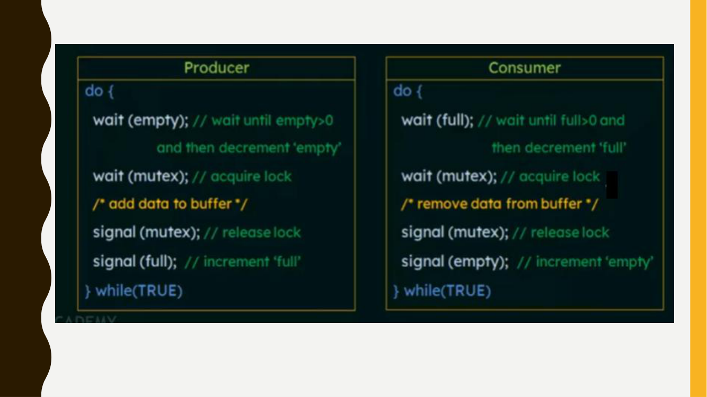

`n` buffers, each able to hold one item.

| Semaphore | Initial value | Meaning |
|---|---|---|
| `mutex` | 1 | Mutual exclusion on the buffer |
| `full` | 0 | Number of full slots |
| `empty` | n | Number of empty slots |

```c
/* Producer */
do {
    /* produce an item in nextp */
    wait(empty);          /* wait until empty > 0, then decrement empty */
    wait(mutex);          /* acquire lock */
    /* add the item to the buffer */
    signal(mutex);        /* release lock */
    signal(full);         /* increment full */
} while (TRUE);

/* Consumer */
do {
    wait(full);           /* wait until full > 0, then decrement full */
    wait(mutex);          /* acquire lock */
    /* remove an item from the buffer to nextc */
    signal(mutex);        /* release lock */
    signal(empty);        /* increment empty */
    /* consume the item in nextc */
} while (TRUE);
```

> **Order matters:** always `wait(empty)`/`wait(full)` **before** `wait(mutex)`. If a producer took `mutex` first and then blocked on `empty`, the consumer could never get `mutex` to free a slot, giving a deadlock.

### 17.2 Readers-writers

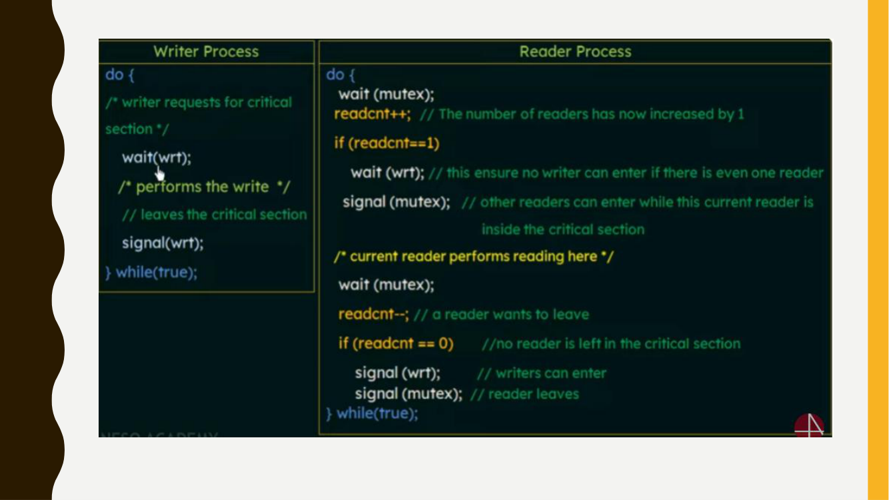

- A database (data set) is shared among several concurrent processes.
- **Readers** only read the data set; they do **not** perform any updates.
- **Writers** can both read and write.
- If two readers access the data together, **no adverse effects** result.
- If a writer and any other process (reader or writer) access it together, **chaos may ensue**.
- **Requirement:** allow **multiple readers** at the same time, but only **one writer**, with **exclusive access**.

Shared data:

| Item | Initial value | Purpose |
|---|---|---|
| `mutex` (semaphore) | 1 | Mutual exclusion when `readcount` is updated, that is, when any reader enters or exits |
| `wrt` / `rw_mutex` (semaphore) | 1 | Common to readers and writers; gives writers exclusive access |
| `readcount` (integer) | 0 | Number of processes currently reading |

```c
/* Writer */
do {
    wait(wrt);            /* writer requests the critical section */
    /* writing is performed */
    signal(wrt);          /* leaves the critical section */
} while (TRUE);

/* Reader */
do {
    wait(mutex);
    readcount++;                  /* one more reader */
    if (readcount == 1)
        wait(wrt);                /* first reader locks out writers */
    signal(mutex);                /* other readers may now enter */

    /* reading is performed */

    wait(mutex);
    readcount--;                  /* a reader leaves */
    if (readcount == 0)
        signal(wrt);              /* last reader lets writers in */
    signal(mutex);
} while (TRUE);
```

**Variations** (all involve some form of priority):

| Variation | Rule | Who may starve |
|---|---|---|
| **First** | No reader is kept waiting unless a writer already has permission to use the shared object | Writers |
| **Second** | Once a writer is ready, it performs its write as soon as possible | Readers |

Both may cause **starvation**, which leads to even more variations. On some systems the problem is solved by the kernel providing **reader-writer locks**. The solution above is the first variation.

### 17.3 Dining philosophers

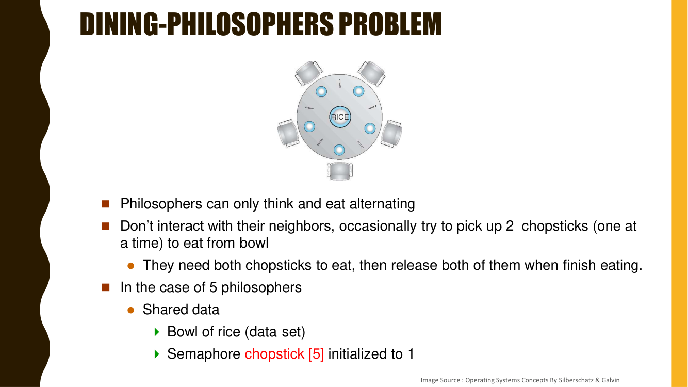

- Philosophers spend their lives **alternating between thinking and eating**.
- They do not interact with their neighbours. Occasionally a philosopher tries to pick up **two chopsticks, one at a time**, to eat from the bowl.
- A philosopher needs **both** chopsticks to eat, and releases both when done.
- With 5 philosophers, the shared data is: a bowl of rice (the data set) and `semaphore chopstick[5]`, each initialized to 1.

```text
            P0
       c0        c1
    P4              P1
       c4        c2
         P3  c3  P2        (5 philosophers, 5 chopsticks, one between each pair)
```

```c
/* Philosopher i */
do {
    wait(chopstick[i]);               /* pick up left chopstick  */
    wait(chopstick[(i + 1) % 5]);     /* pick up right chopstick */
    /* eat */
    signal(chopstick[i]);
    signal(chopstick[(i + 1) % 5]);
    /* think */
} while (TRUE);
```

**What is the problem with this algorithm?**

It guarantees that **no two neighbours eat simultaneously**, but it can create a **deadlock**. Suppose all five philosophers become hungry at the same time and **each grabs the left chopstick**. All elements of `chopstick` are now 0. When each philosopher tries to grab the right chopstick, he is **delayed forever**.

**Possible remedies to avoid deadlock**

1. Allow **at most four** philosophers to sit at the table at the same time.
2. Allow a philosopher to pick up chopsticks **only if both are available** (he must pick them up inside a critical section).
3. Use an **asymmetric** solution: an **odd** philosopher picks up the left chopstick first and then the right; an **even** philosopher picks up the right first and then the left.

---

## 18. Problems with semaphores

Semaphores are easy to misuse. Incorrect use of the operations:

| Mistake | Effect |
|---|---|
| `signal(mutex) … wait(mutex)` (order reversed) | Several processes can be in the critical section at once; **mutual exclusion is violated** |
| `wait(mutex) … wait(mutex)` | The process blocks on itself; **deadlock** |
| Omitting `wait(mutex)` | Mutual exclusion is violated |
| Omitting `signal(mutex)` | Others wait forever; **deadlock** |
| Omitting both | Mutual exclusion is violated |

**Deadlock and starvation are possible.** These errors are hard to detect because they show up only for particular interleavings. This is the motivation for monitors.

---

## 19. Monitors

### 19.1 Concept and syntax

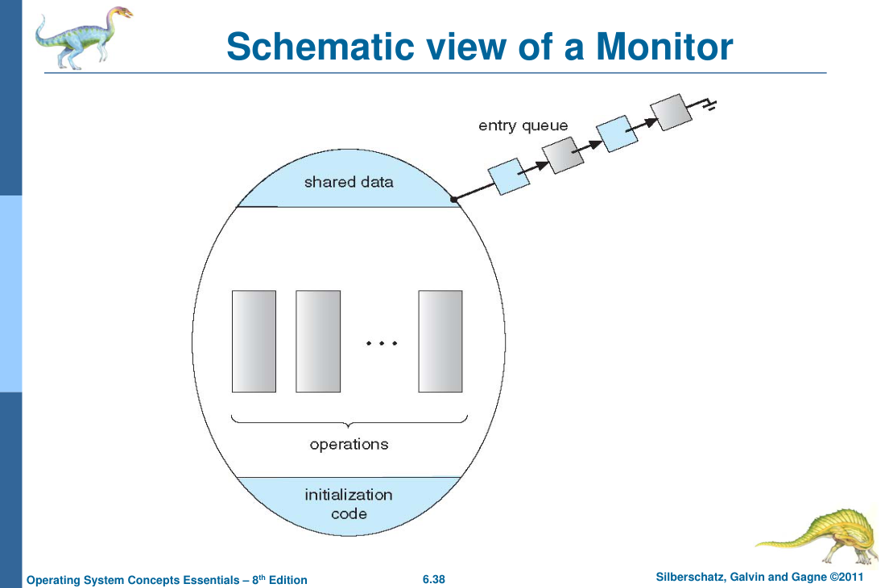

> A **monitor** is a **high-level abstraction** that provides a convenient and effective mechanism for process synchronization.

- It is an **abstract data type**: its internal variables are accessible **only by code within its procedures**.
- **Only one process may be active within the monitor at a time.** Mutual exclusion is automatic; the programmer does not write it.
- On its own it is **not powerful enough to model some synchronization schemes**, which is why condition variables are added.

```text
monitor monitor-name
{
    // shared variable declarations

    procedure P1 (…) { … }
    …
    procedure Pn (…) { … }

    initialization code (…) { … }
}
```

**Schematic view of a monitor**

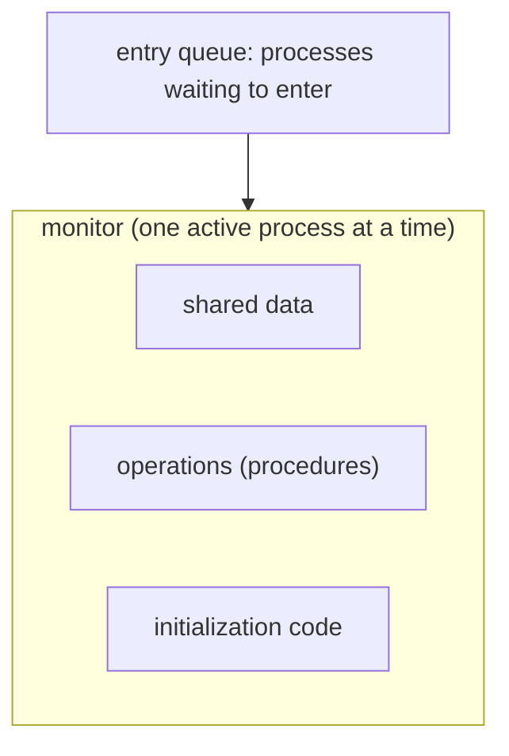
```mermaid
flowchart TB
    EQ["entry queue: processes waiting to enter"] --> MON
    subgraph MON["monitor (one active process at a time)"]
        SD["shared data"]
        OPS["operations (procedures)"]
        INIT["initialization code"]
    end
```

### 19.2 Condition variables

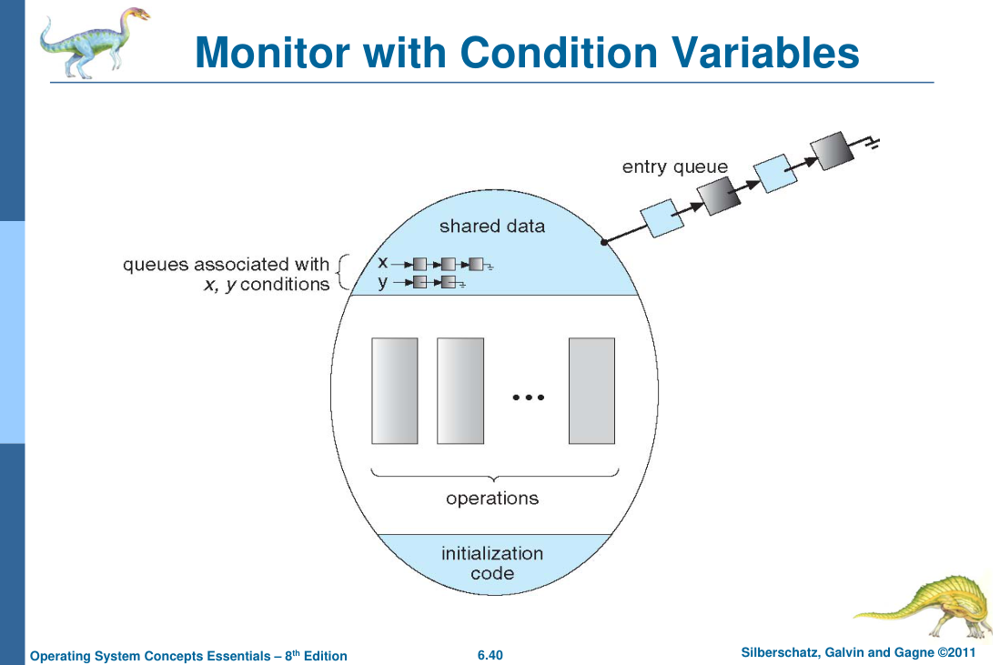

```text
condition x, y;
```

Only two operations are allowed on a condition variable:

| Operation | Effect |
|---|---|
| `x.wait()` | The process that invokes it is **suspended** until another process invokes `x.signal()` |
| `x.signal()` | **Resumes one** of the processes (if any) that invoked `x.wait()`. If no process is waiting on `x`, it has **no effect**. |

> **Exam trap:** a semaphore `signal()` always increments the value, so it is "remembered". A condition-variable `x.signal()` with no waiter is **lost**.

**Monitor with condition variables**

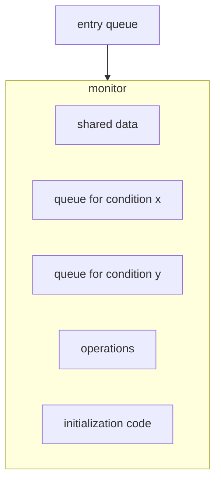
```mermaid
flowchart TB
    EQ["entry queue"] --> MON
    subgraph MON["monitor"]
        SD["shared data"]
        QX["queue for condition x"]
        QY["queue for condition y"]
        OPS["operations"]
        INIT["initialization code"]
    end
```

### 19.3 Signal-and-wait vs signal-and-continue

If process `P` invokes `x.signal()` while process `Q` is suspended in `x.wait()`, what should happen next? **`P` and `Q` cannot both execute in the monitor in parallel.** If `Q` is resumed, `P` must wait.

| Option | Meaning |
|---|---|
| **Signal and wait** | `P` waits until `Q` leaves the monitor or waits for another condition |
| **Signal and continue** | `Q` waits until `P` leaves the monitor or waits for another condition |

- Both have merits and demerits; the **language implementer decides**.
- Monitors in **Concurrent Pascal** use a compromise: the process executing `signal` **immediately leaves the monitor**, and `Q` is resumed.
- Monitors are implemented in other languages including **Mesa, C#, and Java**.

### 19.4 Monitor solution to dining philosophers

This is a **deadlock-free** solution. It imposes the restriction that a philosopher may **pick up chopsticks only if both are available**.

- Three states are needed: `enum { THINKING, HUNGRY, EATING } state[5];`
- Philosopher `i` may set `state[i] = EATING` only if the two neighbours are not eating: `state[(i+4) % 5] != EATING` and `state[(i+1) % 5] != EATING`.
- `condition self[5];` lets philosopher `i` **delay himself** when hungry but unable to get both chopsticks.

```c
monitor DiningPhilosophers
{
    enum { THINKING, HUNGRY, EATING } state[5];
    condition self[5];

    void pickup(int i) {
        state[i] = HUNGRY;
        test(i);                          /* try to start eating */
        if (state[i] != EATING)
            self[i].wait();               /* could not: wait */
    }

    void putdown(int i) {
        state[i] = THINKING;
        test((i + 4) % 5);                /* test left neighbour  */
        test((i + 1) % 5);                /* test right neighbour */
    }

    void test(int i) {
        if ((state[(i + 4) % 5] != EATING) &&
            (state[i] == HUNGRY) &&
            (state[(i + 1) % 5] != EATING)) {
            state[i] = EATING;
            self[i].signal();
        }
    }

    initialization_code() {
        for (int i = 0; i < 5; i++)
            state[i] = THINKING;
    }
}
```

Each philosopher `i` invokes the operations in this sequence:

```c
DiningPhilosophers.pickup(i);
    /* EAT */
DiningPhilosophers.putdown(i);
```

> **Result: no deadlock, but starvation is possible.** A philosopher can starve if the two neighbours keep eating alternately.

### 19.5 Implementing a monitor with semaphores

**Variables**

```c
semaphore mutex;      /* initially = 1; guards entry to the monitor            */
semaphore next;       /* initially = 0; signalling processes suspend here      */
int next_count = 0;   /* number of processes suspended on next                 */
```

**Each procedure `F`** is replaced by:

```c
wait(mutex);
    ...
    body of F;
    ...
if (next_count > 0)
    signal(next);     /* let a suspended signaller continue */
else
    signal(mutex);    /* otherwise open the monitor */
```

Mutual exclusion within the monitor is ensured.

**For each condition variable `x`:**

```c
semaphore x_sem;      /* initially = 0 */
int x_count = 0;
```

`x.wait()` is implemented as:

```c
x_count++;
if (next_count > 0)
    signal(next);
else
    signal(mutex);
wait(x_sem);
x_count--;
```

`x.signal()` is implemented as:

```c
if (x_count > 0) {
    next_count++;
    signal(x_sem);
    wait(next);
    next_count--;
}
```

This implements the **signal-and-wait** scheme: the signaller suspends itself on `next` until the resumed process leaves or waits.

### 19.6 Resuming processes and the conditional wait

- If several processes are queued on condition `x` and `x.signal()` is executed, **which one should be resumed?**
- **FCFS is frequently not adequate.**
- Use the **conditional-wait** construct **`x.wait(c)`**, where `c` is a **priority number**.
- The process with the **lowest number (highest priority)** is scheduled next.

### 19.7 Single-resource allocator

A priority number is used to allocate a **single resource** among competing processes. It specifies the **maximum time** a process plans to use the resource, so the shortest request is served first.

```c
monitor ResourceAllocator
{
    boolean busy;
    condition x;

    void acquire(int time) {
        if (busy)
            x.wait(time);
        busy = TRUE;
    }

    void release() {
        busy = FALSE;
        x.signal();
    }

    initialization_code() {
        busy = FALSE;
    }
}
```

Usage, where `R` is an instance of type `ResourceAllocator`:

```c
R.acquire(t);
    ...
    access the resource;
    ...
R.release();
```

---

## 20. Synchronization examples

### 20.1 Solaris

- Implements a variety of locks to support multitasking, multithreading (including real-time threads), and multiprocessing.
- Uses **adaptive mutexes** for efficiency when protecting data from **short code segments**:
  - starts as a standard semaphore spin-lock;
  - if the lock is held by a thread **running on another CPU**, it **spins**;
  - if the lock is held by a thread that is **not in the run state**, it **blocks and sleeps**, waiting for the signal that the lock has been released.
- Uses **condition variables**.
- Uses **readers-writers locks** when **longer sections** of code need access to data.
- Uses **turnstiles** to order the list of threads waiting to acquire an adaptive mutex or a reader-writer lock. Turnstiles are **per lock-holding thread**, not per object.
- **Priority inheritance** per turnstile gives the running thread the highest of the priorities of the threads in its turnstile.

### 20.2 Windows

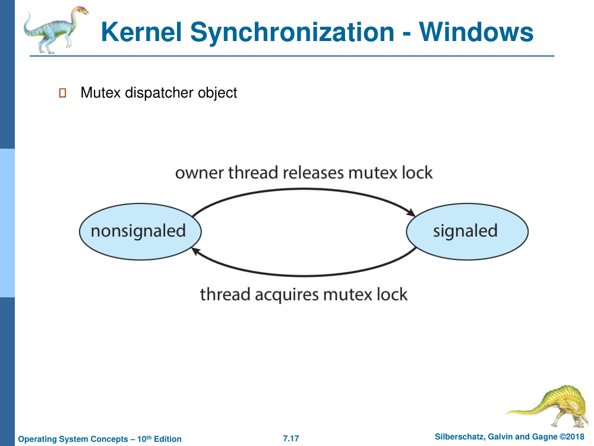

- Uses **interrupt masks** to protect access to global resources on **uniprocessor** systems.
- Uses **spinlocks** on **multiprocessor** systems. A thread holding a spinlock will **never be preempted**.
- Provides **dispatcher objects** in user land, which may act as **mutexes, semaphores, events, and timers**.
  - An **event** acts much like a condition variable.
  - A **timer** notifies one or more threads when a time has expired.
  - A dispatcher object is either in the **signaled state** (object available) or the **non-signaled state** (the thread will block).

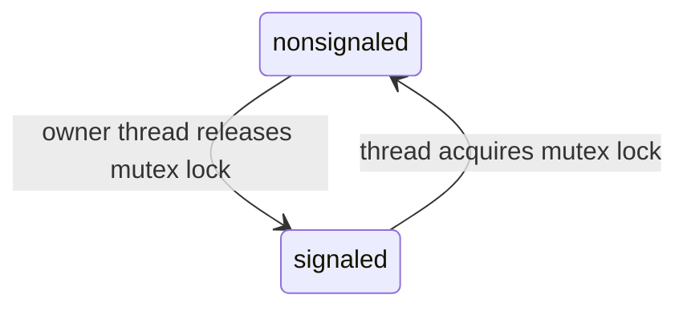
```mermaid
stateDiagram-v2
    nonsignaled --> signaled: owner thread releases mutex lock
    signaled --> nonsignaled: thread acquires mutex lock
```

### 20.3 Linux

- **Before kernel version 2.6:** disables interrupts to implement short critical sections.
- **Version 2.6 and later:** fully **preemptive** kernel.
- Linux provides: **semaphores**, **atomic integers**, **spinlocks**, and **reader-writer versions** of both.
- On a **single-CPU** system, spinlocks are replaced by **enabling and disabling kernel preemption**.

**Atomic variables:** `atomic_t` is the type for an atomic integer.

```c
atomic_t counter;
int value;

atomic_set(&counter, 5);          /* counter = 5  */
atomic_add(10, &counter);         /* counter = 15 */
atomic_sub(4, &counter);          /* counter = 11 */
atomic_inc(&counter);             /* counter = 12 */
value = atomic_read(&counter);    /* value = 12   */
```

### 20.4 POSIX / Pthreads

- The Pthreads API is **OS-independent** and widely used on UNIX, Linux, and macOS.
- It provides **mutex locks**, **semaphores**, and **condition variables**.
- Non-portable extensions include **read-write locks** and **spinlocks**.

**POSIX mutex locks**

```c
#include <pthread.h>
pthread_mutex_t mutex;

pthread_mutex_init(&mutex, NULL);     /* create and initialize the lock */

pthread_mutex_lock(&mutex);           /* acquire the lock */
    /* critical section */
pthread_mutex_unlock(&mutex);         /* release the lock */
```

**POSIX semaphores** — two versions, **named** and **unnamed**. Named semaphores can be used by **unrelated processes**; unnamed semaphores cannot.

```c
/* Named semaphore */
#include <semaphore.h>
sem_t *sem;
sem = sem_open("SEM", O_CREAT, 0666, 1);   /* create and initialize to 1 */
/* another process can access it by referring to its name "SEM" */

sem_wait(sem);                              /* acquire */
    /* critical section */
sem_post(sem);                              /* release */
```

```c
/* Unnamed semaphore */
#include <semaphore.h>
sem_t sem;
sem_init(&sem, 0, 1);                       /* 0 = shared between threads; initial value 1 */

sem_wait(&sem);                             /* acquire */
    /* critical section */
sem_post(&sem);                             /* release */
```

**POSIX condition variables** — POSIX is used from C/C++, which have no monitors, so a condition variable is **associated with a mutex lock** to provide mutual exclusion.

```c
pthread_mutex_t mutex;
pthread_cond_t  cond_var;

pthread_mutex_init(&mutex, NULL);
pthread_cond_init(&cond_var, NULL);

/* Thread waiting for the condition a == b to become true */
pthread_mutex_lock(&mutex);
while (a != b)
    pthread_cond_wait(&cond_var, &mutex);   /* releases mutex while waiting */
pthread_mutex_unlock(&mutex);

/* Thread signalling another thread waiting on the condition variable */
pthread_mutex_lock(&mutex);
a = b;
pthread_cond_signal(&cond_var);
pthread_mutex_unlock(&mutex);
```

### 20.5 Java

Java provides a rich set of synchronization features: **Java monitors**, **reentrant locks**, **semaphores**, and **condition variables**.

**Java monitors**

- Every Java object has a **single lock** associated with it.
- If a method is declared **`synchronized`**, the calling thread must **own the lock** for the object.
- If another thread owns the lock, the calling thread must **wait** until it is released.
- The lock is released when the owning thread **exits the synchronized method**.

```java
public class BoundedBuffer<E> {
    private static final int BUFFER_SIZE = 5;
    private int count, in, out;
    private E[] buffer;

    public synchronized void insert(E item) {
        while (count == BUFFER_SIZE) {
            try { wait(); } catch (InterruptedException ie) { }
        }
        buffer[in] = item;
        in = (in + 1) % BUFFER_SIZE;
        count++;
        notify();
    }

    public synchronized E remove() {
        E item;
        while (count == 0) {
            try { wait(); } catch (InterruptedException ie) { }
        }
        item = buffer[out];
        out = (out + 1) % BUFFER_SIZE;
        count--;
        notify();
        return item;
    }
}
```

**Entry set and wait set**

- A thread that tries to acquire an **unavailable lock** is placed in the object's **entry set**.
- Each object also has a **wait set**.

When a thread calls **`wait()`**:

1. it **releases the lock** for the object;
2. the state of the thread is set to **blocked**;
3. the thread is placed in the **wait set** for the object.

A thread typically calls `wait()` when it is waiting for a condition to become true. When a thread calls **`notify()`**:

1. an **arbitrary** thread `T` is selected from the wait set;
2. `T` is moved from the **wait set to the entry set**;
3. the state of `T` is set from **blocked to runnable**.

`T` can now compete for the lock and check whether the condition it was waiting for is true.

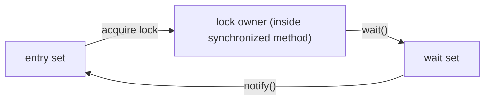
```mermaid
flowchart LR
    ES["entry set"] -->|"acquire lock"| OWN["lock owner (inside synchronized method)"]
    OWN -->|"wait()"| WS["wait set"]
    WS -->|"notify()"| ES
```

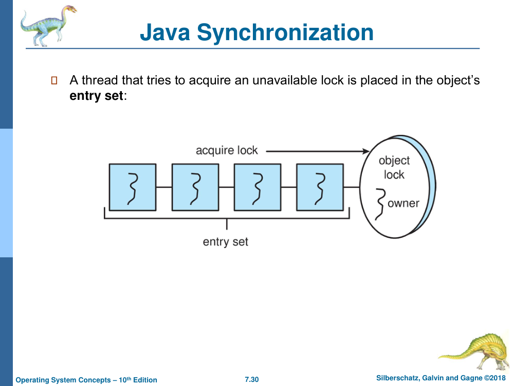

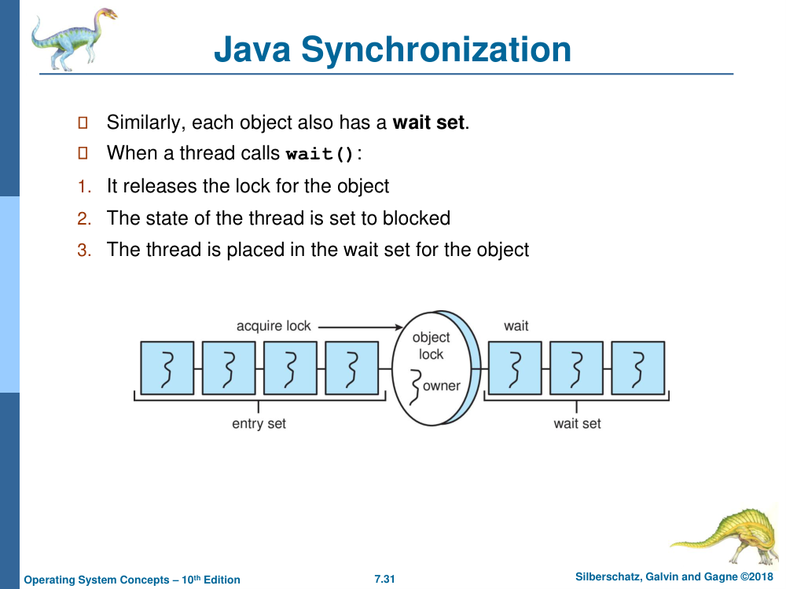

**Java reentrant locks** — similar to mutex locks. The `finally` clause ensures the lock is released even if an exception occurs in the `try` block.

```java
Lock key = new ReentrantLock();

key.lock();
try {
    /* critical section */
} finally {
    key.unlock();
}
```

**Java semaphores**

```java
Semaphore sem = new Semaphore(1);     // constructor: Semaphore(int value)

try {
    sem.acquire();
    /* critical section */
} catch (InterruptedException ie) {
} finally {
    sem.release();
}
```

**Java condition variables**

- Condition variables are associated with a `ReentrantLock`.
- One is created with the **`newCondition()`** method of `ReentrantLock`.
- A thread waits by calling **`await()`** and signals by calling **`signal()`**.

```java
Lock key = new ReentrantLock();
Condition condVar = key.newCondition();
```

**Example from the slides:** five threads numbered 0 to 4 and a shared variable `turn` indicating whose turn it is. A thread calls `doWork()` when it wishes to do some work, but may only work if it is its turn. If it is not its turn, it waits. When finished, it notifies the thread whose turn is next.

```java
Lock lock = new ReentrantLock();
Condition[] condVars = new Condition[5];
for (int i = 0; i < 5; i++)
    condVars[i] = lock.newCondition();

public void doWork(int threadNumber) {
    lock.lock();
    try {
        if (threadNumber != turn)
            condVars[threadNumber].await();     // not my turn: wait

        /* do some work for a while */

        turn = (turn + 1) % 5;                  // pass the turn on
        condVars[turn].signal();
    } catch (InterruptedException ie) {
    } finally {
        lock.unlock();
    }
}
```

---

## 21. Alternative approaches

### 21.1 Transactional memory

Consider a function `update()` that must be called atomically. One option uses mutex locks:

```c
void update() {
    acquire();
    /* modify shared data */
    release();
}
```

A **memory transaction** is a **sequence of read-write operations to memory that are performed atomically**. A transaction is written by adding `atomic{S}`, which ensures the statements in `S` execute atomically:

```c
void update() {
    atomic {
        /* modify shared data */
    }
}
```

### 21.2 OpenMP

OpenMP is a set of compiler directives and an API that support parallel programming. The code inside the **`#pragma omp critical`** directive is treated as a **critical section** and performed atomically.

```c
void update(int value) {
    #pragma omp critical
    {
        count += value;
    }
}
```

### 21.3 Functional programming languages

- Functional languages offer a different paradigm from procedural languages: they **do not maintain state**.
- Variables are treated as **immutable** and cannot change once assigned a value.
- With no mutable shared state there are no data races. There is increasing interest in functional languages such as **Erlang** and **Scala** for this reason.

> **Atomic transactions** appear in the chapter outline of `ch6.pdf` and in the Week 6_3 overview, but no slide in the supplied decks develops them. Know only the idea: a transaction is a set of operations that must be performed as one atomic unit (all or nothing).

---

## 22. Resources and the system model

### 22.1 System model

- A system consists of **resources**.
- Resource **types** `R1, R2, …, Rm`: CPU cycles, memory space, I/O devices.
- Each resource type `Ri` has **`Wi` instances**.
- Each process uses a resource in this sequence:
  1. **request** the resource;
  2. **use** the resource;
  3. **release** the resource.
- If the request is **denied**, the process must wait: it may be **blocked**, or the request may **fail with an error code**.

### 22.2 Preemptable and non-preemptable resources

| Type | Meaning | Example |
|---|---|---|
| **Preemptable** | Can be taken away from a process with **no ill effects** | Memory, CPU |
| **Non-preemptable** | Will cause the process to **fail** if taken away | Printer in the middle of a job, CD burner |

Deadlocks involve non-preemptable resources.

---

## 23. The deadlock problem

### 23.1 Definition

> **Deadlock:** in a computer system, deadlocks arise when members of a group of processes that hold resources are **blocked indefinitely** from access to resources held by other processes within the group.

> **Formal definition:** *a set of processes is deadlocked if each process in the set is waiting for an event that only another process in the set can cause.*

- Usually the event is the **release of a currently held resource**.
- In a deadlock, none of the processes can **run**, **release resources**, or **be awakened**.

### 23.2 When do deadlocks happen?

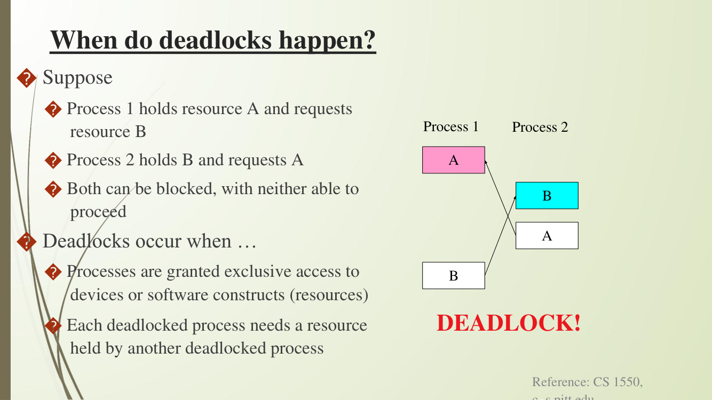

Suppose Process 1 holds resource A and requests resource B, while Process 2 holds B and requests A. **Both are blocked, and neither can proceed.**

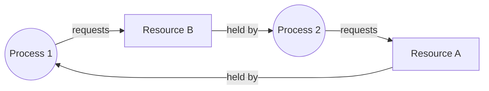
```mermaid
flowchart LR
    P1(("Process 1")) -->|requests| B["Resource B"]
    B -->|held by| P2(("Process 2"))
    P2 -->|requests| A["Resource A"]
    A -->|held by| P1
```

Deadlocks occur when:

- processes are granted **exclusive access** to devices or software constructs (resources);
- each deadlocked process **needs a resource held by another deadlocked process**.

### 23.3 Examples from the slides

**1. Disk drives:** the system has 2 disk drives. `P1` and `P2` each hold one and each needs the other.

**2. Semaphores:** `S1` and `S2` (or `A` and `B`) initialized to 1.

```c
/* P1 */               /* P2 */
wait(S1);              wait(S2);
wait(S2);              wait(S1);
```

**3. Mutex locks (Pthreads):** deadlocks can occur via system calls, locking, and so on.

```c
/* thread one runs in this function */
void *do_work_one(void *param) {
    pthread_mutex_lock(&first_mutex);
    pthread_mutex_lock(&second_mutex);
    /* do some work */
    pthread_mutex_unlock(&second_mutex);
    pthread_mutex_unlock(&first_mutex);
    pthread_exit(0);
}

/* thread two runs in this function */
void *do_work_two(void *param) {
    pthread_mutex_lock(&second_mutex);      /* opposite order! */
    pthread_mutex_lock(&first_mutex);
    /* do some work */
    pthread_mutex_unlock(&first_mutex);
    pthread_mutex_unlock(&second_mutex);
    pthread_exit(0);
}
```

Deadlock happens if thread one gets `first_mutex` while thread two gets `second_mutex`.

**4. Lock ordering is not always enough:**

```c
void transaction(Account from, Account to, double amount) {
    mutex lock1, lock2;
    lock1 = get_lock(from);
    lock2 = get_lock(to);
    acquire(lock1);
    acquire(lock2);
    withdraw(from, amount);
    deposit(to, amount);
    release(lock2);
    release(lock1);
}
```

Transactions 1 and 2 execute concurrently. Transaction 1 transfers $25 from account A to account B, and Transaction 2 transfers $50 from B to A. Transaction 1 locks A then wants B; Transaction 2 locks B then wants A. The code looks ordered, but the order depends on the arguments, so a deadlock is still possible.

**5. Bridge-crossing example**

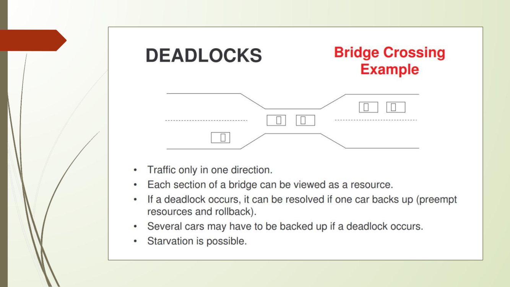

```text
  ════════╗                        ╔════════
  →  →    ╚════════════════════════╝    ←  ←
           one-lane bridge section
  ════════╗                        ╔════════
          ╚════════════════════════╝
```

- Traffic can flow in only **one direction** at a time.
- Each **section of the bridge** can be viewed as a **resource**.
- If a deadlock occurs, it can be resolved if **one car backs up** (preempt resources and roll back).
- **Several cars** may have to back up.
- **Starvation is possible.**
- Note: **most operating systems do not prevent or deal with deadlocks.**

---

## 24. Deadlock characterization: the four conditions

Deadlock can arise **only if all four conditions hold simultaneously**. These are **necessary** conditions.

| Condition | Textbook statement | Short form from the lecture |
|---|---|---|
| **1. Mutual exclusion** | Only one process at a time can use a resource | Each resource is assigned to exactly one process or is available |
| **2. Hold and wait** | A process holding at least one resource is waiting to acquire additional resources held by other processes | A process holding resources can request more |
| **3. No preemption** | A resource can be released only voluntarily by the process holding it, after that process has completed its task | Previously granted resources cannot be forcibly taken away |
| **4. Circular wait** | There is a set `{P0, P1, …, Pn}` of waiting processes such that `P0` waits for a resource held by `P1`, `P1` waits for `P2`, …, `Pn-1` waits for `Pn`, and `Pn` waits for `P0` | A circular chain of two or more processes, each waiting for a resource held by the next member of the chain |

> **Memory aid:** **M-H-N-C** — Mutual exclusion, Hold and wait, No preemption, Circular wait.
> **Exam point:** break **any one** condition and deadlock becomes impossible. This is the basis of deadlock prevention.

---

## 25. Resource-allocation graph

### 25.1 Definition

A resource-allocation graph (RAG) is a set of **vertices `V`** and a set of **edges `E`**.

- `V` is partitioned into two types:
  - `P = {P1, P2, …, Pn}` — all the **processes** in the system;
  - `R = {R1, R2, …, Rm}` — all the **resource types** in the system.
- **Request edge:** directed edge **`Pi → Rj`** (process `Pi` requests an instance of `Rj`).
- **Assignment edge:** directed edge **`Rj → Pi`** (process `Pi` is holding an instance of `Rj`).

| Symbol | Meaning |
|---|---|
| Circle | Process |
| Rectangle with dots | Resource type; each dot is one instance |
| Arrow from circle to rectangle | Request edge |
| Arrow from a dot to a circle | Assignment edge |

### 25.2 Example of a resource-allocation graph

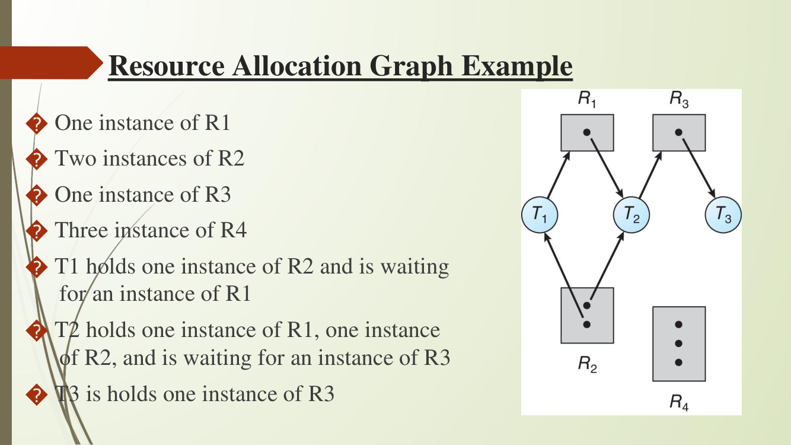

- One instance of `R1`, two instances of `R2`, one instance of `R3`, three instances of `R4`.
- `T1` holds one instance of `R2` and is waiting for an instance of `R1`.
- `T2` holds one instance of `R1` and one instance of `R2`, and is waiting for an instance of `R3`.
- `T3` holds one instance of `R3`.

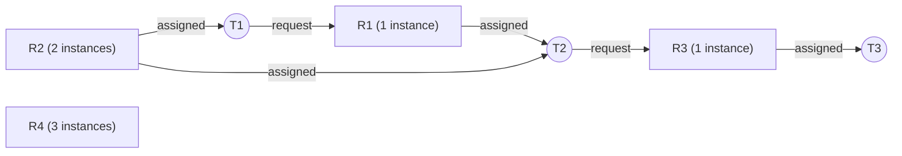
```mermaid
flowchart LR
    T1(("T1")) -->|request| R1["R1 (1 instance)"]
    R1 -->|assigned| T2(("T2"))
    R2["R2 (2 instances)"] -->|assigned| T1
    R2 -->|assigned| T2
    T2 -->|request| R3["R3 (1 instance)"]
    R3 -->|assigned| T3(("T3"))
    R4["R4 (3 instances)"]
```

**No cycle, so no deadlock.** `T3` can finish and release `R3`; then `T2` can finish; then `T1`.

### 25.3 Resource-allocation graph with a deadlock

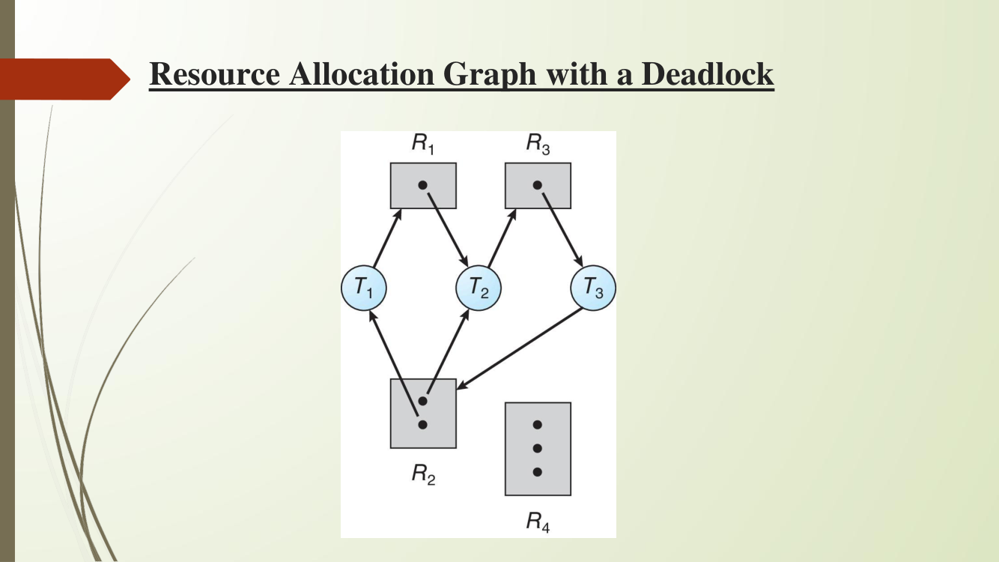

Add one edge to the graph above: **`T3` requests `R2`**.

```mermaid
flowchart LR
    T1(("T1")) -->|request| R1["R1 (1 instance)"]
    R1 -->|assigned| T2(("T2"))
    R2["R2 (2 instances)"] -->|assigned| T1
    R2 -->|assigned| T2
    T2 -->|request| R3["R3 (1 instance)"]
    R3 -->|assigned| T3(("T3"))
    T3 -->|request| R2
```

Two cycles now exist:

- `T1 → R1 → T2 → R3 → T3 → R2 → T1`
- `T2 → R3 → T3 → R2 → T2`

Both instances of `R2` are held by `T1` and `T2`, which are inside the cycles. **`T1`, `T2`, and `T3` are deadlocked.**

### 25.4 Graph with a cycle but no deadlock

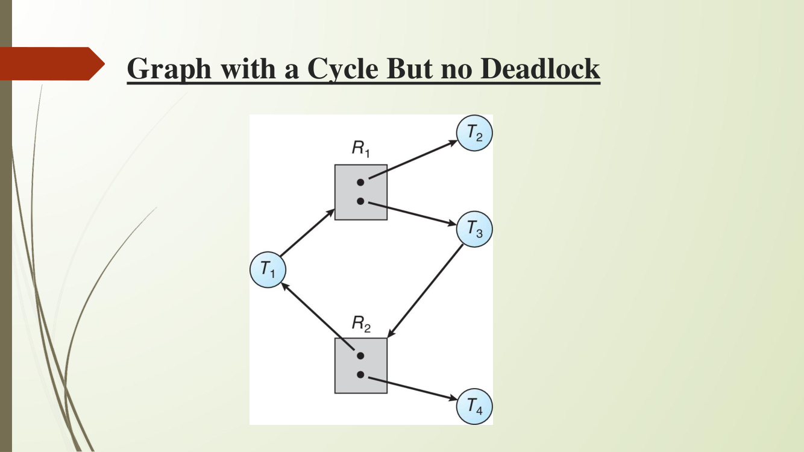

```mermaid
flowchart LR
    T1(("T1")) -->|request| R1["R1 (2 instances)"]
    R1 -->|assigned| T2(("T2"))
    R1 -->|assigned| T3(("T3"))
    T3 -->|request| R2["R2 (2 instances)"]
    R2 -->|assigned| T1
    R2 -->|assigned| T4(("T4"))
```

There is a cycle `T1 → R1 → T3 → R2 → T1`, **but no deadlock**. `T4` is not in the cycle and can release its instance of `R2`, which can then be given to `T3`, breaking the cycle. (`T2` can likewise release `R1`.)

### 25.5 Basic facts

| Graph | Conclusion |
|---|---|
| **No cycle** | **No deadlock** |
| Cycle, and **only one instance per resource type** | **Deadlock** |
| Cycle, and **several instances per resource type** | **Possibility** of deadlock |

> A cycle is **necessary** for deadlock. It is **sufficient** only when every resource type has a single instance.

---

## 26. Methods for handling deadlocks

| Method | Idea |
|---|---|
| **1. Ensure the system never enters a deadlock state** | **Deadlock prevention** — adopt a policy that eliminates one of the four conditions. **Deadlock avoidance** — make the appropriate dynamic choices based on the current state of resource allocation. |
| **2. Allow the system to enter a deadlock state and then recover** | **Deadlock detection** — attempt to detect the presence of deadlock and take action to recover. |
| **3. Ignore the problem** | Pretend that deadlocks never occur. **Used by most operating systems, including UNIX.** (Often called the ostrich approach.) |

```mermaid
flowchart TB
    H["Handling deadlocks"] --> N["Never enter a deadlock state"]
    H --> D["Enter, detect, recover"]
    H --> I["Ignore the problem (most OSs, UNIX)"]
    N --> P["Prevention: break one of the 4 conditions"]
    N --> A["Avoidance: stay in a safe state (Banker's)"]
    D --> DT["Detection algorithm"]
    D --> RC["Recovery: terminate or preempt"]
```

---

## 27. Deadlock prevention

**Idea:** restrain the ways a request can be made so that **one of the four necessary conditions is invalidated**.

### 27.1 Mutual exclusion

- **Not required for sharable resources** (for example read-only files).
- **Must hold for non-sharable resources.**
- So in general this condition **cannot be removed**.

### 27.2 Hold and wait

Guarantee that **whenever a process requests a resource, it does not hold any other resources**. Two protocols:

1. require the process to **request and be allocated all its resources before it begins execution**; or
2. allow a process to request resources **only when it has none allocated** to it.

**Drawbacks:** **low resource utilization** and **starvation is possible**.

### 27.3 No preemption

- If a process that is holding some resources requests another resource that **cannot be immediately allocated**, then **all the resources it currently holds are released**.
- The preempted resources are added to the **list of resources for which the process is waiting**.
- The process is **restarted only when it can regain its old resources** as well as the new ones it is requesting.

### 27.4 Circular wait

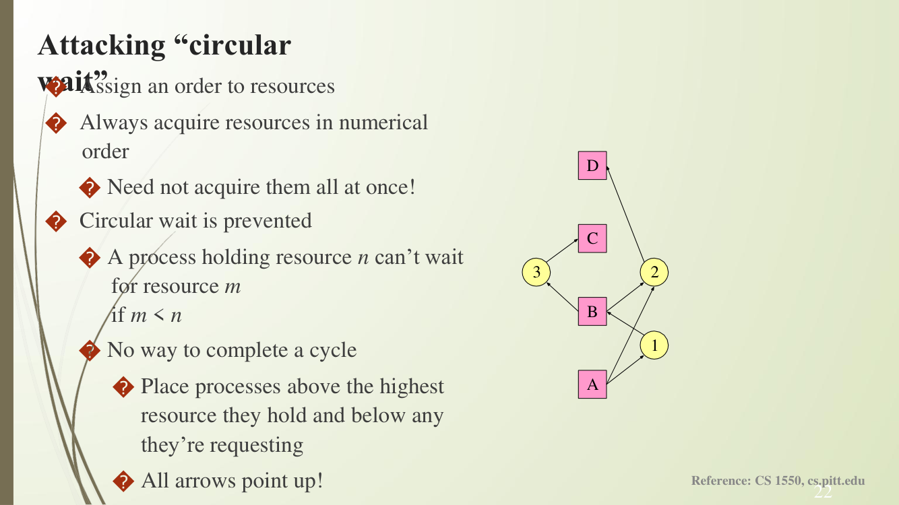

**Impose a total ordering of all resource types, and require that each process requests resources in an increasing order of enumeration.**

**Attacking circular wait (lecture slide):**

- Assign an **order** (number) to the resources.
- **Always acquire resources in numerical order.** They need not all be acquired at once.
- Circular wait is prevented: a process holding resource `n` **cannot wait for resource `m` if `m < n`**.
- There is **no way to complete a cycle**. Picture each process placed above the highest resource it holds and below any it is requesting: **all arrows point up**, so the chain can never loop back.

```text
Resources ordered A < B < C < D

    D ●
      ↑
    C ●        Process holding B may request C or D,
      ↑        but may never request A.
    B ●
      ↑
    A ●        All arrows point up → no cycle possible.
```

**Proof idea:** in a circular wait `P0 → P1 → … → Pn → P0`, the resource numbers would have to satisfy `F(R0) < F(R1) < … < F(Rn) < F(R0)`, which is impossible.

### 27.5 Summary of prevention

| Condition attacked | How | Problem |
|---|---|---|
| Mutual exclusion | Make resources sharable | Not possible for non-sharable resources |
| Hold and wait | Request all resources at once, or only when holding none | Low utilization; starvation |
| No preemption | Release everything if a request cannot be granted | Only works for resources whose state can be saved and restored |
| Circular wait | Total ordering; request in increasing order | Programmers must respect the order; disallows incremental requests in arbitrary order |

---

## 28. Deadlock avoidance

### 28.1 A priori information

Avoidance **requires that the system has some additional a priori information** available.

- The simplest and most useful model requires each process to **declare the maximum number of resources of each type** that it may need.
- The deadlock-avoidance algorithm **dynamically examines the resource-allocation state** to ensure that there can **never be a circular-wait condition**.
- The **resource-allocation state** is defined by the number of **available** and **allocated** resources and the **maximum demands** of the processes.

### 28.2 Safe state

When a process requests an available resource, the system must decide whether **immediate allocation leaves the system in a safe state**.

> The system is in a **safe state** if there exists a sequence `<P1, P2, …, Pn>` of **all** the processes such that, for each `Pi`, the resources that `Pi` can still request can be satisfied by the **currently available resources plus the resources held by all `Pj` with `j < i`**.

That is:

- if `Pi`'s resource needs are not immediately available, `Pi` can **wait until all `Pj` have finished**;
- when `Pj` finishes, `Pi` can obtain the needed resources, execute, return its allocated resources, and terminate;
- when `Pi` terminates, `Pi+1` can obtain its needed resources, and so on.

Such a sequence is called a **safe sequence**.

**Basic facts**

| State | Consequence |
|---|---|
| **Safe** state | **No deadlock** |
| **Unsafe** state | **Possibility** of deadlock (not a certainty) |
| **Avoidance** | Ensure the system **never enters an unsafe state** |

```text
┌──────────────────────────────────────────────┐
│ unsafe                                        │
│      ┌──────────────┐                         │
│      │   deadlock   │                         │
│      └──────────────┘                         │
├──────────────────────────────────────────────┤
│ safe                                          │
│                                               │
└──────────────────────────────────────────────┘
Deadlock states are a subset of unsafe states. Safe and unsafe do not overlap.
```

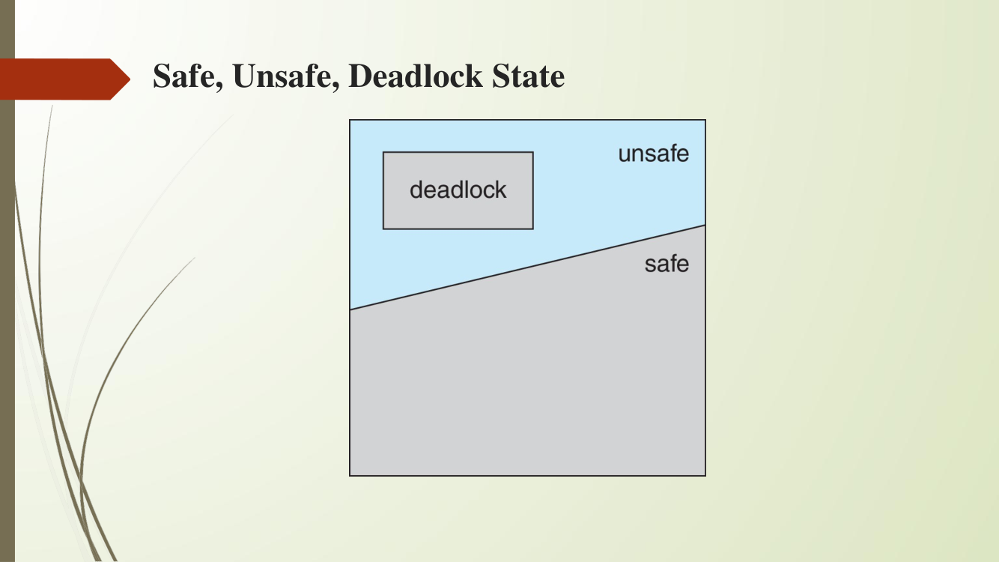

**Which algorithm?**

| Situation | Algorithm |
|---|---|
| **Single instance** of each resource type | **Resource-allocation-graph** algorithm (modified RAG with claim edges) |
| **Multiple instances** of a resource type | **Banker's algorithm** |

### 28.3 Resource-allocation-graph algorithm

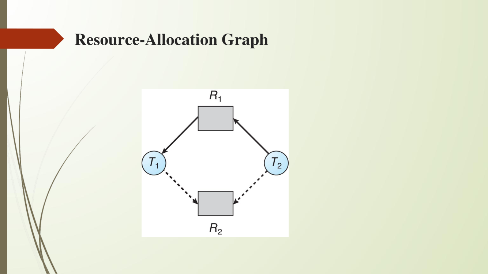

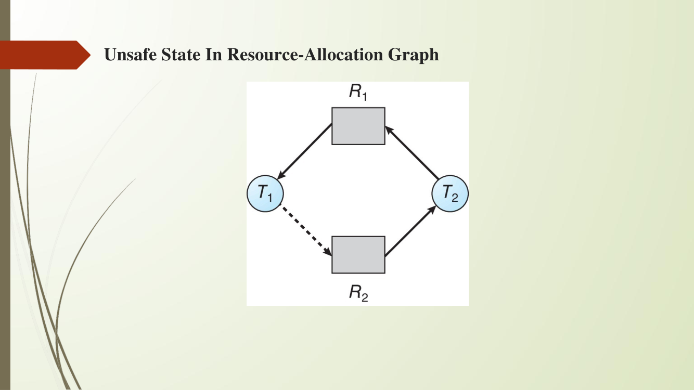

Three kinds of edge:

| Edge | Drawn as | Meaning |
|---|---|---|
| **Claim edge** `Pi ⇢ Rj` | **Dashed** line | Process `Pi` **may request** resource `Rj` in the future |
| **Request edge** `Pi → Rj` | Solid line | Process `Pi` **requests** `Rj` |
| **Assignment edge** `Rj → Pi` | Solid line | `Rj` **was allocated** to `Pi` |

Rules:

- A **claim edge converts to a request edge** when the process requests the resource.
- A **request edge converts to an assignment edge** when the resource is allocated.
- When the resource is released, the **assignment edge reconverts to a claim edge**.
- Resources must be **claimed a priori** in the system.

**The algorithm:** suppose process `Pi` requests resource `Rj`. The request can be granted **only if converting the request edge to an assignment edge does not result in the formation of a cycle** in the resource-allocation graph (claim edges are included when checking).

```mermaid
flowchart LR
    R1["R1"] -->|assigned| T1(("T1"))
    T2(("T2")) -->|request| R1
    T1 -. claim .-> R2["R2"]
    T2 -. claim .-> R2
```

In this state `R1` is held by `T1`, `T2` requests `R1`, and both may later claim `R2`. Suppose `T2` now requests `R2`. Although `R2` is free, **it cannot be given to `T2`**, because the assignment `R2 → T2` would create the cycle `T1 ⇢ R2 → T2 → R1 → T1`:

```mermaid
flowchart LR
    R1["R1"] -->|assigned| T1(("T1"))
    T2(("T2")) -->|request| R1
    T1 -. claim .-> R2["R2"]
    R2 -->|assigned| T2
```

This is an **unsafe state**. If `T1` then requests `R2`, a deadlock occurs.

### 28.4 Banker's algorithm

Used when resources have **multiple instances**.

- Each process must **claim its maximum use a priori**.
- When a process requests a resource, it **may have to wait**.
- When a process gets all its resources, it must **return them in a finite amount of time**.

**Data structures** — let `n` = number of processes and `m` = number of resource types.

| Structure | Size | Meaning |
|---|---|---|
| **Available** | Vector of length `m` | `Available[j] = k` → `k` instances of resource type `Rj` are available |
| **Max** | `n × m` matrix | `Max[i,j] = k` → process `Pi` may request at most `k` instances of `Rj` |
| **Allocation** | `n × m` matrix | `Allocation[i,j] = k` → `Pi` is currently allocated `k` instances of `Rj` |
| **Need** | `n × m` matrix | `Need[i,j] = k` → `Pi` may need `k` more instances of `Rj` to complete its task |

> **`Need[i,j] = Max[i,j] − Allocation[i,j]`**

### 28.5 Safety algorithm

Finds out whether the system is in a safe state.

1. Let `Work` and `Finish` be vectors of length `m` and `n`. Initialize:
   - `Work = Available`
   - `Finish[i] = false` for `i = 0, 1, …, n−1`
2. Find an `i` such that both:
   - (a) `Finish[i] == false`
   - (b) `Need_i ≤ Work`

   If no such `i` exists, go to step 4.
3. `Work = Work + Allocation_i`; `Finish[i] = true`; go to step 2.
4. If `Finish[i] == true` for **all** `i`, the system is in a **safe state**.

In plain words: pick any unfinished process whose remaining need fits in what is free, pretend it runs to completion and returns everything it holds, and repeat. If everyone can finish, the state is safe. The algorithm needs on the order of `m × n²` operations.

### 28.6 Resource-request algorithm

Decides whether a request can be granted safely. `Request_i` is the request vector for `Pi`; `Request_i[j] = k` means `Pi` wants `k` instances of `Rj`.

1. If `Request_i ≤ Need_i`, go to step 2. Otherwise **raise an error**: the process has exceeded its maximum claim.
2. If `Request_i ≤ Available`, go to step 3. Otherwise **`Pi` must wait**: the resources are not available.
3. **Pretend** to allocate the requested resources to `Pi` by modifying the state:

   ```text
   Available    = Available    − Request_i
   Allocation_i = Allocation_i + Request_i
   Need_i       = Need_i       − Request_i
   ```

   Run the safety algorithm on this new state.
   - If **safe** → the resources are **allocated** to `Pi`.
   - If **unsafe** → `Pi` **must wait**, and the **old resource-allocation state is restored**.

```mermaid
flowchart TB
    A["Request_i arrives"] --> B{"Request_i ≤ Need_i ?"}
    B -- no --> E["Error: exceeded maximum claim"]
    B -- yes --> C{"Request_i ≤ Available ?"}
    C -- no --> W["Pi must wait"]
    C -- yes --> D["Pretend to allocate"]
    D --> S{"Safety algorithm: safe?"}
    S -- yes --> G["Grant the request"]
    S -- no --> R["Restore old state; Pi waits"]
```

---

## 29. Banker's algorithm: solved examples

### 29.1 Example 1 — the textbook example (5 processes, 3 resource types)

5 processes `P0`–`P4`; 3 resource types: **A (10 instances), B (5 instances), C (7 instances)**.

**Snapshot at time T0:**

| Process | Allocation (A B C) | Max (A B C) | Need = Max − Allocation (A B C) |
|---|---|---|---|
| P0 | 0 1 0 | 7 5 3 | 7 4 3 |
| P1 | 2 0 0 | 3 2 2 | 1 2 2 |
| P2 | 3 0 2 | 9 0 2 | 6 0 0 |
| P3 | 2 1 1 | 2 2 2 | 0 1 1 |
| P4 | 0 0 2 | 4 3 3 | 4 3 1 |

**Available = (3, 3, 2)**

*Check:* total allocated = (7, 2, 5); total − allocated = (10, 5, 7) − (7, 2, 5) = (3, 3, 2). ✓

**(a) Is the system in a safe state?** Run the safety algorithm with `Work = (3, 3, 2)`.

| Step | Process chosen | Need ≤ Work? | Work after it finishes (Work + Allocation) |
|---|---|---|---|
| 1 | **P1** | (1,2,2) ≤ (3,3,2) ✓ | (3,3,2) + (2,0,0) = **(5,3,2)** |
| 2 | **P3** | (0,1,1) ≤ (5,3,2) ✓ | (5,3,2) + (2,1,1) = **(7,4,3)** |
| 3 | **P4** | (4,3,1) ≤ (7,4,3) ✓ | (7,4,3) + (0,0,2) = **(7,4,5)** |
| 4 | **P2** | (6,0,0) ≤ (7,4,5) ✓ | (7,4,5) + (3,0,2) = **(10,4,7)** |
| 5 | **P0** | (7,4,3) ≤ (10,4,7) ✓ | (10,4,7) + (0,1,0) = **(10,5,7)** |

All processes finish. **The system is in a safe state; safe sequence `<P1, P3, P4, P2, P0>`.** (The final `Work` equals the total resources, a useful self-check.)

**(b) P1 requests (1, 0, 2).**

1. `Request ≤ Need`? (1,0,2) ≤ (1,2,2) ✓
2. `Request ≤ Available`? (1,0,2) ≤ (3,3,2) ✓
3. Pretend to allocate:

| Process | Allocation (A B C) | Need (A B C) |
|---|---|---|
| P0 | 0 1 0 | 7 4 3 |
| **P1** | **3 0 2** | **0 2 0** |
| P2 | 3 0 2 | 6 0 0 |
| P3 | 2 1 1 | 0 1 1 |
| P4 | 0 0 2 | 4 3 1 |

**Available = (2, 3, 0)**

Safety algorithm with `Work = (2, 3, 0)`:

| Step | Process | Need ≤ Work? | New Work |
|---|---|---|---|
| 1 | P1 | (0,2,0) ≤ (2,3,0) ✓ | (5,3,2) |
| 2 | P3 | (0,1,1) ≤ (5,3,2) ✓ | (7,4,3) |
| 3 | P4 | (4,3,1) ≤ (7,4,3) ✓ | (7,4,5) |
| 4 | P0 | (7,4,3) ≤ (7,4,5) ✓ | (7,5,5) |
| 5 | P2 | (6,0,0) ≤ (7,5,5) ✓ | (10,5,7) |

Safe sequence `<P1, P3, P4, P0, P2>`. **The request is granted immediately.**

**(c) Can a request for (3, 3, 0) by P4 be granted?** (state after part b)

- `Request ≤ Need`? (3,3,0) ≤ (4,3,1) ✓
- `Request ≤ Available`? (3,3,0) ≤ (2,3,0) ✗ (3 > 2 for A)

**No. The resources are not available, so P4 must wait.**

**(d) Can a request for (0, 2, 0) by P0 be granted?** (state after part b)

- `Request ≤ Need`? (0,2,0) ≤ (7,4,3) ✓
- `Request ≤ Available`? (0,2,0) ≤ (2,3,0) ✓
- Pretend: Available = (2,1,0); P0 Allocation = (0,3,0); P0 Need = (7,2,3).
- Safety check with `Work = (2,1,0)`:
  - P0 needs (7,2,3) ✗; P1 needs (0,2,0) ✗ (B: 2 > 1); P2 needs (6,0,0) ✗; P3 needs (0,1,1) ✗ (C: 1 > 0); P4 needs (4,3,1) ✗.
  - No process can finish.

**No. The resulting state is unsafe, so the request is denied; P0 must wait and the old state is restored.**

### 29.2 Example 2 — determination of a safe state (4 processes, 3 resources)

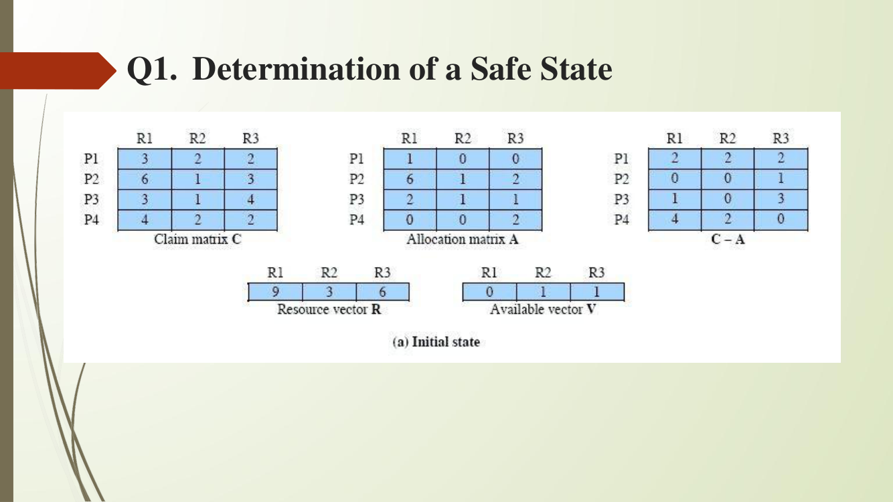

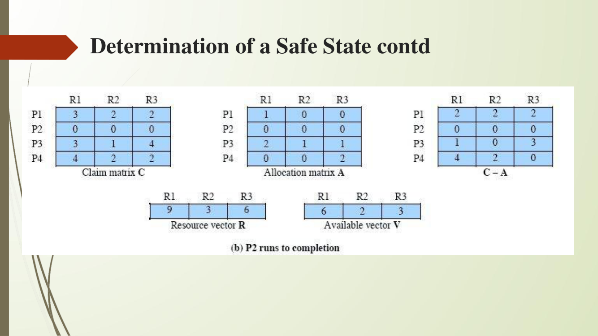

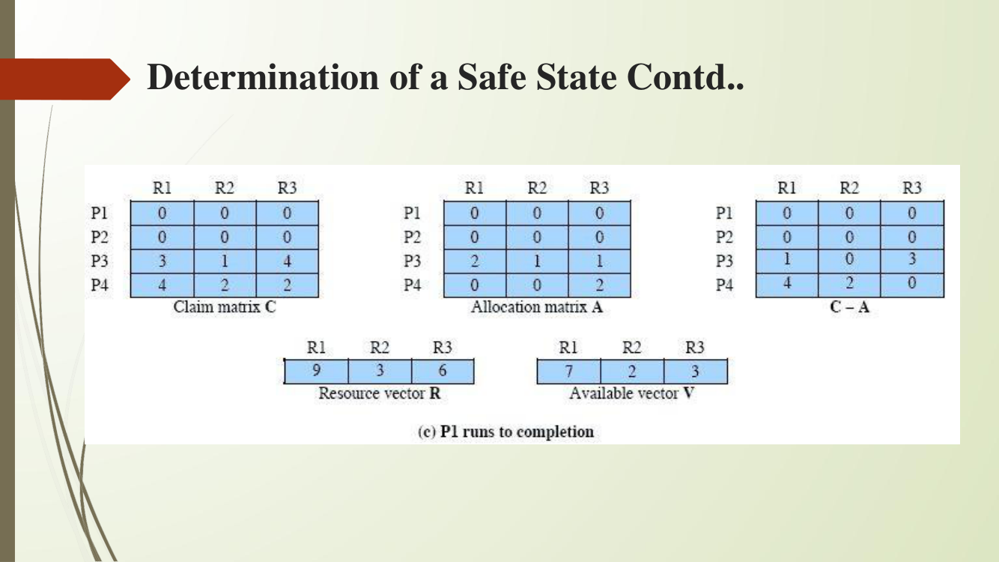

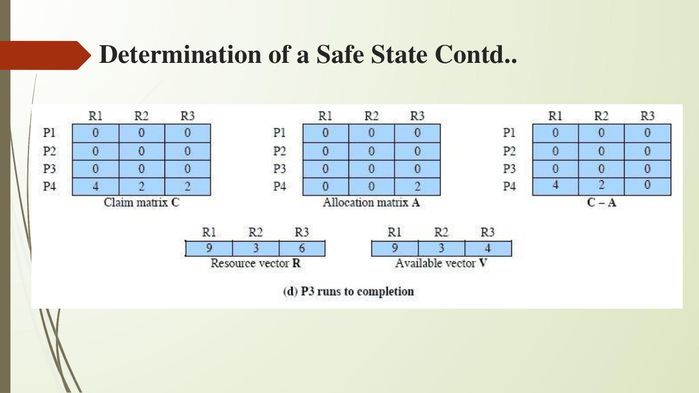

This example uses Stallings' notation: **Claim matrix C** (= Max), **Allocation matrix A**, **C − A** (= Need), **Resource vector R** (total), **Available vector V**.

**(a) Initial state** — `R = (9, 3, 6)`, `V = (0, 1, 1)`

| Process | Claim C (R1 R2 R3) | Allocation A (R1 R2 R3) | C − A (R1 R2 R3) |
|---|---|---|---|
| P1 | 3 2 2 | 1 0 0 | 2 2 2 |
| P2 | 6 1 3 | 6 1 2 | 0 0 1 |
| P3 | 3 1 4 | 2 1 1 | 1 0 3 |
| P4 | 4 2 2 | 0 0 2 | 4 2 0 |

**Step-by-step**

| Step | Who can run? | Reason | Available after completion |
|---|---|---|---|
| (b) | **P2** | Need (0,0,1) ≤ V (0,1,1) | (0,1,1) + (6,1,2) = **(6,2,3)** |
| (c) | **P1** | Need (2,2,2) ≤ (6,2,3) | (6,2,3) + (1,0,0) = **(7,2,3)** |
| (d) | **P3** | Need (1,0,3) ≤ (7,2,3) | (7,2,3) + (2,1,1) = **(9,3,4)** |
| (e) | **P4** | Need (4,2,0) ≤ (9,3,4) | (9,3,4) + (0,0,2) = **(9,3,6)** = R ✓ |

Initially only `P2` can run: `P1` needs 2 units of R1, `P3` needs 1 unit of R1, and `P4` needs 4 units of R1, but 0 are available.

**The state is safe. Safe sequence: `<P2, P1, P3, P4>`.**

### 29.3 Example 3 — determination of an unsafe state

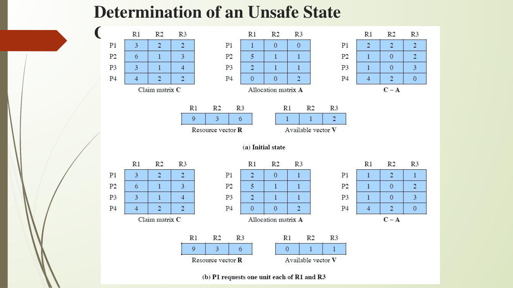

**(a) Initial state** — `R = (9, 3, 6)`, `V = (1, 1, 2)`

| Process | Claim C | Allocation A | C − A |
|---|---|---|---|
| P1 | 3 2 2 | 1 0 0 | 2 2 2 |
| P2 | 6 1 3 | 5 1 1 | 1 0 2 |
| P3 | 3 1 4 | 2 1 1 | 1 0 3 |
| P4 | 4 2 2 | 0 0 2 | 4 2 0 |

**(b) P1 requests one unit each of R1 and R3**, that is `Request = (1, 0, 1)`.

- `Request ≤ Need`? (1,0,1) ≤ (2,2,2) ✓
- `Request ≤ Available`? (1,0,1) ≤ (1,1,2) ✓
- Pretend to allocate → `V = (0, 1, 1)`:

| Process | Claim C | Allocation A | C − A |
|---|---|---|---|
| P1 | 3 2 2 | **2 0 1** | **1 2 1** |
| P2 | 6 1 3 | 5 1 1 | 1 0 2 |
| P3 | 3 1 4 | 2 1 1 | 1 0 3 |
| P4 | 4 2 2 | 0 0 2 | 4 2 0 |

**Safety check with `V = (0, 1, 1)`:** every process still needs **at least 1 unit of R1** (P1: 1, P2: 1, P3: 1, P4: 4), but **0 units of R1 are available**. No process can run to completion.

**The state is unsafe, so the request must be denied and P1 is blocked.**

> **Important:** unsafe does **not** mean deadlocked. If `P1` were to release its R1 and R3 before asking for more, the system could return to a safe state. Unsafe only means deadlock has become **possible**.

### 29.4 Example 4 — practice problem from the slides (3 processes, 3 resources)

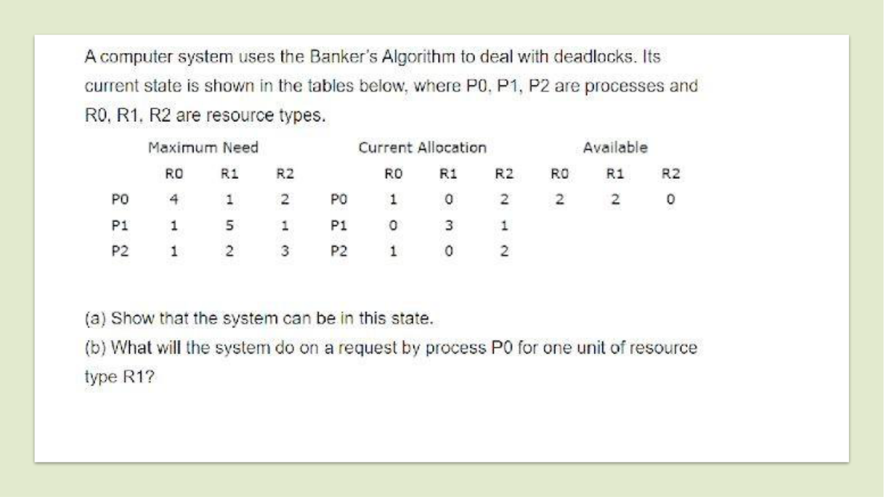

A computer system uses the Banker's algorithm. Its current state:

| Process | Maximum Need (R0 R1 R2) | Current Allocation (R0 R1 R2) |
|---|---|---|
| P0 | 4 1 2 | 1 0 2 |
| P1 | 1 5 1 | 0 3 1 |
| P2 | 1 2 3 | 1 0 2 |

**Available = (2, 2, 0)**

**(a) Show that the system can be in this state** (that is, the state is safe).

`Need = Max − Allocation`:

| Process | Need (R0 R1 R2) |
|---|---|
| P0 | 3 1 0 |
| P1 | 1 2 0 |
| P2 | 0 2 1 |

Safety algorithm with `Work = (2, 2, 0)`:

| Step | Process | Need ≤ Work? | New Work |
|---|---|---|---|
| 1 | P0 | (3,1,0) ≤ (2,2,0)? ✗ (3 > 2) | — |
| 1 | **P1** | (1,2,0) ≤ (2,2,0) ✓ | (2,2,0) + (0,3,1) = **(2,5,1)** |
| 2 | **P2** | (0,2,1) ≤ (2,5,1) ✓ | (2,5,1) + (1,0,2) = **(3,5,3)** |
| 3 | **P0** | (3,1,0) ≤ (3,5,3) ✓ | (3,5,3) + (1,0,2) = **(4,5,5)** |

**Safe sequence `<P1, P2, P0>`. The state is safe, so the system can be in this state.** (Total resources = (4, 5, 5).)

**(b) What will the system do on a request by P0 for one unit of resource type R1?** `Request_0 = (0, 1, 0)`.

1. `Request ≤ Need_0`? (0,1,0) ≤ (3,1,0) ✓
2. `Request ≤ Available`? (0,1,0) ≤ (2,2,0) ✓
3. Pretend: `Available = (2,1,0)`; `Allocation_0 = (1,1,2)`; `Need_0 = (3,0,0)`.
4. Safety check with `Work = (2, 1, 0)`:
   - P0 needs (3,0,0) ✗ (3 > 2)
   - P1 needs (1,2,0) ✗ (R1: 2 > 1)
   - P2 needs (0,2,1) ✗ (R1: 2 > 1, R2: 1 > 0)

No process can finish. **The new state would be unsafe, so the system denies the request; P0 must wait and the original state is kept.**

---

## 30. Deadlock detection

If the system uses neither prevention nor avoidance, it must:

1. **allow the system to enter a deadlock state**;
2. run a **detection algorithm**;
3. apply a **recovery scheme**.

### 30.1 Single instance of each resource type: wait-for graph

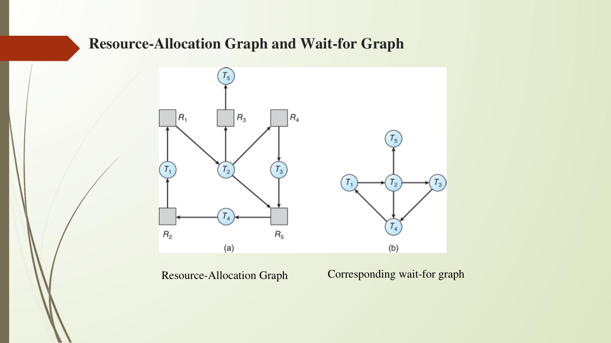

- Maintain a **wait-for graph**.
  - The **nodes are processes**.
  - There is an edge **`Pi → Pj` if `Pi` is waiting for `Pj`**.
- **Periodically** invoke an algorithm that searches for a **cycle** in the graph. **If there is a cycle, there is a deadlock.**
- Detecting a cycle in a graph requires on the order of **`n²` operations**, where `n` is the number of vertices.

The wait-for graph is obtained from the resource-allocation graph by **removing the resource nodes and collapsing the edges**: `Pi → Rq` and `Rq → Pj` become `Pi → Pj`.

```mermaid
flowchart LR
    subgraph RAG["Resource-allocation graph"]
        A1(("P1")) --> X1["R1"]
        X1 --> A2(("P2"))
        A2 --> X2["R2"]
        X2 --> A1
    end
    subgraph WFG["Corresponding wait-for graph"]
        B1(("P1")) --> B2(("P2"))
        B2 --> B1
    end
```

### 30.2 Several instances of a resource type

Data structures:

| Structure | Meaning |
|---|---|
| **Available** | Vector of length `m`: number of available resources of each type |
| **Allocation** | `n × m` matrix: number of resources of each type currently allocated to each process |
| **Request** | `n × m` matrix: the **current request** of each process. `Request[i][j] = k` means `Pi` is requesting `k` more instances of `Rj`. |

**Detection algorithm**

1. Let `Work` and `Finish` be vectors of length `m` and `n`. Initialize:
   - (a) `Work = Available`
   - (b) for `i = 1, 2, …, n`: if `Allocation_i ≠ 0` then `Finish[i] = false`; otherwise `Finish[i] = true`
2. Find an index `i` such that both:
   - (a) `Finish[i] == false`
   - (b) `Request_i ≤ Work`

   If no such `i` exists, go to step 4.
3. `Work = Work + Allocation_i`; `Finish[i] = true`; go to step 2.
4. If `Finish[i] == false` for some `i`, the system is in a **deadlock state**. Moreover, each `Pi` with `Finish[i] == false` is **deadlocked**.

The algorithm requires on the order of **`O(m × n²)`** operations.

**Detection vs safety algorithm**

| Safety algorithm (avoidance) | Detection algorithm |
|---|---|
| Uses **Need** (future maximum demand) | Uses **Request** (what is being asked for right now) |
| `Finish[i] = false` for all `i` at the start | `Finish[i] = true` at the start if the process holds nothing |
| Answers: could a deadlock occur in the **future**? | Answers: is there a deadlock **now**? |

### 30.3 Example of the detection algorithm

Five processes `P0`–`P4`; three resource types **A (7 instances), B (2 instances), C (6 instances)**.

**Snapshot at time T0:**

| Process | Allocation (A B C) | Request (A B C) |
|---|---|---|
| P0 | 0 1 0 | 0 0 0 |
| P1 | 2 0 0 | 2 0 2 |
| P2 | 3 0 3 | 0 0 0 |
| P3 | 2 1 1 | 1 0 0 |
| P4 | 0 0 2 | 0 0 2 |

**Available = (0, 0, 0)**

| Step | Process | Request ≤ Work? | New Work |
|---|---|---|---|
| 1 | P0 | (0,0,0) ≤ (0,0,0) ✓ | (0,1,0) |
| 2 | P2 | (0,0,0) ≤ (0,1,0) ✓ | (3,1,3) |
| 3 | P3 | (1,0,0) ≤ (3,1,3) ✓ | (5,2,4) |
| 4 | P1 | (2,0,2) ≤ (5,2,4) ✓ | (7,2,4) |
| 5 | P4 | (0,0,2) ≤ (7,2,4) ✓ | (7,2,6) |

The sequence **`<P0, P2, P3, P1, P4>`** gives `Finish[i] = true` for all `i`. **No deadlock.**

**Now suppose P2 requests one additional instance of type C:**

| Process | Request (A B C) |
|---|---|
| P0 | 0 0 0 |
| P1 | 2 0 2 |
| **P2** | **0 0 1** |
| P3 | 1 0 0 |
| P4 | 0 0 2 |

State of the system?

- `P0` can finish; reclaiming its resources gives `Work = (0, 1, 0)`.
- That is **insufficient** to fulfil any other process's request (P1 needs A and C, P2 needs C, P3 needs A, P4 needs C).

**A deadlock exists, consisting of processes P1, P2, P3, and P4.**

### 30.4 Practice question from the slides (4 processes, 5 resources)

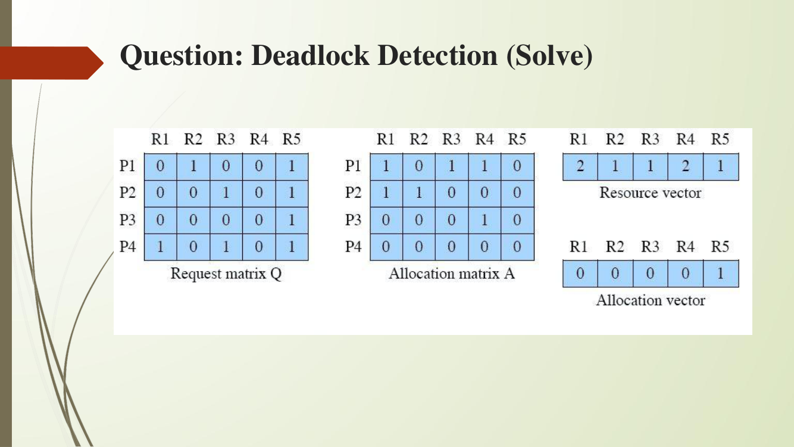

**Request matrix Q** and **Allocation matrix A**:

| Process | Request Q (R1 R2 R3 R4 R5) | Allocation A (R1 R2 R3 R4 R5) |
|---|---|---|
| P1 | 0 1 0 0 1 | 1 0 1 1 0 |
| P2 | 0 0 1 0 1 | 1 1 0 0 0 |
| P3 | 0 0 0 0 1 | 0 0 0 1 0 |
| P4 | 1 0 1 0 1 | 0 0 0 0 0 |

**Resource vector = (2, 1, 1, 2, 1)**; **Available vector = (0, 0, 0, 0, 1)** (labelled "Allocation vector" on the slide).

*Check:* column sums of A = (2, 1, 1, 2, 0); resource − allocated = (0, 0, 0, 0, 1). ✓

**Solution**

1. **Mark P4**, because it has no allocated resources (`Allocation_4 = 0`, so `Finish[4] = true`). It cannot be part of a deadlock.
2. Set `Work = Available = (0, 0, 0, 0, 1)`.
3. `P3`: Request (0,0,0,0,1) ≤ Work (0,0,0,0,1) ✓ → **mark P3**; `Work = (0,0,0,0,1) + (0,0,0,1,0) = (0, 0, 0, 1, 1)`.
4. `P1`: Request (0,1,0,0,1) ≤ (0,0,0,1,1)? ✗ (needs R2).
5. `P2`: Request (0,0,1,0,1) ≤ (0,0,0,1,1)? ✗ (needs R3).
6. No other unmarked process can proceed. The algorithm terminates.

**P1 and P2 remain unmarked, so P1 and P2 are deadlocked.** (P1 holds R3, which P2 wants; P2 holds R2, which P1 wants.)

### 30.5 Detection-algorithm usage

When, and how often, to invoke the detection algorithm depends on:

- **How often** is a deadlock likely to occur?
- **How many processes** will need to be rolled back? (One for each disjoint cycle.)

If the detection algorithm is invoked **arbitrarily**, there may be **many cycles** in the resource graph, and we would not be able to tell **which of the many deadlocked processes "caused" the deadlock**.

Trade-off: invoking it on every request finds the culprit immediately but is expensive; invoking it rarely is cheap but lets deadlocks linger and grow.

---

## 31. Recovery from deadlock

### 31.1 Process termination

Two options:

1. **Abort all deadlocked processes.** Simple but expensive, since all partial computation is lost.
2. **Abort one process at a time until the deadlock cycle is eliminated.** The detection algorithm must be re-run after each abort.

**In which order should we choose to abort?**

1. **Priority** of the process.
2. **How long** the process has computed, and **how much longer** to completion.
3. **Resources the process has used.**
4. **Resources the process needs** to complete.
5. **How many processes** will need to be terminated.
6. Is the process **interactive or batch**?

### 31.2 Resource preemption

Take resources away from some processes and give them to others until the deadlock is broken. Three issues:

| Issue | Meaning |
|---|---|
| **Selecting a victim** | Choose which resources and processes to preempt so as to **minimize cost** |
| **Rollback** | Return the victim to **some safe state** and **restart** it from that state |
| **Starvation** | The same process may **always be picked as the victim**. Fix: include the **number of rollbacks in the cost factor**. |

---

## 32. Prevention vs avoidance vs detection

### 32.1 Summary table from the slides (advantages and disadvantages)

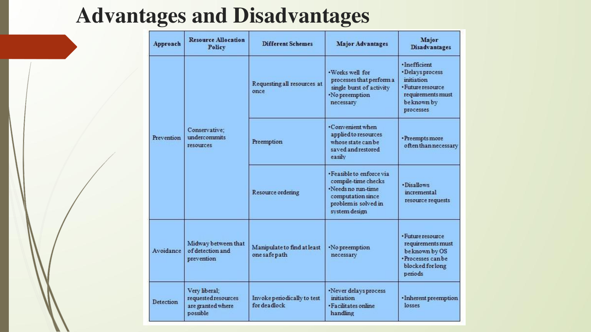

| Approach | Resource-allocation policy | Different schemes | Major advantages | Major disadvantages |
|---|---|---|---|---|
| **Prevention** | Conservative; undercommits resources | **Requesting all resources at once** | Works well for processes that perform a single burst of activity; no preemption necessary | Inefficient; delays process initiation; future resource requirements must be known by processes |
| | | **Preemption** | Convenient when applied to resources whose state can be saved and restored easily | Preempts more often than necessary |
| | | **Resource ordering** | Feasible to enforce via compile-time checks; needs no run-time computation since the problem is solved in system design | Disallows incremental resource requests |
| **Avoidance** | Midway between detection and prevention | **Manipulate to find at least one safe path** | No preemption necessary | Future resource requirements must be known by the OS; processes can be blocked for long periods |
| **Detection** | Very liberal; requested resources are granted where possible | **Invoke periodically to test for deadlock** | Never delays process initiation; facilitates online handling | Inherent preemption losses |

### 32.2 Quick comparison

| Aspect | Prevention | Avoidance | Detection and recovery |
|---|---|---|---|
| Idea | Break one of the four conditions | Never enter an unsafe state | Let it happen, then fix it |
| Information needed | None in advance | Maximum claim of each process | Current allocation and requests |
| When the decision is made | Design time (static rules) | Each request (dynamic) | Periodically |
| Resource utilization | Lowest | Medium | Highest |
| Algorithm | Protocol rules (ordering, all-at-once) | RAG algorithm; Banker's | Wait-for graph; detection algorithm |
| Main cost | Low utilization, starvation | Run-time overhead, must know Max | Lost work on abort or rollback |

---

## Appendix A. Processes and interprocess communication (Chapter 3)

> **Source note:** built from `ch3.ppt` (Chapter 3: Processes, *Operating System Concepts*, 10th edition). This chapter is **not in the T2 syllabus line**, but threads, scheduling, synchronization, and deadlocks all assume it. Use it as background: process states, the PCB, context switching, `fork()`/`exec()`/`wait()`, and the producer-consumer problem come back again and again in Parts 1 to 3.

### A.1 Process concept

> **Process:** a **program in execution**. Process execution must progress in **sequential** fashion.

A process has several parts:

| Part | Contents |
|---|---|
| **Text section** | The program code |
| **Current activity** | The **program counter** and the processor **registers** |
| **Stack** | Temporary data: function parameters, return addresses, local variables |
| **Data section** | Global variables |
| **Heap** | Memory dynamically allocated during run time |

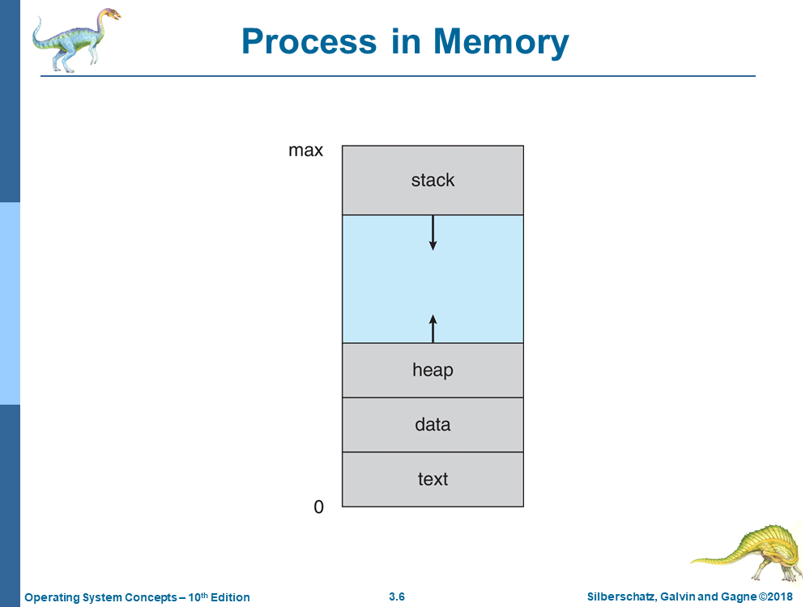

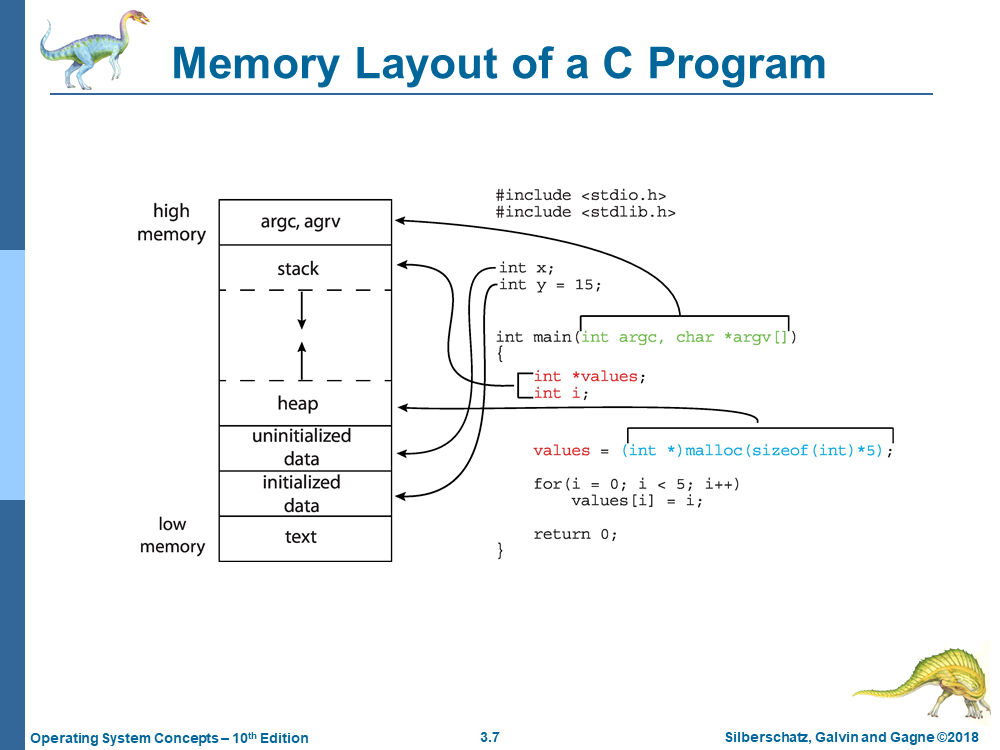

**Program vs process**

| Program | Process |
|---|---|
| **Passive** entity stored on disk (an executable file) | **Active** entity |
| Becomes a process when the executable file is **loaded into memory** | Has a program counter, stack, data section, and heap |
| One program | Can be **several processes** (for example many users running the same program) |

Execution of a program starts through GUI mouse clicks, a command-line entry of its name, and so on.

### A.2 Process states

As a process executes, it changes **state**.

| State | Meaning |
|---|---|
| **New** | The process is being created |
| **Ready** | The process is waiting to be assigned to a processor |
| **Running** | Instructions are being executed |
| **Waiting** | The process is waiting for some event to occur (for example I/O completion) |
| **Terminated** | The process has finished execution |

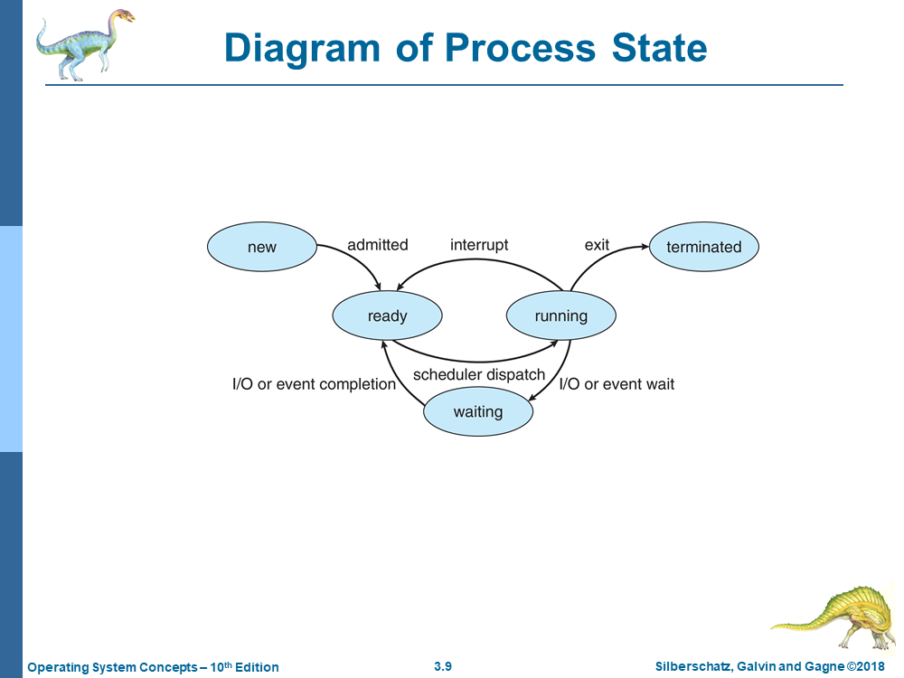

| Transition | Cause |
|---|---|
| New → Ready | Admitted |
| Ready → Running | **Scheduler dispatch** |
| Running → Ready | **Interrupt** (for example the time slice expires) |
| Running → Waiting | I/O or event wait |
| Waiting → Ready | I/O or event completion |
| Running → Terminated | Exit |

Only **one** process can be running on a processor core at any instant; many processes may be ready or waiting. A waiting process never goes straight back to running: it always passes through **ready**.

### A.3 Process Control Block (PCB)

> **PCB (also called task control block):** the data structure holding the information associated with each process.

| Field | What it stores |
|---|---|
| **Process state** | Running, waiting, and so on |
| **Program counter** | Location of the next instruction to execute |
| **CPU registers** | Contents of all process-centric registers |
| **CPU-scheduling information** | Priorities, scheduling-queue pointers |
| **Memory-management information** | Memory allocated to the process |
| **Accounting information** | CPU used, clock time elapsed since start, time limits |
| **I/O status information** | I/O devices allocated to the process, list of open files |

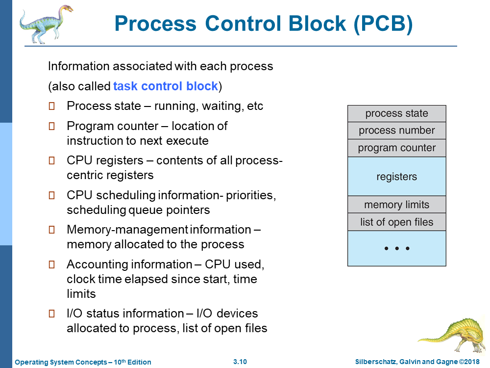

**Threads.** So far a process has a **single thread of execution**. With **multiple program counters per process**, multiple locations can execute at once: these are multiple threads of control. The PCB must then store thread details and several program counters. This is covered in sections 2 to 10.

**Process representation in Linux.** A process is represented by the C structure `task_struct`:

```c
pid_t pid;                    /* process identifier */
long state;                   /* state of the process */
unsigned int time_slice;      /* scheduling information */
struct task_struct *parent;   /* this process's parent */
struct list_head children;    /* this process's children */
struct files_struct *files;   /* list of open files */
struct mm_struct *mm;         /* address space of this process */
```

### A.4 Process scheduling

- **Goal:** maximize CPU use, and quickly switch processes onto a CPU core.
- The **process scheduler** selects among the available processes for the next execution on a CPU core.
- It maintains **scheduling queues** of processes:

| Queue | Contents |
|---|---|
| **Ready queue** | All processes residing in main memory, ready and waiting to execute |
| **Wait queues** | Processes waiting for an event (for example I/O) |

- Processes **migrate** among the various queues during their lifetime.

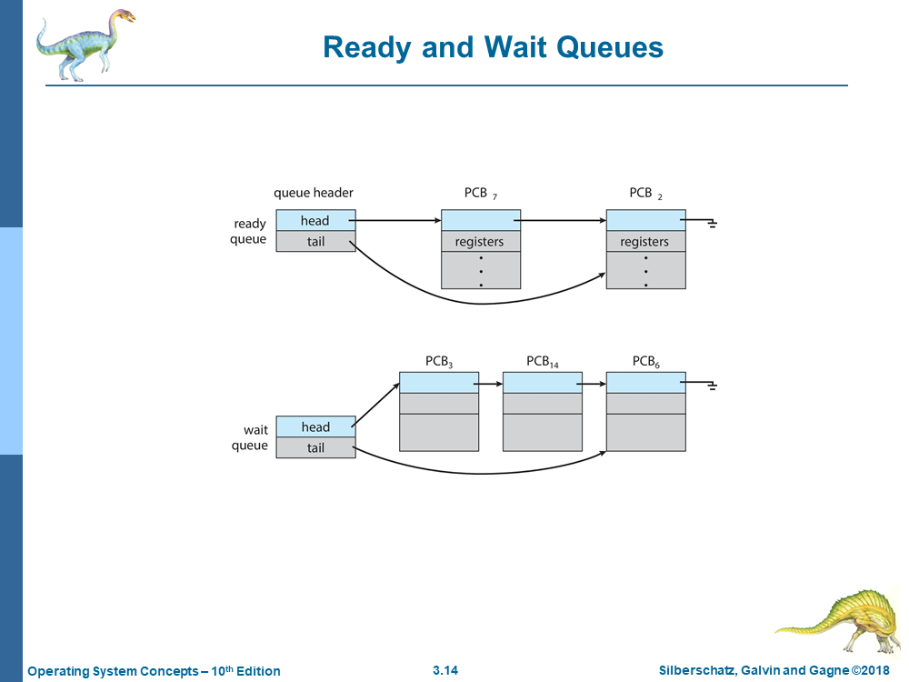

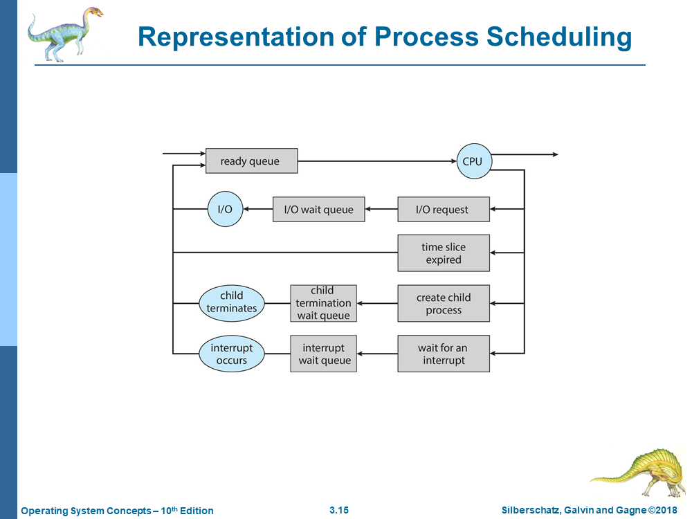

A running process leaves the CPU for one of four reasons shown in the queueing diagram: it issues an **I/O request**, its **time slice expires**, it **creates a child** and waits for it to terminate, or it **waits for an interrupt**. In every case it eventually returns to the ready queue.

**Context switch**

> **Context switch:** when the CPU switches to another process, the system **saves the state of the old process** and **loads the saved state of the new process**. The context of a process is represented in its **PCB**.

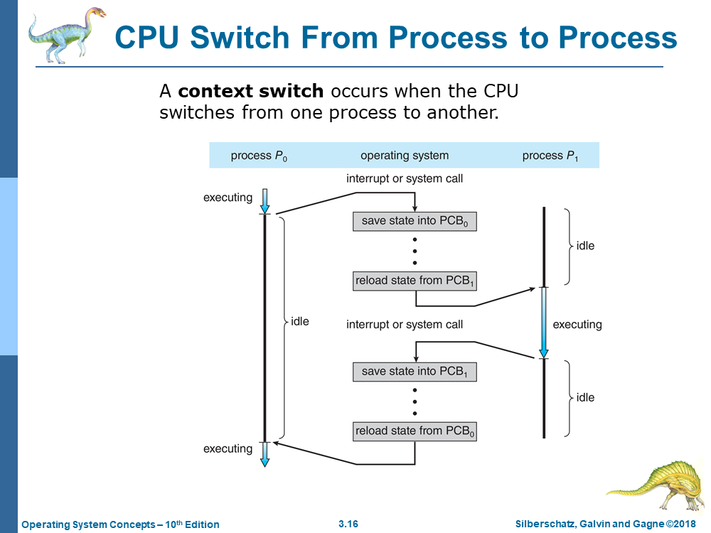

- Context-switch time is **pure overhead**: the system does no useful work while switching.
- The more complex the OS and the PCB, the **longer** the context switch.
- The time depends on **hardware support**: some hardware provides multiple sets of registers per CPU, so several contexts can be loaded at once.

**Multitasking in mobile systems**

| System | Behaviour |
|---|---|
| **Early iOS** | Only one process runs; the others are suspended |
| **iOS** | A single **foreground** process (controlled through the user interface) and multiple **background** processes (in memory and running, but not on the display, and with limits: a single short task, receiving event notifications, specific long-running tasks such as audio playback) |
| **Android** | Runs foreground and background with **fewer limits**. A background process uses a **service** to perform tasks; the service keeps running even if the background process is suspended, has no user interface, and uses little memory |

### A.5 Operations on processes

The system must provide mechanisms for **process creation** and **process termination**.

**Process creation**

- A **parent** process creates **children**, which in turn create other processes, forming a **tree of processes**.
- A process is identified and managed through a **process identifier (pid)**.

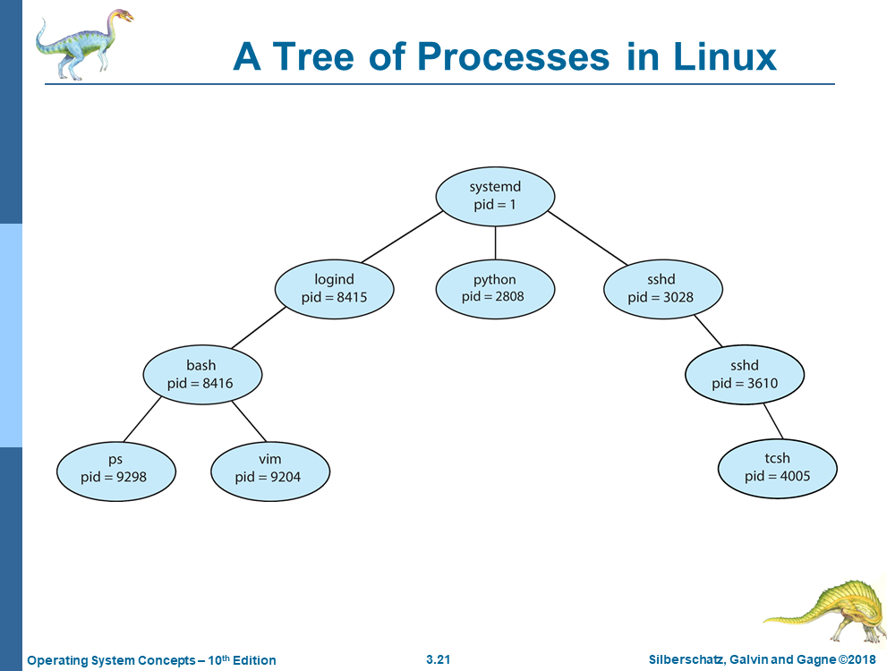

| Design choice | Options |
|---|---|
| **Resource sharing** | Parent and children share **all** resources · children share a **subset** of the parent's resources · parent and child share **no** resources |
| **Execution** | Parent and children execute **concurrently** · parent **waits** until the children terminate |
| **Address space** | Child is a **duplicate** of the parent · child has a **new program** loaded into it |

**UNIX system calls**

| Call | Effect |
|---|---|
| `fork()` | Creates a new process (a copy of the parent). Returns **0 in the child** and the **child's pid in the parent**; a negative value means failure |
| `exec()` | Used after `fork()` to **replace the process's memory space with a new program** |
| `wait()` | The parent waits for the child to terminate |
| `exit()` | The process terminates and asks the OS to delete it |

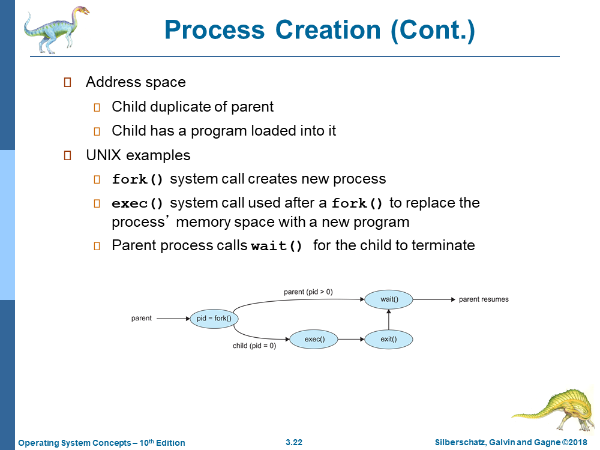

```c
#include <sys/types.h>
#include <stdio.h>
#include <unistd.h>

int main()
{
    pid_t pid;

    /* fork a child process */
    pid = fork();

    if (pid < 0) {                 /* error occurred */
        fprintf(stderr, "Fork Failed");
        return 1;
    }
    else if (pid == 0) {           /* child process */
        execlp("/bin/ls", "ls", NULL);
    }
    else {                         /* parent process */
        /* parent will wait for the child to complete */
        wait(NULL);
        printf("Child Complete");
    }

    return 0;
}
```

On Windows the equivalent is `CreateProcess()`, which creates the child **and** loads the specified program into it in one call; the parent then waits with `WaitForSingleObject()`.

**Process termination**

- A process executes its last statement and asks the OS to delete it using **`exit()`**. Status data is returned from child to parent through `wait()`, and the process's resources are **deallocated** by the OS.
- A parent may terminate its children with **`abort()`**. Reasons:
  - the child has **exceeded its allocated resources**;
  - the task assigned to the child is **no longer required**;
  - the parent is exiting, and the OS does not allow a child to continue if its parent terminates.
- **Cascading termination:** on such systems, when a process terminates, all its children, grandchildren, and so on are terminated too. The termination is initiated by the operating system.
- The parent waits with `pid = wait(&status);`, which returns the status information and the pid of the terminated child.

| Term | Meaning |
|---|---|
| **Zombie** | A process that has terminated, but whose parent has **not yet called `wait()`** |
| **Orphan** | A process whose parent **terminated without calling `wait()`** |

**Android process importance hierarchy.** Mobile systems often terminate processes to reclaim resources such as memory. From most to least important: **foreground → visible → service → background → empty**. Android terminates the **least important** processes first.

**Multiprocess architecture: the Chrome browser.** Many browsers ran as a single process, so one misbehaving site could hang or crash the whole browser. Chrome uses three kinds of process:

| Process | Role |
|---|---|
| **Browser** | Manages the user interface, disk I/O, and network I/O |
| **Renderer** | Renders web pages (HTML, JavaScript); a new renderer for each site opened. Runs in a **sandbox** that restricts disk and network I/O, limiting the effect of security exploits |
| **Plug-in** | One process for each type of plug-in |

### A.6 Interprocess communication (IPC)

| Independent process | Cooperating process |
|---|---|
| **Cannot** affect or be affected by the execution of another process | **Can** affect or be affected by other processes, including by sharing data |

**Reasons for process cooperation:** information sharing, computation speedup, modularity, convenience.

Cooperating processes need **interprocess communication**. There are two models.

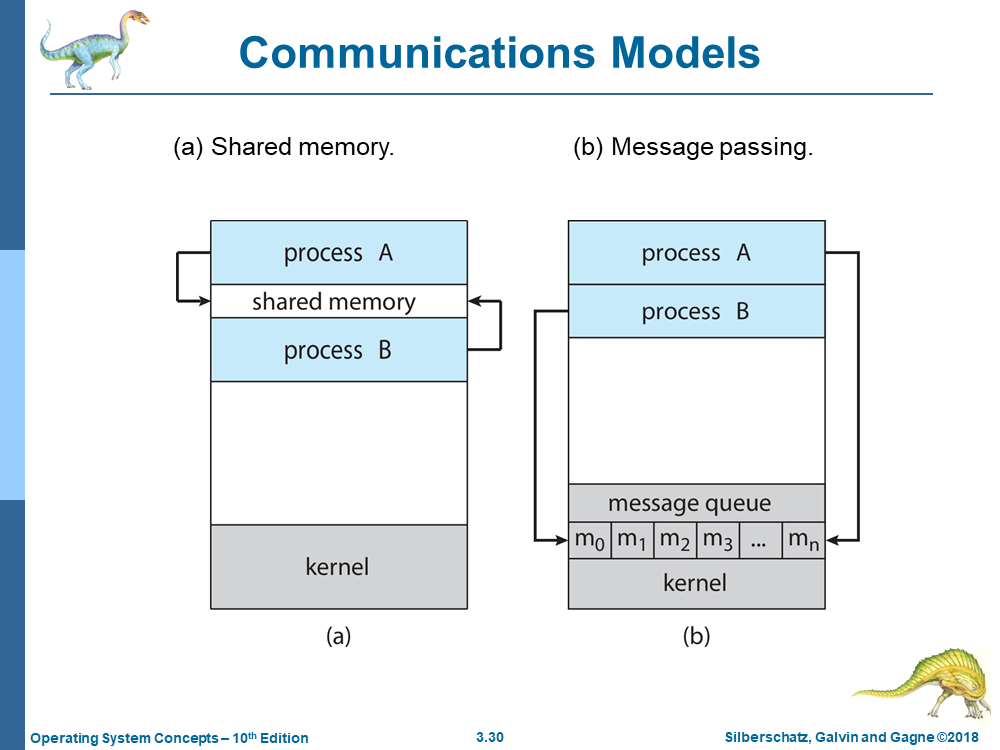

| Aspect | Shared memory | Message passing |
|---|---|---|
| Mechanism | A region of memory shared by the communicating processes | Messages exchanged with `send()` and `receive()` |
| Controlled by | The **user processes** | The **operating system** (kernel) |
| System calls | Needed only to **set up** the shared region | Needed for **every** message |
| Speed | Faster | Slower |
| Synchronization | The **processes** must synchronize their own access | Handled by the message system |
| Best suited to | Large amounts of data on one machine | Small amounts of data; distributed systems |

**Producer-consumer problem.** The standard paradigm for cooperating processes: a **producer** process produces information that is consumed by a **consumer** process.

| Buffer type | Meaning |
|---|---|
| **Unbounded buffer** | No practical limit on the size of the buffer; the producer never waits |
| **Bounded buffer** | Fixed buffer size; the producer waits when the buffer is full, and the consumer waits when it is empty |

### A.7 IPC in shared-memory systems

- An area of memory is shared among the processes that wish to communicate.
- The communication is under the control of the **user processes**, not the operating system.
- The major issue is providing a mechanism that lets the processes **synchronize** their actions when they access the shared memory. That is the subject of Part 2 (sections 12 to 21).

**Bounded buffer: shared data**

```c
#define BUFFER_SIZE 10

typedef struct {
    . . .
} item;

item buffer[BUFFER_SIZE];
int in = 0;      /* next free position */
int out = 0;     /* first full position */
```

**Producer**

```c
item next_produced;

while (true) {
    /* produce an item in next_produced */
    while (((in + 1) % BUFFER_SIZE) == out)
        ;   /* do nothing: buffer full */
    buffer[in] = next_produced;
    in = (in + 1) % BUFFER_SIZE;
}
```

**Consumer**

```c
item next_consumed;

while (true) {
    while (in == out)
        ;   /* do nothing: buffer empty */
    next_consumed = buffer[out];
    out = (out + 1) % BUFFER_SIZE;
    /* consume the item in next_consumed */
}
```

| Condition | Test |
|---|---|
| Buffer **empty** | `in == out` |
| Buffer **full** | `((in + 1) % BUFFER_SIZE) == out` |

The solution is correct, but it can use only **`BUFFER_SIZE − 1`** elements: one slot is always left empty so that "full" and "empty" can be told apart. Section 12.2 fixes this with a shared `counter`, and that is exactly what introduces the **race condition**.

### A.8 IPC in message-passing systems

- A mechanism for processes to communicate **and to synchronize** their actions **without shared variables**.
- The IPC facility provides two operations: **`send(message)`** and **`receive(message)`**.
- The message size is either **fixed** or **variable**.

If processes P and Q wish to communicate, they must **establish a communication link** and then **exchange messages** through send/receive.

**Implementation questions:** How are links established? Can a link be associated with more than two processes? How many links can there be between a pair of processes? What is the capacity of a link? Is the message size fixed or variable? Is a link unidirectional or bidirectional?

| Level | Choices |
|---|---|
| **Physical** implementation of a link | Shared memory · hardware bus · network |
| **Logical** implementation of a link | Direct or indirect · synchronous or asynchronous · automatic or explicit buffering |

**Direct vs indirect communication**

| Aspect | Direct | Indirect |
|---|---|---|
| Naming | Processes **name each other** explicitly | Messages go through **mailboxes (ports)**, each with a unique id |
| Primitives | `send(P, message)`, `receive(Q, message)` | `send(A, message)`, `receive(A, message)` for mailbox A |
| Link establishment | **Automatic** | Only if the processes **share a common mailbox** |
| Processes per link | Exactly **one pair** | **Many** processes |
| Links per pair | Exactly **one** | **Several** (one per shared mailbox) |
| Direction | May be unidirectional, usually **bidirectional** | Unidirectional or bidirectional |

Indirect communication needs three operations: **create** a mailbox, **send and receive** through it, and **destroy** it.

**Mailbox sharing problem.** P1, P2, and P3 share mailbox A. P1 sends; P2 and P3 both receive. Who gets the message? Solutions:

1. allow a link to be associated with **at most two** processes;
2. allow **only one process at a time** to execute a receive operation;
3. let the **system select the receiver arbitrarily**, and notify the sender who it was.

**Synchronization**

| Operation | Blocking (synchronous) | Non-blocking (asynchronous) |
|---|---|---|
| **Send** | The sender is blocked until the message is received | The sender sends the message and continues |
| **Receive** | The receiver is blocked until a message is available | The receiver gets either a valid message or a **null** message |

Different combinations are possible. If **both** send and receive are blocking, we have a **rendezvous**.

With blocking send and receive, the producer-consumer problem becomes trivial:

```c
/* producer */                              /* consumer */
message next_produced;                      message next_consumed;
while (true) {                              while (true) {
    /* produce an item in next_produced */      receive(next_consumed);
    send(next_produced);                        /* consume the item in next_consumed */
}                                           }
```

**Buffering.** A queue of messages is attached to the link. It is implemented in one of three ways:

| Capacity | Queue length | Sender behaviour |
|---|---|---|
| **Zero capacity** | No messages are queued | The sender must **wait for the receiver** (rendezvous) |
| **Bounded capacity** | Finite length of *n* messages | The sender waits **only if the link is full** |
| **Unbounded capacity** | Infinite length | The sender **never waits** |

### A.9 Examples of IPC systems

**POSIX shared memory**

| Step | Call |
|---|---|
| Create (or open) the shared-memory segment | `shm_fd = shm_open(name, O_CREAT \| O_RDWR, 0666);` |
| Set the size of the object | `ftruncate(shm_fd, 4096);` |
| Memory-map the object | `ptr = mmap(0, SIZE, PROT_WRITE, MAP_SHARED, shm_fd, 0);` |
| Read and write | Through the pointer returned by `mmap()` |
| Remove the object | `shm_unlink(name);` |

Producer:

```c
#include <stdio.h>
#include <stdlib.h>
#include <string.h>
#include <fcntl.h>
#include <sys/shm.h>
#include <sys/stat.h>

int main()
{
    const int SIZE = 4096;                 /* size (in bytes) of the shared memory object */
    const char *name = "OS";               /* name of the shared memory object */
    const char *message_0 = "Hello";       /* strings written to shared memory */
    const char *message_1 = "World!";

    int shm_fd;                            /* shared memory file descriptor */
    void *ptr;                             /* pointer to the shared memory object */

    shm_fd = shm_open(name, O_CREAT | O_RDWR, 0666);             /* create the object */
    ftruncate(shm_fd, SIZE);                                     /* configure its size */
    ptr = mmap(0, SIZE, PROT_WRITE, MAP_SHARED, shm_fd, 0);      /* memory-map it */

    sprintf(ptr, "%s", message_0);                               /* write to it */
    ptr += strlen(message_0);
    sprintf(ptr, "%s", message_1);
    ptr += strlen(message_1);

    return 0;
}
```

Consumer:

```c
int main()
{
    const int SIZE = 4096;
    const char *name = "OS";
    int shm_fd;
    void *ptr;

    shm_fd = shm_open(name, O_RDONLY, 0666);                     /* open the object */
    ptr = mmap(0, SIZE, PROT_READ, MAP_SHARED, shm_fd, 0);       /* memory-map it */

    printf("%s", (char *)ptr);                                   /* read from it */

    shm_unlink(name);                                            /* remove the object */
    return 0;
}
```

**Mach**

- Communication is **message based**; even system calls are messages.
- Each task gets **two ports** at creation: **Kernel** and **Notify**.
- Messages are sent and received with **`mach_msg()`**; ports are created with **`mach_port_allocate()`**.
- If a mailbox is full, the sender has four options: **wait indefinitely**, **wait at most *n* milliseconds**, **return immediately**, or **temporarily cache** the message.

**Windows**

- Message-passing centric, through the **advanced local procedure call (ALPC)** facility, which works only between processes on the **same system**.
- Uses **ports** (like mailboxes) to establish and maintain communication channels.

```mermaid
flowchart LR
    C["Client"] -->|"1. opens a handle to the connection port"| CP["Connection port"]
    C -->|"2. sends a connection request"| S["Server"]
    S -->|"3. creates two private communication ports, returns one handle"| C
    C <-->|"4. messages, callbacks, and replies through the port handles"| S
```

### A.10 Pipes

> **Pipe:** a **conduit** allowing two processes to communicate.

Four questions to ask about any pipe: Is communication **unidirectional or bidirectional**? If two-way, is it **half or full duplex**? Must there be a **relationship** (such as parent-child) between the processes? Can it be used **over a network**?

| Aspect | Ordinary (anonymous) pipes | Named pipes |
|---|---|---|
| Direction | **Unidirectional** | **Bidirectional** |
| Relationship needed | **Parent-child** | **None** |
| Access | Cannot be accessed from outside the process that created it | Several processes can use it |
| Style | Producer writes to the **write end**; consumer reads from the **read end** | General communication |
| Platforms | UNIX; Windows calls them **anonymous pipes** | Both UNIX and Windows |

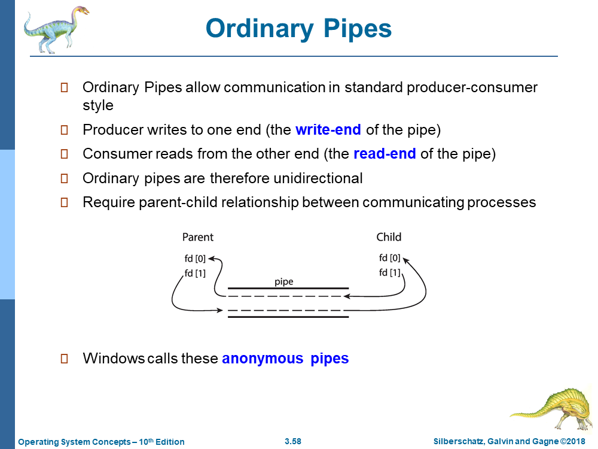

In UNIX an ordinary pipe is created with `pipe(int fd[])`: **`fd[0]` is the read end** and **`fd[1]` is the write end**. Typically a parent creates the pipe and uses it to communicate with a child it creates with `fork()`.

### A.11 Communication in client-server systems

**Sockets**

> **Socket:** an **endpoint for communication**, identified by an **IP address concatenated with a port number**.

- The **port** is a number included at the start of a message packet to differentiate the network services on a host.
- The socket **`161.25.19.8:1625`** refers to port **1625** on host **161.25.19.8**.
- Communication takes place between a **pair of sockets**.
- All ports **below 1024** are **well known** and used for standard services.
- The special IP address **`127.0.0.1`** (**loopback**) refers to the system on which the process is running.

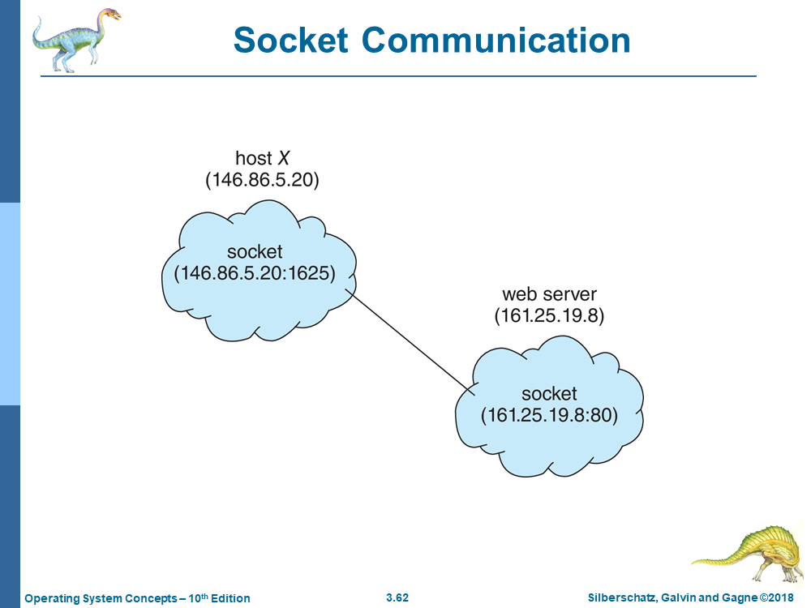

| Java socket type | Class | Nature |
|---|---|---|
| **Connection-oriented (TCP)** | `Socket`, `ServerSocket` | Reliable stream |
| **Connectionless (UDP)** | `DatagramSocket` | Individual datagrams |
| **Multicast** | `MulticastSocket` | Data can be sent to multiple recipients |

The slides' "Date" server listens on a port with a `ServerSocket`, blocks in `accept()`, and writes the date to each client that connects; the client opens a `Socket` to `127.0.0.1` on that port and reads the reply.

**Remote procedure calls (RPC)**

> **RPC:** abstracts procedure calls between processes on **networked systems**. It again uses **ports** for service differentiation.

- **Stub:** a client-side **proxy** for the actual procedure on the server.
- The **client-side stub** locates the server and **marshals** the parameters.
- The **server-side stub** receives the message, **unpacks** the marshalled parameters, and performs the procedure on the server.
- On Windows, stub code is compiled from a specification written in **Microsoft Interface Definition Language (MIDL)**.
- **Data representation** is handled through the **External Data Representation (XDR)** format (the slide prints "XDL"), to account for different architectures such as **big-endian** and **little-endian**.
- Remote communication has **more failure scenarios** than local communication, so messages can be delivered **exactly once** rather than **at most once**.
- The OS typically provides a **rendezvous (matchmaker)** service to connect client and server.

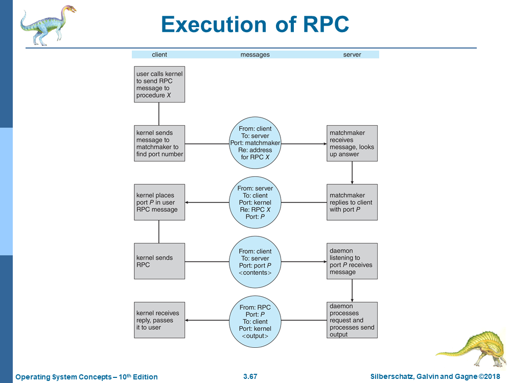

### A.12 Key terms and likely questions

| Term | One-line meaning |
|---|---|
| Process | A program in execution |
| PCB | Per-process data structure: state, program counter, registers, scheduling, memory, accounting, I/O information |
| Ready queue | Processes in main memory, ready and waiting to execute |
| Context switch | Saving the state of the old process and loading the saved state of the new one |
| `fork()` / `exec()` / `wait()` | Create a child / load a new program / wait for the child to terminate |
| Zombie | Terminated process whose parent has not yet called `wait()` |
| Orphan | Process whose parent terminated without calling `wait()` |
| Cascading termination | Terminating a process terminates all of its descendants |
| Rendezvous | Both send and receive are blocking (zero-capacity link) |
| Mailbox (port) | Object through which messages are sent and received in indirect communication |
| Ordinary pipe | Unidirectional, parent-child only |
| Named pipe | Bidirectional, no parent-child relationship needed |
| Socket | Endpoint for communication: IP address plus port |
| Stub | Client-side proxy that marshals the parameters of a remote procedure call |

**Likely questions**

1. Define a process. Draw the process state diagram and explain each transition.
2. What is a PCB? List its fields.
3. What is a context switch? Why is it pure overhead?
4. Explain `fork()`, `exec()`, and `wait()` with a C program. What does `fork()` return in the parent and in the child?
5. Distinguish a zombie process from an orphan process.
6. Compare shared memory and message passing.
7. Write the bounded-buffer producer and consumer using shared memory. Why can only `BUFFER_SIZE − 1` slots be used?
8. Compare direct and indirect communication. What is the mailbox-sharing problem?
9. Explain blocking and non-blocking send and receive. What is a rendezvous?
10. Compare ordinary pipes and named pipes.
11. What is a socket? What is an RPC, and what does a stub do?

---

## 33. Rapid revision tables

### 33.1 One-line definitions

| Term | One-line answer |
|---|---|
| Thread | A separate stream of execution within a process; basic unit of CPU utilization |
| TCB | Thread Control Block: stores a thread's registers and stack information |
| Heavyweight process | A process with a single thread of control |
| Lightweight process | A thread; also the intermediate structure between user and kernel threads |
| Concurrency | More than one task making progress (possibly interleaved on one core) |
| Parallelism | More than one task executing simultaneously (needs multiple cores) |
| Data parallelism | Same operation on subsets of the same data across cores |
| Task parallelism | Different operations (threads) distributed across cores |
| Amdahl's Law | speedup ≤ 1 / (S + (1 − S)/N) |
| ULT | Thread managed by a user-level library; kernel unaware |
| KLT | Thread created and managed by the kernel |
| Jacketing | Converting a blocking system call into a non-blocking one |
| Many-to-One | Many user threads mapped to one kernel thread |
| One-to-One | Each user thread mapped to its own kernel thread |
| Many-to-Many | Many user threads mapped to many kernel threads |
| Two-level model | Many-to-many plus the ability to bind a user thread to a kernel thread |
| Pthreads | POSIX standard (IEEE 1003.1c) API; a specification, not an implementation |
| Implicit threading | Thread creation and management done by compilers and run-time libraries |
| Thread pool | A set of pre-created threads that await work |
| Fork-join | Tasks are forked into subtasks and then joined |
| OpenMP | Compiler directives and API for shared-memory parallel programming |
| Grand Central Dispatch | Apple technology that places blocks on dispatch queues |
| Signal | Notification to a process that a particular event has occurred |
| Target thread | The thread that is to be cancelled |
| Asynchronous cancellation | Target thread is terminated immediately |
| Deferred cancellation | Target thread checks periodically and stops at a cancellation point |
| TLS | Per-thread copy of data, visible across function calls |
| Thread-safe function | Can be called by many threads at once without disruption |
| Scheduler activation | Kernel-to-library communication using upcalls |
| Upcall | A call from the kernel to the upcall handler in the thread library |
| ETHREAD / KTHREAD / TEB | Windows thread structures: executive block, kernel block, environment block |
| `clone()` | Linux system call that creates a task; flags control what is shared |
| SMP | Each processor is self-scheduling |
| Processor affinity | Tendency of a process to stay on the same processor |
| MLQ | Multilevel queue: the ready queue is split into separate queues; a process never changes queue |
| MLFQ | Multilevel feedback queue: processes move between queues based on CPU-burst behaviour |
| Hard real-time | A critical task must complete within a guaranteed amount of time |
| Soft real-time | Critical processes receive priority over others, with no guarantee |
| Dispatch latency | Time the dispatcher takes to stop one process and start another (conflict phase + dispatch phase) |
| Aging | Moving a long-waiting process to a higher-priority queue to prevent starvation |
| Load balancing | Keeping the workload evenly distributed across processors |
| Memory stall | Time a processor waits for data to become available from memory |
| PCS | Process-contention scope: the thread library schedules user threads onto LWPs |
| SCS | System-contention scope: the kernel schedules kernel threads onto CPUs |
| Deterministic modelling | Evaluating algorithms on one predetermined workload |
| Little's formula | n = λ × W (average queue length = arrival rate × average waiting time) |
| Trace tape | Recorded sequence of real system events used to drive a simulation |
| Race condition | Outcome depends on the order in which concurrent accesses happen |
| Critical section | Code segment that accesses shared data |
| Mutual exclusion | Only one process in its critical section at a time |
| Progress | The choice of who enters next cannot be postponed indefinitely |
| Bounded waiting | A limit on how many times others enter before a waiting process |
| Peterson's solution | Two-process software solution using `turn` and `flag[2]` |
| Atomic | Non-interruptible |
| TestAndSet | Atomically returns the old value and sets the target to TRUE |
| compare_and_swap | Atomically sets value to new_value only if it equals expected; returns old value |
| Semaphore | Integer variable accessed only through atomic `wait()` and `signal()` |
| Binary semaphore | Semaphore with values 0 and 1; same as a mutex lock |
| Counting semaphore | Semaphore whose value ranges over an unrestricted domain |
| Busy waiting | Looping continuously in the entry code while waiting |
| Spinlock | A lock that makes the waiting process busy-wait |
| `block()` / `wakeup()` | Put a process on the semaphore's waiting queue / move it to the ready queue |
| Starvation | Indefinite blocking |
| Priority inversion | A low-priority process holds a lock needed by a high-priority process |
| Priority inheritance | The lock holder temporarily inherits the higher priority |
| Monitor | High-level abstract data type; only one process active inside at a time |
| Condition variable | Monitor variable with `wait()` and `signal()` operations |
| Conditional wait | `x.wait(c)`: the lowest priority number `c` is resumed first |
| Adaptive mutex | Solaris lock that spins or sleeps depending on the holder's state |
| Dispatcher object | Windows object (mutex, semaphore, event, timer); signaled or non-signaled |
| Entry set / wait set | Java: threads waiting for the lock / threads that called `wait()` |
| Memory transaction | Sequence of memory read-write operations performed atomically |
| Deadlock | Each process in a set waits for an event only another process in the set can cause |
| Preemptable resource | Can be taken away with no ill effects |
| Request edge | `Pi → Rj` |
| Assignment edge | `Rj → Pi` |
| Claim edge | Dashed `Pi ⇢ Rj`: the process may request the resource in future |
| Safe state | A sequence of all processes exists in which each can finish |
| Safe sequence | The order in which all processes can finish |
| Need | `Max − Allocation` |
| Wait-for graph | Graph of processes with an edge `Pi → Pj` if `Pi` waits for `Pj` |
| Victim | The process or resource chosen for preemption during recovery |
| Rollback | Returning a process to a safe state and restarting it |

### 33.2 Frequently confused pairs

| Pair | Critical difference |
|---|---|
| Process vs thread | Own address space vs shares the process's code, data, and files |
| Concurrency vs parallelism | Making progress together vs executing at the same instant |
| Data vs task parallelism | Same operation on split data vs different operations on different cores |
| ULT vs KLT | Library-managed and invisible to the kernel vs kernel-managed |
| Many-to-One vs One-to-One | One blocking call blocks all vs each thread independent |
| Many-to-Many vs Two-level | Pure multiplexing vs multiplexing plus bound threads |
| Asynchronous vs deferred cancellation | Immediate vs at a cancellation point |
| Local variable vs TLS | Visible in one function call vs visible across calls, one copy per thread |
| Synchronous vs asynchronous signal | Caused by the running code vs caused by an external event |
| AMP vs SMP | One master schedules vs every processor schedules itself |
| Soft vs hard affinity | Tries to stay vs guaranteed to stay |
| Push vs pull migration | Overloaded CPU pushes tasks vs idle CPU pulls tasks |
| MLQ vs MLFQ | Permanent queue assignment vs movement between queues |
| PCS vs SCS | Competition within one process vs competition among all threads in the system |
| Coarse-grained vs fine-grained multithreading | Switch on a long stall vs switch at instruction-cycle boundaries |
| Deterministic modelling vs simulation | One fixed workload, exact vs modelled system driven by random or trace data |
| Progress vs bounded waiting | Someone gets in vs **I** get in within a bound |
| `turn` algorithm vs Peterson | Strict alternation (no progress) vs `turn` + `flag` (all three hold) |
| TestAndSet vs compare_and_swap | Always sets TRUE vs sets only if value equals expected |
| Binary vs counting semaphore | 0/1 mutex vs counts multiple instances |
| Busy-wait vs blocking semaphore | Spins, value ≥ 0 vs sleeps in a queue, value may be negative |
| Semaphore `signal` vs condition `signal` | Always increments (remembered) vs no effect if nobody waits (lost) |
| Signal-and-wait vs signal-and-continue | Signaller waits vs signalled process waits |
| Deadlock vs starvation | Circular waiting, nobody proceeds vs one process waits indefinitely while others proceed |
| First vs second readers-writers | Readers preferred (writers may starve) vs writers preferred (readers may starve) |
| Named vs unnamed POSIX semaphore | Usable by unrelated processes vs not |
| Prevention vs avoidance | Static rule that breaks a condition vs dynamic check using future claims |
| Safe vs unsafe state | No deadlock possible vs deadlock possible (not certain) |
| Unsafe vs deadlock | Might deadlock vs has deadlocked |
| Need vs Request | Max − Allocation (future) vs what is asked for now |
| Safety vs detection algorithm | Uses Need vs uses Request |
| RAG vs wait-for graph | Processes and resources vs processes only |
| Claim vs request edge | May request later (dashed) vs requesting now (solid) |
| Process termination vs resource preemption | Kill processes vs take resources and roll back |

### 33.3 Initial values to memorise

| Problem | Variables and initial values |
|---|---|
| Mutual exclusion | `mutex = 1` |
| Ordering S1 before S2 | `synch = 0` |
| Bounded buffer | `mutex = 1`, `full = 0`, `empty = n` |
| Readers-writers | `mutex = 1`, `wrt = 1`, `readcount = 0` |
| Dining philosophers | `chopstick[5]`, each `= 1` |
| Peterson | `flag[2] = {false, false}`, `turn` = either |
| TestAndSet / Swap lock | `lock = FALSE` |
| compare_and_swap lock | `lock = 0` |
| Monitor via semaphores | `mutex = 1`, `next = 0`, `next_count = 0`, `x_sem = 0`, `x_count = 0` |

### 33.4 High-yield diagrams to practise

1. Single-threaded vs multithreaded process (shared vs private parts).
2. Multithreaded server architecture.
3. Concurrency on one core vs parallelism on two cores.
4. Many-to-One, One-to-One, Many-to-Many, Two-level mappings.
5. ULT states vs process states (four cases).
6. LWP between user thread and kernel thread.
7. Windows ETHREAD → KTHREAD → TEB.
8. Fork-join tree.
9. Critical-section structure: entry, critical, exit, remainder.
10. Race-condition interleaving table for `counter++` / `counter--`.
11. Schematic view of a monitor, and a monitor with condition-variable queues.
12. Dining-philosophers table.
13. Java entry set and wait set.
14. Resource-allocation graph: no deadlock, with deadlock, cycle without deadlock.
15. Safe / unsafe / deadlock regions.
16. RAG with claim edges (avoidance) and the unsafe case.
17. Resource-allocation graph and its wait-for graph.
18. Resource ordering with all arrows pointing up.
19. MLFQ flow: Q0 → Q1 → Q2 with demotion and aging.
20. AMP vs SMP organization.
21. Trace-tape-driven simulation of scheduling algorithms.

---

## 34. Exam question bank

### 34.1 Very short questions (1–2 marks)

1. Define a thread.
2. What does a Thread Control Block contain?
3. List what a thread owns privately and what it shares.
4. Why is a thread called a lightweight process?
5. State the four benefits of multithreading.
6. Differentiate concurrency and parallelism in one line each.
7. Define data parallelism and task parallelism.
8. State Amdahl's Law.
9. An application is 75% parallel. What is the speedup on 2 cores?
10. What is a user-level thread?
11. What is jacketing?
12. Name the three multithreading models.
13. Give one example system for the many-to-one model.
14. What is the two-level model?
15. What is Pthreads?
16. What do `pthread_create()` and `pthread_join()` do?
17. Name the two ways to create a thread in Java.
18. What is implicit threading? Name any three methods.
19. Give two advantages of thread pools.
20. What is the difference between `RecursiveTask` and `RecursiveAction`?
21. What does `#pragma omp parallel` do?
22. Name the two types of dispatch queue in GCD.
23. What is a signal?
24. What is a target thread?
25. Differentiate asynchronous and deferred cancellation.
26. What is thread-local storage?
27. When is a function thread-safe?
28. What is an upcall?
29. Expand ETHREAD, KTHREAD, and TEB.
30. Which system call creates a thread in Linux?
31. Differentiate AMP and SMP.
32. Define processor affinity.
33. Define a race condition.
34. What is a critical section?
35. State the three requirements of a critical-section solution.
36. Which two variables does Peterson's solution use?
37. What does "atomic" mean?
38. Write the definition of `TestAndSet()`.
39. Define a semaphore.
40. What were `wait()` and `signal()` originally called?
41. Differentiate binary and counting semaphores.
42. What is busy waiting? What is a spinlock?
43. What do `block()` and `wakeup()` do?
44. What does a negative semaphore value indicate?
45. Define starvation.
46. What is priority inversion and how is it solved?
47. Give the initial values of `mutex`, `full`, and `empty` in the bounded-buffer problem.
48. What is `readcount` used for?
49. Why can the semaphore solution to dining philosophers deadlock?
50. Define a monitor.
51. What operations are allowed on a condition variable?
52. What happens if `x.signal()` is called and nobody is waiting?
53. What is `x.wait(c)`?
54. What is an adaptive mutex?
55. What is a dispatcher object?
56. Differentiate named and unnamed POSIX semaphores.
57. What is the `synchronized` keyword in Java?
58. What is a memory transaction?
59. Define deadlock.
60. Differentiate preemptable and non-preemptable resources.
61. State the four necessary conditions for deadlock.
62. Define request edge and assignment edge.
63. A RAG has a cycle. Is there a deadlock?
64. What are the three methods for handling deadlocks?
65. What is a safe state?
66. Does an unsafe state always lead to deadlock?
67. What is a claim edge?
68. Write the formula for the Need matrix.
69. What is a wait-for graph?
70. What is the complexity of the detection algorithm?
71. List the two ways of recovering from deadlock.
72. What are the three issues in resource preemption?
73. Define multilevel feedback queue scheduling.
74. List the five parameters that define an MLFQ scheduler.
75. What is aging?
76. Differentiate push migration and pull migration.
77. What is a memory stall?
78. Differentiate PCS and SCS.
79. What do `PTHREAD_SCOPE_PROCESS` and `PTHREAD_SCOPE_SYSTEM` mean?
80. Name the four algorithm-evaluation methods.
81. State Little's formula.
82. What is a trace tape?

### 34.2 Short-answer questions (3–5 marks)

1. Using the 4-CPU summation scenario, explain why threads are better than multiple processes.
2. Compare threads and processes.
3. Explain the benefits of multithreaded programming.
4. Explain the five challenges of multicore programming.
5. Distinguish concurrency from parallelism and data parallelism from task parallelism, with diagrams.
6. State Amdahl's Law and compute the speedup for `S = 0.25` with `N = 2` and `N → ∞`.
7. Explain the merits and demerits of user-level threads. What is jacketing?
8. Explain the merits and demerits of kernel-level threads.
9. Explain the relationship between ULT states and process states with the four cases.
10. Explain the three multithreading models with diagrams and examples.
11. Write a Pthreads program that creates four threads to sum numbers and joins them.
12. Explain how threads are created in Java. What is the Executor framework?
13. Explain thread pools and the three Java factory methods.
14. Explain fork-join parallelism with its general algorithm.
15. Write short notes on OpenMP, Grand Central Dispatch, and Intel TBB.
16. Explain the semantics of `fork()` and `exec()` in a multithreaded program.
17. Explain signal handling and the four delivery options in a multithreaded process.
18. Explain thread cancellation, its states, and its types in Pthreads.
19. What is thread safety? Give an unsafe function and explain how to make functions thread-safe.
20. Explain scheduler activations and the role of the LWP.
21. Describe the Windows thread data structures with a diagram.
22. Explain Linux threads and the `clone()` flags.
23. Explain processor affinity and load balancing in multiprocessor scheduling.
24. Show how `counter++` and `counter--` cause a race condition.
25. Explain the critical-section problem and its general structure.
26. Explain the three requirements for a critical-section solution.
27. Why does the simple `turn` algorithm fail?
28. Explain Peterson's solution and prove that it is correct.
29. Explain how `TestAndSet()` provides mutual exclusion.
30. Explain `compare_and_swap()` and its use as a lock.
31. Write the bounded-waiting mutual-exclusion algorithm using `TestAndSet()`.
32. Define a semaphore and show two uses of it.
33. Explain the busy-waiting problem and the semaphore implementation that avoids it.
34. Explain deadlock, starvation, and priority inversion with semaphores.
35. Give the semaphore solution to the bounded-buffer problem.
36. Give the semaphore solution to the readers-writers problem and state its variations.
37. State the dining-philosophers problem, its deadlock, and three remedies.
38. What are the problems with semaphores?
39. Explain monitors and condition variables with a schematic diagram.
40. Distinguish signal-and-wait from signal-and-continue.
41. Explain how a monitor is implemented using semaphores.
42. Write a monitor to allocate a single resource using conditional wait.
43. Explain synchronization in Solaris.
44. Explain synchronization in Windows and Linux.
45. Explain POSIX mutex locks, semaphores, and condition variables.
46. Explain Java monitors, the entry set, and the wait set.
47. Write short notes on transactional memory and functional programming languages.
48. Explain the system model for deadlocks.
49. Explain the four necessary conditions for deadlock.
50. Explain the resource-allocation graph and the basic facts about cycles.
51. Explain how each of the four conditions can be prevented.
52. How does resource ordering prevent circular wait?
53. Define safe state, unsafe state, and safe sequence.
54. Explain the resource-allocation-graph algorithm for avoidance.
55. Write the safety algorithm.
56. Write the resource-request algorithm.
57. Explain the wait-for graph method of detection.
58. Write the deadlock-detection algorithm for multiple instances.
59. When should the detection algorithm be invoked?
60. Explain recovery from deadlock by process termination and by resource preemption.
61. Compare deadlock prevention, avoidance, and detection.
62. Explain multilevel feedback queue scheduling with the three-queue example.
63. Compare multilevel queue and multilevel feedback queue scheduling.
64. Compare asymmetric and symmetric multiprocessing.
65. Explain multicore processors, memory stall, and coarse-grained vs fine-grained multithreading.
66. Explain thread scheduling: PCS, SCS, and the Pthread scheduling API.
67. Explain deterministic modelling with an example.
68. Explain queueing models and Little's formula.
69. Explain simulations and implementation as evaluation methods.

### 34.3 Long-answer questions (8–10 marks)

1. Explain threads in detail: motivation, thread vs process, benefits, and multicore programming issues including Amdahl's Law.
2. Compare user-level and kernel-level threads, and explain all multithreading models with diagrams.
3. Explain thread libraries: Pthreads, Windows, and Java, with code.
4. Explain implicit threading and all five methods.
5. Explain all threading issues: `fork`/`exec`, signal handling, cancellation, TLS, thread safety, and scheduler activations.
6. Describe how Windows and Linux represent threads.
7. Explain multiple-processor scheduling: AMP, SMP, affinity, load balancing, and thread scheduling scopes.
8. Explain the critical-section problem, its requirements, and Peterson's solution with proof.
9. Explain synchronization hardware: disabling interrupts, TestAndSet, Swap, compare_and_swap, and the bounded-waiting algorithm.
10. Explain semaphores: definition, types, usage, both implementations, and their problems.
11. Explain the three classical synchronization problems with semaphore solutions.
12. Explain monitors: syntax, condition variables, the dining-philosophers solution, and implementation using semaphores.
13. Describe synchronization in Solaris, Windows, Linux, POSIX, and Java.
14. Explain deadlock characterization with the four conditions and resource-allocation graphs.
15. Explain deadlock prevention in detail.
16. Explain deadlock avoidance: safe state, the RAG algorithm, and the Banker's algorithm with an example.
17. Explain deadlock detection for single and multiple instances, with an example, and recovery from deadlock.
18. Compare the three approaches to deadlock with their advantages and disadvantages.
19. Explain multilevel feedback queue scheduling: the five parameters, the three-queue example with a trace, aging, and a comparison with the multilevel queue.
20. Compare the four algorithm-evaluation methods: deterministic modelling, queueing models, simulations, and implementation.

### 34.4 Code and trace questions

1. `counter = 5`. Give an interleaving of `counter++` and `counter--` that leaves `counter = 6`.
2. In Peterson's solution, both processes set their flags and then `P0` sets `turn = 1` followed by `P1` setting `turn = 0`. Who enters first? *(Ans: P0, because turn = 0 means P1 waits.)*
3. What goes wrong in Peterson's solution if `turn = j` is executed before `flag[i] = true`?
4. A semaphore `S = 3`. The operations `P, P, P, P, V, P, P` are performed with the blocking implementation. What is the final value and how many processes are blocked? *(Ans: −2; two blocked.)*
5. A counting semaphore is initialized to 10. 6 `P` operations and 4 `V` operations are completed. What is its value? *(Ans: 8.)*
6. In the bounded buffer, swap `wait(empty)` and `wait(mutex)` in the producer. Show the deadlock.
7. In the reader code, why is `wait(wrt)` executed only when `readcount == 1`?
8. Trace the monitor solution when philosophers 0 and 2 are eating and philosopher 1 calls `pickup(1)`. What happens when philosopher 0 calls `putdown(0)`?
9. `P0: wait(S); wait(Q);` and `P1: wait(Q); wait(S);` with `S = Q = 1`. Give an interleaving that deadlocks and one that does not.
10. Identify the bug in the `Incr()` function and fix it with a mutex.
11. In the `do_work_one` / `do_work_two` example, rewrite `do_work_two` so that deadlock is impossible.
12. Explain why the `transaction()` function can deadlock even though it acquires `lock1` before `lock2`.
13. What does this print, and why might the order vary? Four threads each call `printf` with their ID and are then joined.
14. What is wrong with `signal(mutex); critical section; wait(mutex);`?

### 34.5 Multiple-choice questions

1. Which of the following is **not** shared by the threads of a process?<br>
   A. Code  B. Global data  C. Stack  D. Open files
2. In the many-to-one model, a blocking system call by one thread:<br>
   A. Blocks only that thread  B. Blocks the entire process  C. Kills the process  D. Has no effect
3. Which model does Linux use?<br>
   A. Many-to-One  B. One-to-One  C. Many-to-Many  D. Two-level
4. With `S = 0.25`, the maximum speedup as `N → ∞` is:<br>
   A. 1.6  B. 2  C. 4  D. Unbounded
5. Jacketing is used to:<br>
   A. Speed up KLTs  B. Convert a blocking call into a non-blocking call  C. Cancel a thread  D. Create a thread pool
6. The default cancellation type in Pthreads is:<br>
   A. Asynchronous  B. Deferred  C. Disabled  D. Immediate
7. Which Windows structure lives in user space?<br>
   A. ETHREAD  B. KTHREAD  C. TEB  D. PCB
8. Linux creates threads using:<br>
   A. `fork()`  B. `exec()`  C. `clone()`  D. `thread()`
9. Which is **not** a requirement of a critical-section solution?<br>
   A. Mutual exclusion  B. Progress  C. Bounded waiting  D. No preemption
10. Peterson's solution works for:<br>
    A. Two processes  B. Three processes  C. n processes  D. Only threads
11. `TestAndSet(&lock)` returns:<br>
    A. Always TRUE  B. Always FALSE  C. The old value of lock  D. The new value of lock
12. A binary semaphore is also known as a:<br>
    A. Monitor  B. Mutex lock  C. Condition variable  D. Spinlock only
13. In the bounded-buffer problem, `empty` is initialized to:<br>
    A. 0  B. 1  C. n  D. −1
14. In the readers-writers solution, `wrt` is acquired by:<br>
    A. Every reader  B. Only the first reader and every writer  C. Only writers  D. Nobody
15. The monitor solution to dining philosophers is free from:<br>
    A. Starvation  B. Deadlock  C. Both  D. Neither
16. `x.signal()` on a condition variable with no waiting process:<br>
    A. Blocks the caller  B. Increments a counter  C. Has no effect  D. Causes an error
17. Priority inversion is solved by:<br>
    A. Aging  B. Priority inheritance  C. Round robin  D. Rollback
18. Which is **not** a necessary condition for deadlock?<br>
    A. Mutual exclusion  B. Hold and wait  C. Preemption  D. Circular wait
19. A cycle in a RAG with a single instance of each resource type means:<br>
    A. No deadlock  B. Possible deadlock  C. Deadlock  D. Starvation
20. Imposing a total ordering on resource types prevents:<br>
    A. Mutual exclusion  B. Hold and wait  C. No preemption  D. Circular wait
21. The Banker's algorithm is used for deadlock:<br>
    A. Prevention  B. Avoidance  C. Detection  D. Recovery
22. `Need` equals:<br>
    A. Max + Allocation  B. Max − Allocation  C. Allocation − Max  D. Available − Max
23. An unsafe state:<br>
    A. Is always a deadlock  B. May lead to deadlock  C. Never leads to deadlock  D. Is a safe state
24. A wait-for graph is used when:<br>
    A. Each resource type has one instance  B. Resources have many instances  C. There are no resources  D. Avoidance is used
25. Most operating systems, including UNIX, handle deadlock by:<br>
    A. Prevention  B. Avoidance  C. Detection  D. Ignoring the problem

**MCQ answer key:** 1-C, 2-B, 3-B, 4-C, 5-B, 6-B, 7-C, 8-C, 9-D, 10-A, 11-C, 12-B, 13-C, 14-B, 15-B, 16-C, 17-B, 18-C, 19-C, 20-D, 21-B, 22-B, 23-B, 24-A, 25-D.

### 34.6 Numericals (must-practise)

1. **Amdahl.** An application is 60% parallel. Compute the speedup on 2, 4, and infinitely many cores. *(Ans: S = 0.4 → 1.43, 1.82, 2.5.)*
2. **Banker's — safety.** Solve Example 1(a) in section 29.1 and write the safe sequence. *(Ans: `<P1, P3, P4, P2, P0>`.)*
3. **Banker's — request.** For the same data, decide the requests P1 (1,0,2), then P4 (3,3,0), then P0 (0,2,0). *(Ans: granted; must wait since resources are unavailable; denied since unsafe.)*
4. **Safe state.** Solve Example 2 in section 29.2. *(Ans: `<P2, P1, P3, P4>`.)*
5. **Unsafe state.** Solve Example 3 in section 29.3. *(Ans: unsafe; request denied.)*
6. **Slide practice problem.** Solve Example 4 in section 29.4. *(Ans: (a) safe, `<P1, P2, P0>`; (b) request denied, the state would be unsafe.)*
7. **Detection.** Solve the example in section 30.3 before and after P2's extra request. *(Ans: no deadlock; then P1, P2, P3, P4 deadlocked.)*
8. **Detection practice question.** Solve section 30.4. *(Ans: P1 and P2 are deadlocked.)*
9. **Minimum resources.** Three processes each need at most 2 instances of a resource. What is the minimum number of instances that guarantees no deadlock? *(Ans: 3 × (2 − 1) + 1 = 4.)*
10. **RAG reading.** Draw the RAG of section 25.3, list the cycles, and state which processes are deadlocked.
11. **MLFQ trace.** With Q0 (RR, 8 ms), Q1 (RR, 16 ms), Q2 (FCFS), trace single processes with bursts 5, 20, and 40 ms. *(Ans: 5 → finishes in Q0; 20 → 8 in Q0 + 12 in Q1; 40 → 8 in Q0 + 16 in Q1 + 16 in Q2.)*
12. **Deterministic modelling.** Bursts 10, 29, 3, 7, 12 ms, all arriving at time 0. Find the average waiting time under FCFS, SJF, and RR (q = 10). *(Ans: 28, 13, 23 ms.)*
13. **Preemptive priority with I/O (slide practice problem).** Solve section 11.7. *(Ans, smaller number = higher priority: P1 = 10, P2 = 15, P3 = 9, P4 = 18.)*
13. **Little's formula.** On average 7 processes arrive per second and 14 are in the queue. Find the average waiting time. *(Ans: W = n / λ = 2 s.)*

---

## 35. Model answers and marking points

### 35.1 Model: ULT vs KLT (5 marks)

Define both (1 mark): a ULT is managed by a user-level thread library and the kernel is not aware of it; a KLT is created and managed by the kernel. Give ULT merits (1): works on an OS without thread support, fast creation and switching, no system call. Give ULT demerits (1): one blocking system call blocks every thread, and the process competes as a single unit; mention **jacketing** as the fix. Give KLT merits (1): the kernel knows the threads, one blocked thread does not block the others, more quantum for many-thread processes. Give KLT demerits (1): slow, larger overhead, a mode switch on every thread switch. A comparison table earns the presentation mark.

### 35.2 Model: Multithreading models (5 marks)

Draw three mapping diagrams (1.5 marks). **Many-to-One:** many user threads on one kernel thread; one blocking call blocks all; no parallelism on multicore; Solaris Green Threads, GNU Portable Threads (1). **One-to-One:** one kernel thread per user thread; more concurrency; thread count may be restricted by overhead; Windows, Linux (1). **Many-to-Many:** many user threads on many kernel threads; the OS creates a sufficient number of kernel threads; Windows with ThreadFiber (1). Add the **two-level** variant, which also allows a user thread to be bound to a kernel thread (0.5).

### 35.3 Model: Critical-section problem and Peterson's solution (8 marks)

Define the critical section and draw the entry/critical/exit/remainder structure (2). State the three requirements precisely (2). Write Peterson's algorithm for `Pi` with `flag[i] = true; turn = j; while (flag[j] && turn == j);` then the critical section and `flag[i] = false` (2). Prove the properties (2): mutual exclusion because `turn` cannot be both `i` and `j`; progress because a process waits only if the other is interested and has the turn; bounded waiting because the other process enters at most once before `Pi`. State the assumption that load and store are atomic and that it may not work on modern architectures.

### 35.4 Model: Semaphores (8 marks)

Definition with `wait`/`signal` code and the names P and V (2). Counting vs binary, and binary = mutex (1). Two usages: mutual exclusion with `mutex = 1` and ordering with `synch = 0` (1.5). The busy-waiting problem and the term spinlock (1). The blocking implementation with the `struct`, `block()`, and `wakeup()`, and the meaning of a negative value (1.5). Problems: deadlock with the `S`/`Q` example, starvation, priority inversion with priority inheritance (1).

### 35.5 Model: Readers-writers (5 marks)

State the problem: many readers may read together, a writer needs exclusive access (1). Declare `mutex = 1`, `wrt = 1`, `readcount = 0` and say what each does (1). Write the writer code (0.5) and the reader code (1.5). Explain that the first reader locks `wrt` and the last reader releases it (0.5). Mention the two variations and that both can starve (0.5).

### 35.6 Model: Monitor solution to dining philosophers (8 marks)

Define a monitor and condition variables (1.5). State the restriction that a philosopher picks up chopsticks only if both are available (0.5). Declare `state[5]` and `self[5]` (1). Write `pickup`, `putdown`, `test`, and the initialization (3). Explain the trace: `pickup` sets HUNGRY and tests; if a neighbour is eating it waits on `self[i]`; `putdown` sets THINKING and tests both neighbours, which may signal them (1.5). Conclude: **no deadlock, but starvation is possible** (0.5).

### 35.7 Model: Four conditions and prevention (8 marks)

Define deadlock (1). State the four conditions (2): mutual exclusion, hold and wait, no preemption, circular wait, and say that all four must hold simultaneously. Prevention for each (4): mutual exclusion cannot be denied for non-sharable resources; hold and wait is denied by requesting all resources at once or only when holding none (low utilization, starvation); no preemption is denied by releasing all held resources when a request cannot be met; circular wait is denied by a total ordering with requests in increasing order. Add the "all arrows point up" argument (1).

### 35.8 Model: Solving a Banker's problem (8–10 marks)

1. **Compute Need** = Max − Allocation and show the matrix (2).
2. **Verify Available** if the totals are given: total − sum of allocations (1).
3. **Safety algorithm:** show `Work` after each step in a table; pick any process with `Need ≤ Work` (3).
4. **State the result:** "The system is in a safe state; safe sequence `<…>`" (1).
5. **For a request:** check `Request ≤ Need`, then `Request ≤ Available`, pretend to allocate, show the new table, and re-run the safety algorithm (2–3).
6. **Conclude** with "granted", "must wait (resources unavailable)", or "denied (unsafe); old state restored".

**Common mistakes:** forgetting to add **Allocation** (not Need) back to `Work`; comparing Request with Max instead of Need; calling an unsafe state a deadlock; stopping at the first process that fails instead of trying the others.

### 35.9 Model: Deadlock detection and recovery (8 marks)

Single instance: wait-for graph, edge `Pi → Pj`, cycle means deadlock, `O(n²)` (2). Multiple instances: Available, Allocation, Request; the four-step algorithm with `Finish[i] = true` initially for processes holding nothing; `O(m × n²)` (3). Usage: how often deadlock occurs and how many processes are affected (1). Recovery: abort all or one at a time with the six selection criteria; or resource preemption with victim selection, rollback, and starvation (2).

### 35.10 Answer-writing strategy

For a 5-mark answer: give a precise definition, one labelled diagram or code fragment, three or four explained points, and a concluding distinction. For a 10-mark answer: add the algorithm or proof, advantages and limitations, a comparison table, and one nuance (for example "unsafe is not deadlock" or "a cycle is not always a deadlock"). In numericals, always show the `Work` vector after every step and write the final sequence in angle brackets.

---

## Final checklist

- [ ] I can explain the 4-CPU scenario and why threads beat multiple processes.
- [ ] I can list what a thread owns and what it shares, and compare threads with processes.
- [ ] I can state the four benefits and the five multicore challenges.
- [ ] I can distinguish concurrency/parallelism and data/task parallelism, and apply Amdahl's Law.
- [ ] I can compare ULT and KLT with merits, demerits, jacketing, and the ULT-state cases.
- [ ] I can draw and explain Many-to-One, One-to-One, Many-to-Many, and Two-level models.
- [ ] I can write a Pthreads program with `pthread_create` and `pthread_join`.
- [ ] I can describe Windows and Java thread creation and the Executor framework.
- [ ] I can explain thread pools, fork-join, OpenMP, GCD, and TBB.
- [ ] I can explain `fork`/`exec` semantics, signal delivery, cancellation, TLS, thread safety, and scheduler activations.
- [ ] I can describe ETHREAD/KTHREAD/TEB and the Linux `clone()` flags.
- [ ] I can explain MLFQ with its five parameters, the three-queue example, and aging.
- [ ] I can explain AMP vs SMP, processor affinity, load balancing, and multicore scheduling.
- [ ] I can distinguish PCS and SCS thread scheduling.
- [ ] I can compare the four algorithm-evaluation methods and use Little's formula.
- [ ] I can show the race condition on `counter` step by step.
- [ ] I can state the three critical-section requirements and explain why the `turn` algorithm fails.
- [ ] I can write and prove Peterson's solution.
- [ ] I can write `TestAndSet`, `Swap`, `compare_and_swap`, and the bounded-waiting algorithm.
- [ ] I can define semaphores and write both implementations.
- [ ] I can write the semaphore solutions to bounded buffer, readers-writers, and dining philosophers.
- [ ] I can explain monitors, condition variables, and the monitor solution to dining philosophers.
- [ ] I can implement a monitor using semaphores and explain conditional wait.
- [ ] I can describe synchronization in Solaris, Windows, Linux, POSIX, and Java.
- [ ] I can define deadlock, state the four conditions, and read a resource-allocation graph.
- [ ] I can explain how each condition is prevented.
- [ ] I can define a safe state and apply the RAG algorithm with claim edges.
- [ ] I can solve Banker's algorithm safety and request problems.
- [ ] I can run the detection algorithm and draw a wait-for graph.
- [ ] I can explain recovery by termination and by preemption.
- [ ] I can compare prevention, avoidance, and detection.

> **Revision rule:** first reproduce the diagrams and code from memory, then answer the short questions, and finally solve one Banker's problem and one detection problem under timed conditions.
